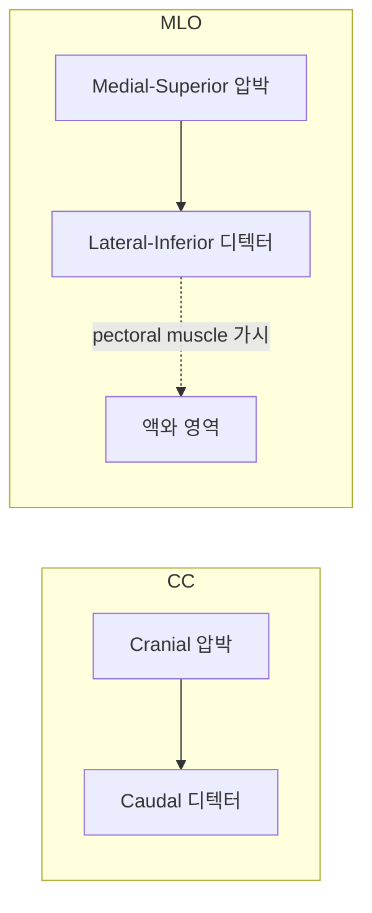

# Views — CC / MLO

표준 선별 mammography는 좌·우 유방을 각각 두 각도에서 촬영해 **4장**을 한 묶음으로 본다.

| 약자 | 뜻 | 위치 |
|------|------|------|
| **R-CC** | Right Cranio-Caudal | 우측, 위→아래 압박 |
| **L-CC** | Left Cranio-Caudal | 좌측, 위→아래 압박 |
| **R-MLO** | Right Medio-Lateral Oblique | 우측, 45° 비스듬 |
| **L-MLO** | Left Medio-Lateral Oblique | 좌측, 45° 비스듬 |

두 뷰가 필요한 이유는 **3차원 유방 구조를 2D X선 한 장으로 표현할 때 생기는 겹침(superimposition)** 문제다. 한 뷰에서 종괴처럼 보이는 음영이 다른 뷰에서 사라지면 단순 조직 겹침이고, 두 뷰 모두에서 보이면 실재 병변일 가능성이 높다.

## CC (Cranio-Caudal)

위에서 아래 방향으로 압박해 촬영한다. 압박판이 유두 위에 놓이고, 디텍터가 유두 아래에 놓인다.

- 시야: 유두 중심으로 **앞쪽 1/3**과 **내측(medial)** 구조가 잘 보임
- 한계: **axillary tail** (유방의 외측 상부 꼬리)을 놓치기 쉬움
- 좌우 비교가 가장 쉬운 뷰 — 좌·우 CC를 나란히 놓으면 대칭/비대칭을 한눈에 보기 좋다

## MLO (Medio-Lateral Oblique)

내측 상부에서 외측 하부로 45° 비스듬히 압박. 압박판이 흉골 측, 디텍터가 액와(겨드랑이) 측.

- 시야: **pectoral muscle**(흉근)까지 한 프레임에 들어옴
- 단일 뷰 중 **가장 많은 유방 조직**을 포착 — 선별검사가 한 뷰만 가능했다면 MLO를 선택
- 한계: CC만큼 내측 조직이 깨끗하게 보이지는 않음

## 비교표

| 항목 | CC | MLO |
|------|-----|-----|
| 압박 방향 | 위 → 아래 | 내측 상부 → 외측 하부 (45°) |
| pectoral muscle | 보통 안 보임 | **유두 높이까지** 보여야 적절 |
| axillary tail | 누락 위험 | 포함 |
| 내측 조직 | 잘 보임 | 잘 안 보임 |
| 좌우 대칭 비교 | 가장 쉬움 | 보조 |
| 자세 평가의 핵심 신호 | 유두가 가장자리에 있고 가운데 정렬 | pectoral muscle이 유두 후방까지 닿음 |
