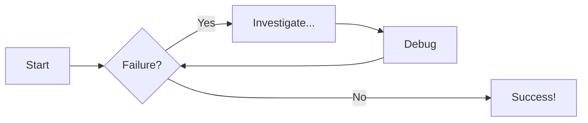
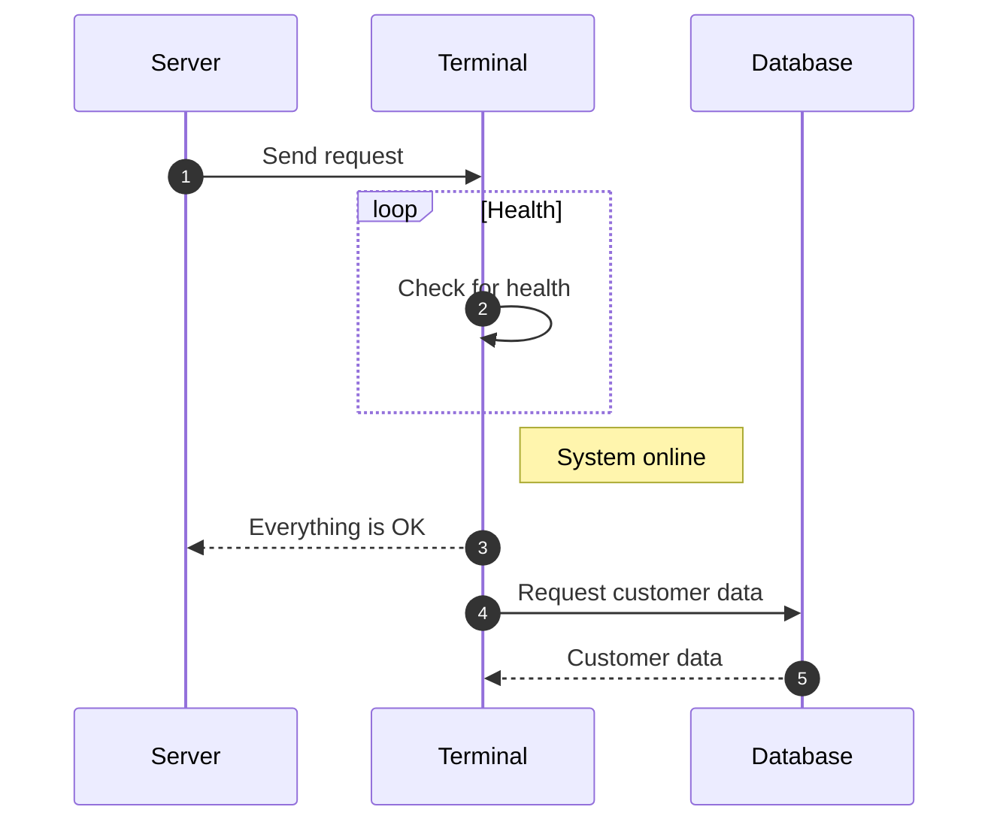
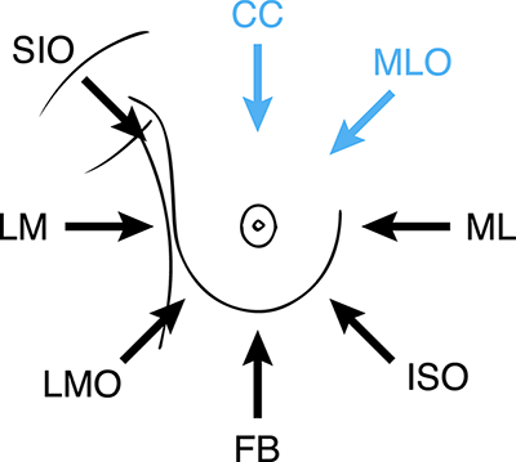

# Examples

## Code blocks

```py title="add_numbers.py" linenums="5"
# Function to add two numbers
def add_two_numbers(num1, num2):
    return num1 + num2

# Example usage
result = add_two_numbers(5, 3)
print('The sum is:', result)
```

```js title="code-examples.md" linenums="1" hl_lines="2-4"
// Function to concatenate two strings
function concatenateStrings(str1, str2) {
  return str1 + str2;
}

// Example usage
const result = concatenateStrings("Hello, ", "World!");
console.log("The concatenated string is:", result);
```

## Content Tabs

### Generic Content

=== "Plain text"

    This is some plain text

=== "Unordered list"

    * First item
    * Second item
    * Third item

=== "Ordered list"

    1. First item
    2. Second item
    3. Third item

### Code Blocks in Content Tabs

=== "Python"

    ```py
    def main():
        print("Hello world!")

    if __name__ == "__main__":
        main()
    ```

=== "JavaScript"

    ```js
    function main() {
        console.log("Hello world!");
    }

    main();
    ```

## Admonitions

!!! note "Title of the callout"

    Lorem ipsum dolor sit amet, consectetur adipiscing elit. Nulla et euismod
    nulla. Curabitur feugiat, tortor non consequat finibus, justo purus auctor
    massa, nec semper lorem quam in massa.

??? info "Collapsible callout"

    Lorem ipsum dolor sit amet, consectetur adipiscing elit. Nulla et euismod
    nulla. Curabitur feugiat, tortor non consequat finibus, justo purus auctor
    massa, nec semper lorem quam in massa.

## Diagram Examples

### Flowcharts



### Sequence Diagrams



## Tables

|  Method  |             Description              |
| :------: | :----------------------------------: |
|  `GET`   |   :material-check: Fetch resource    |
|  `PUT`   | :material-check-all: Update resource |
| `DELETE` |   :material-close: Delete resource   |

## Footnotes

Lorem ipsum[^1] dolor sit amet, consectetur adipiscing elit.[^2]
[^1]: Lorem ipsum dolor sit amet, consectetur adipiscing elit.
[^2]:
Lorem ipsum dolor sit amet, consectetur adipiscing elit. Nulla et euismod
nulla. Curabitur feugiat, tortor non consequat finibus, justo purus auctor
massa, nec semper lorem quam in massa.

## Images

### Left aligned

{ align=left }
Lorem ipsum dolor sit amet, consectetur adipiscing elit. Nulla et euismod nulla. Curabitur feugiat, tortor non consequat finibus, justo purus auctor massa, nec semper lorem quam in massa.
Lorem ipsum dolor sit amet, consectetur adipiscing elit. Nulla et euismod nulla. Curabitur feugiat, tortor non consequat finibus, justo purus auctor massa, nec semper lorem quam in massa.

### With caption

The align attribute doesn't allow for centered alignment, which is why this option is not supported by Material for MkDocs.1 Instead, the image captions syntax can be used, as captions are optional.

{ width="600" }
/// caption
Image caption
///

### With asset path
{ width="600" }
/// caption
Note: MkDocs treats the docs/ folder as the root. For an image located at docs/assets/images/example.png, use the path assets/images/example.png.
///


## Math

### Block syntax

$$
\cos x=\sum_{k=0}^{\infty}\frac{(-1)^k}{(2k)!}x^{2k}
$$

### Inline block syntex

The homomorphism $f$ is injective if and only if its kernel is only the
singleton set $e_G$, because otherwise $\exists a,b\in G$ with $a\neq b$ such
that $f(a)=f(b)$.

## Formatting

### Use case 1

Text can be {--deleted--} and replacement text {++added++}. This can also be
combined into {~~one~>a single~~} operation. {==Highlighting==} is also
possible {>>and comments can be added inline<<}.

{==

Formatting can also be applied to blocks by putting the opening and closing
tags on separate lines and adding new lines between the tags and the content.

==}

### Use case 2

- ==This was marked (highlight)==
- ^^This was inserted (underline)^^
- ~~This was deleted (strikethrough)~~

### Sub- and superscripts

- H~2~O
- A^T^A

### Adding keyboard keys

++ctrl+alt+del++

docs is [here](https://facelessuser.github.io/pymdown-extensions/extensions/keys/)

## Move to other titles

[Move to other titles](#diagram-examples)
