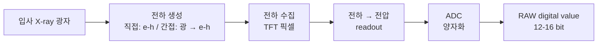

# 디지털 디텍터와 신호의 비선형성

!!! abstract "요약"
    이 페이지는 디지털 유방촬영 디텍터의 종류(직접 변환 a-Se, 간접 변환 a-Si + scintillator)와 입사 광자 → 전하 → 디지털 값으로 이어지는 검출 과정을 정리한다. 핵심 논점은 **검출기의 광자수 대 신호 응답은 대체로 선형**인 반면, **조직 두께/감쇠 대 검출 신호의 관계는 Beer–Lambert 때문에 본질적으로 지수적(비선형)**이라는 구분이다. 따라서 RAW 값을 인지적으로 다루기 쉬운 표현으로 바꾸려면 $\log(I_0/I) = \mu t$ 형태의 로그 선형화가 필요함을 수식으로 보이고, dark current·gain/offset·dead pixel 등 검출기 고유 비선형성과 양자화·양자 잡음·bit depth를 설명한다. 물리적 배경은 [X-ray의 성질과 감쇠](xray-physics.md), 선형화 구현은 [특성 곡선과 LUT](../image-formation/characteristic-curves.md)로 연결한다.

## 디지털 디텍터의 종류

디지털 유방촬영 디텍터는 입사 X-ray를 전기 신호로 변환하는 방식에 따라 크게 두 부류로 나뉜다.

=== "직접 변환 (direct conversion)"

    비정질 셀레늄(a-Se, amorphous selenium) 같은 광도전체(photoconductor)를 사용한다. X-ray가 a-Se 층에서 직접 전자–정공 쌍(electron–hole pair)을 생성하고, 인가된 전기장이 이 전하를 측방 확산 없이 수직으로 수집한다. 전하 확산이 거의 없어 **공간 해상도([MTF](../image-quality/metrics.md))가 우수**하다.

=== "간접 변환 (indirect conversion)"

    섬광체(scintillator, 주로 CsI:Tl)가 X-ray를 가시광으로 변환하고, 그 빛을 비정질 실리콘(a-Si) 광다이오드 배열이 전하로 변환한다. CsI를 기둥(needle) 구조로 성장시켜 빛의 측방 확산을 줄이지만, 직접 변환에 비해 광 확산에 의한 해상도 손실 여지가 있다.

두 방식 모두 픽셀 단위의 박막 트랜지스터(TFT) 배열로 전하를 읽어내며, 이후 읽기 회로(readout)와 ADC를 거쳐 디지털 값이 된다.

## 검출 과정: 광자에서 디지털 값까지

이 사슬에서 **검출기 자체**(광자 → 전하 → 디지털 값) 단계는 설계상 입사 광자 수에 대해 **선형(또는 거의 선형)**이도록 만든다. 즉 노출 범위 내에서 디지털 값 $D$는 검출된 광자 강도 $I$에 비례한다.

$$
D \approx a\, I + b
$$

여기서 $a$는 시스템 이득(gain), $b$는 오프셋(offset)이다. 이 관계는 보정 후 RAW 값이 "검출된 광자 강도에 비례"한다는 파이프라인의 가정과 일치한다.

## 핵심 구분: 검출기 선형성 vs 감쇠의 지수성

!!! warning "비선형성의 출처를 혼동하지 말 것"
    "RAW 신호가 비선형이다"라고 할 때 그 비선형성은 **검출기 응답** 때문이 아니라 **물리적 감쇠** 때문이다. 두 개념을 분리해야 한다.

    - **검출기 응답**: 광자 강도 $I$ → 디지털 값 $D$, 대체로 **선형** ($D \approx aI+b$).
    - **두께/감쇠 → 신호**: 두께 $t$ → 강도 $I$, [Beer–Lambert](xray-physics.md)에 의해 **지수적(비선형)**.

[Beer–Lambert 법칙](xray-physics.md)에 의해 검출된 강도는

$$
I \approx I_0\, e^{-\mu t}
$$

이므로, RAW 값은 조직 두께 $t$(또는 감쇠량 $\mu t$)에 대해 **선형으로 비례하지 않는다.** 두께가 선형으로 증가해도 신호는 지수적으로 감소한다. 이 때문에 두꺼운 중심부는 신호가 좁은 어두운 영역에 몰리고, 얇은 변연부는 밝은 쪽으로 압축되어 동적 범위가 극히 비대칭해진다.

### 로그 선형화

신호를 두께·감쇠에 선형인 표현으로 되돌리려면 조명 맵(illumination map) $I_0$ 추정값으로 정규화한 뒤 로그를 취한다.

$$
\log\!\left(\frac{I_0}{I}\right) = \log\!\left(\frac{I_0}{I_0 e^{-\mu t}}\right) = \mu t
$$

즉 $\log(I_0/I)$는 누적 감쇠량 $\mu t$에 **선형**이며, 이는 조직의 양(두께·밀도)에 비례하는 물리적으로 의미 있는 양이다. 이 선형화된 신호 위에서만 톤 압축과 국소 대조도 강조가 인지적으로 균일하게 동작한다. 선형화의 구체적 구현(조명 맵 추정, LUT 적용)은 [특성 곡선과 LUT](../image-formation/characteristic-curves.md)에서 다룬다.

!!! example "수치 직관"
    $\mu t = 1$ 인 영역과 $\mu t = 4$ 인 영역을 비교하면, RAW 강도 비는 $e^{-1}:e^{-4} \approx 0.368 : 0.018$ 로 약 20배 차이다. 그러나 로그 영역에서는 $1$ 대 $4$ 로 단지 4배 차이다. 로그 변환이 어떻게 동적 범위를 압축하면서 두께에 선형인 척도를 복원하는지 보여 준다.

## 검출기 고유의 비선형/오차 요인

검출기 응답이 "대체로 선형"이라 해도, 실제로는 여러 비이상(non-ideal) 요인으로 픽셀별 보정(calibration)이 필요하다.

| 요인 | 설명 | 보정 방법 |
| --- | --- | --- |
| 암전류(dark current) | 노출이 없어도 흐르는 누설 전류로 인한 오프셋 | dark/offset frame 차감 |
| 이득/오프셋 편차(gain/offset) | 픽셀·채널마다 다른 감도와 기준값 | flat-field 보정 (gain map) |
| 불량 화소(dead/defective pixel) | 응답이 없거나 비정상인 픽셀 | bad pixel map 기반 보간 |
| 잔상(lag/ghosting) | 직전 노출 전하가 남는 현상 | 시간 보정 / 대기 |
| 비선형 포화(saturation) | 고노출에서 응답이 평탄해짐 | 응답 곡선 보정 / 포화 클립 |

이 보정들은 파이프라인 초기에 적용되어 $D \approx aI + b$ 의 선형 모델이 픽셀 전체에서 성립하도록 만든다.

## 양자화와 bit depth, 동적 범위

ADC는 연속 신호를 이산 정수로 **양자화(quantization)**한다. 유방촬영 RAW는 통상 12~16 bit로 저장된다.

- $n$-bit 이면 표현 가능한 계조 수는 $2^n$ 단계(12 bit = 4096, 14 bit = 16384, 16 bit = 65536).
- **동적 범위(dynamic range)**는 표현 가능한 최대/최소 신호의 비로, 두꺼운 중심부와 얇은 변연부를 동시에 담으려면 넓은 동적 범위가 필요하다. 이 프로젝트의 RAW는 little-endian uint16(16-bit)으로 저장된다.
- 양자화 간격이 신호 변동보다 크면 정보 손실과 계조 끊김(banding)이 생기므로, 잡음 수준 대비 충분한 bit depth가 필요하다.

## 신호 대 잡음과 양자 잡음

X-ray 검출의 근본 잡음원은 광자 수의 통계적 요동인 **양자 잡음(quantum/photon noise)**이다. 검출 광자 수 $N$은 Poisson 분포를 따르므로 분산이 평균과 같다.

$$
\operatorname{Var}(N) = N, \qquad \sigma_N = \sqrt{N}
$$

따라서 신호 대 잡음비(SNR)는

$$
\text{SNR} = \frac{N}{\sqrt{N}} = \sqrt{N}
$$

로 광자 수가 많을수록(선량이 높을수록) 개선된다. 중요한 함의는 **잡음의 분산이 신호에 비례**(신호 의존적 잡음)한다는 점이다. 신호가 약한 두꺼운(어두운) 영역일수록 상대 잡음이 커지고, 이 영역을 로그·톤 압축으로 밝히면 잡음도 함께 증폭된다. 따라서 detail 계층 강조 시 잡음 억제(denoising)와의 균형이 중요하다. 잡음·해상도 지표의 정량화는 [영상 품질 지표](../image-quality/metrics.md)에서 다룬다.

!!! note "왜 톤 매핑은 RAW가 아니라 선형화 신호에서 동작하는가"
    RAW는 두께에 지수적이고(동적 범위 비대칭) 잡음이 신호 의존적이라, RAW에 직접 감마·CLAHE 같은 톤 매핑을 적용하면 두께 변화에 따라 대조도 응답이 들쭉날쭉해진다. 반면 $\log(I_0/I)=\mu t$ 선형화 신호는 (i) 조직량에 선형이고 (ii) 곱셈적 조명 변동을 덧셈적으로 바꿔, 다중 스케일 분해(global/regional/detail)와 톤 압축이 일관되게 동작한다. 그래서 downstream 처리는 항상 **선형화된 로그 신호** 위에서 이루어진다. 구체적 곡선·LUT는 [특성 곡선](../image-formation/characteristic-curves.md)을 참고하라.

## 참고문헌

- J. T. Bushberg, J. A. Seibert, E. M. Leidholdt, J. M. Boone, *The Essential Physics of Medical Imaging*, 3rd ed., Lippincott Williams & Wilkins, 2011.
- J. A. Rowlands, J. Yorkston, "Flat Panel Detectors for Digital Radiography," in *Handbook of Medical Imaging, Vol. 1: Physics and Psychophysics*, SPIE Press, 2000.
- M. J. Yaffe, J. A. Rowlands, "X-ray detectors for digital radiography," *Physics in Medicine and Biology*, 42(1):1–39, 1997.
- E. Samei, M. J. Flynn (eds.), AAPM/RSNA tutorials on detector DQE and image quality.
- ICRU Report 54, *Medical Imaging — The Assessment of Image Quality*, 1996.
- IAEA, *Quality Assurance Programme for Digital Mammography*, IAEA Human Health Series No. 17, 2011.
