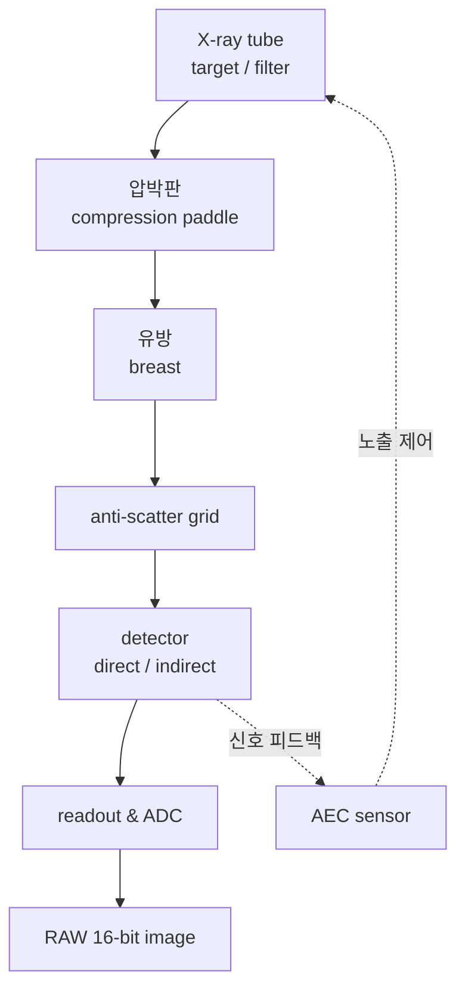

# 유방촬영 장비의 기본 구조

!!! abstract "요약"
    이 페이지는 유방촬영 시스템의 영상 사슬(imaging chain)을 X-ray tube에서 detector·readout까지 순서대로 정리한다. 표적/필터 조합과 준단색(quasi-monochromatic) 저에너지 스펙트럼을 쓰는 이유, 압박(compression)의 다중 목적, anti-scatter grid와 AEC(automatic exposure control)의 역할을 설명하고, FFDM과 DBT의 차이를 요약한다. X-ray의 물리적 세부는 [X-ray의 성질과 감쇠](xray-physics.md), 신호 검출 세부는 [디지털 디텍터](detector.md)로 연결한다.

## 영상 사슬 개요

유방촬영 시스템은 X-ray를 생성하고, 유방을 통과시키고, 산란을 제거한 뒤 검출·디지털화하는 일련의 구성요소로 이루어진다.

각 구성요소를 아래에서 차례로 살펴본다.

## X-ray tube와 표적/필터 조합

유방촬영용 X-ray tube는 가속된 전자를 표적(target/anode)에 충돌시켜 [제동복사(bremsstrahlung)와 특성 X-ray](xray-physics.md)를 생성한다. 일반 진단용과 달리 표적과 필터 물질을 의도적으로 선택해 좁은 에너지 대역의 **준단색(quasi-monochromatic)** 스펙트럼을 만든다.

| 표적/필터 (target/filter) | 특징 | 사용 경향 |
| --- | --- | --- |
| Mo/Mo | Mo 특성선(17.5, 19.6 keV) 강조, 저에너지 | 얇고 지방형 유방 |
| Mo/Rh | Rh 필터로 고에너지 꼬리 일부 투과 | 중간 두께 |
| W/Rh | W 표적 + Rh K-edge 필터, 효율적 | 두껍거나 치밀한 유방, 디지털 |
| W/Ag | W 표적 + Ag 필터, 더 단단한 빔 | 두꺼운/고밀도 유방 |

### 왜 저 kVp 준단색 스펙트럼인가

유방은 거의 전부가 연조직이고 구성 조직 간 [감쇠 계수](xray-physics.md) 차이가 작다. 이 차이는 광전효과(photoelectric effect)가 지배적인 **저에너지(약 17~25 keV)** 대역에서 가장 크게 벌어진다. 광전효과의 단면적은 대략 $\propto Z^3/E^3$ 로 에너지가 낮을수록 급격히 커지므로, 저에너지를 쓸수록 지방과 섬유선조직의 대조도가 향상된다.

!!! warning "대조도와 선량의 균형"
    에너지를 무작정 낮추면 대조도는 좋아지지만 유방에 흡수되는 선량(absorbed dose)이 급증한다. 너무 낮은 에너지의 광자는 유방을 투과하지 못하고 흡수되어 영상에 기여하지 못한 채 선량만 높이기 때문이다. 필터는 이 진단에 쓸모없는 초저에너지 성분과 불필요한 고에너지 성분을 모두 깎아내어 스펙트럼을 진단에 유용한 좁은 대역으로 정형(shaping)한다. 즉 표적/필터 선택은 **대조도와 선량의 절충(trade-off)** 문제이다.

K-edge 필터(Rh, Ag 등)는 자신의 K 흡수단 바로 위 에너지를 강하게 흡수해 스펙트럼의 고에너지 꼬리를 잘라내고, 결과적으로 좁은 준단색 대역을 강화한다.

## 압박(compression)

압박판(compression paddle)은 유방을 디텍터 쪽으로 눌러 평평하게 만든다. 압박은 단일 목적이 아니라 여러 이점을 동시에 제공한다.

1. **두께 균일화(uniform thickness)**: 유방 두께 편차를 줄여 동적 범위(dynamic range)를 좁히고, 변연부(periphery)와 중심부의 노출 차이를 완화한다. 이는 후처리의 [말초 두께 보정](../techniques/index.md) 부담을 줄인다.
2. **산란 감소(reduced scatter)**: 두께가 얇아지면 발생하는 산란선(scattered radiation)이 줄어 대조도가 향상된다.
3. **운동 흐림 감소(reduced motion blur)**: 유방을 고정해 노출 중 움직임을 막아 공간 해상도([MTF](../image-quality/metrics.md))를 보존한다.
4. **선량 감소(reduced dose)**: 투과 경로가 짧아져 같은 영상 품질을 더 낮은 선량으로 달성한다.
5. **조직 분리(tissue separation)**: 겹쳐진 조직을 펼쳐 superimposition에 의한 가짜 소견을 줄인다.

!!! note "균일 두께 가정과 그 한계"
    압박은 유방을 "균일 두께 평판"에 가깝게 만들지만, 유방 변연부는 곡면이라 두께가 급격히 얇아진다. 이 영역은 신호가 포화에 가깝게 밝아져 정보가 묻히므로, 처리 파이프라인에서 [말초 두께 보정(peripheral thickness compensation)](../techniques/index.md)이 필요하다.

## Anti-scatter grid

산란선은 1차(primary) 신호 위에 거의 균일한 흐릿한 배경을 더해 대조도를 떨어뜨린다. anti-scatter grid는 얇은 흡수 격벽(보통 일정 방향으로 정렬)으로 비스듬히 입사하는 산란 광자를 차단하고 직진하는 1차 광자만 통과시킨다. 격자비(grid ratio)와 격자 주파수(line density)가 산란 제거 성능과 1차선 투과율을 결정한다. 격자 자체도 1차선을 일부 흡수하므로 노출량 증가(Bucky factor)를 수반하며, 이 또한 선량–대조도 절충의 일부이다.

## AEC (automatic exposure control)

AEC는 디텍터(또는 별도 센서)가 받은 신호를 실시간으로 측정해 목표 영상 품질(또는 신호 대 잡음비)에 도달하면 노출을 자동 종료한다. 유방 두께와 밀도에 따라 적절한 kVp, 표적/필터, mAs를 선택해 환자마다 일관된 영상 품질과 적정 선량을 보장한다. AEC가 도출한 노출량은 RAW 신호의 평균 수준(즉 [Beer–Lambert](xray-physics.md)에서의 $I_0$ 규모)을 좌우하므로, 후처리의 조명 맵(illumination map) 추정과도 간접적으로 연결된다.

## FFDM과 DBT

=== "FFDM"

    FFDM(full-field digital mammography)은 단일 투영 방향에서 2D 디지털 영상을 획득하는 표준 방식이다. 빠르고 선량이 낮으나, 조직이 한 평면에 겹쳐 투영(superimposition)되어 종괴가 가려지거나 가짜 소견이 생길 수 있다는 한계가 있다.

=== "DBT"

    DBT(digital breast tomosynthesis)는 X-ray tube를 제한된 각도 범위에서 회전시키며 여러 저선량 투영을 획득하고, 이를 재구성(reconstruction)해 얇은 단면(slice) 스택을 만든다. 조직 겹침 문제를 완화해 종괴 검출 특이도를 높이지만, 데이터 양과 재구성·처리 복잡도가 증가한다.

두 방식 모두 디텍터가 출력하는 신호는 본질적으로 [지수적으로 감쇠된 광자 강도](detector.md)이며, 따라서 동일한 [log 선형화·톤 매핑 원리](../image-formation/characteristic-curves.md)를 따른다.

## 참고문헌

- J. T. Bushberg, J. A. Seibert, E. M. Leidholdt, J. M. Boone, *The Essential Physics of Medical Imaging*, 3rd ed., Lippincott Williams & Wilkins, 2011.
- A. D. A. Maidment, "Digital Mammography," in *Handbook of Medical Imaging*, SPIE Press.
- IAEA, *Quality Assurance Programme for Digital Mammography*, IAEA Human Health Series No. 17, 2011.
- AAPM Report No. 125, *Functionality and Operation of Automatic Exposure Control Systems in Mammography*, 2009.
- I. Sechopoulos, "A review of breast tomosynthesis. Part I/II," *Medical Physics*, 40(1), 2013.
- E. B. Cole et al., comparative studies on Mo/Rh and W/Rh spectra in digital mammography, *Medical Physics*.
