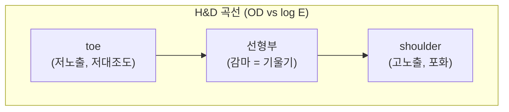

# 특성 곡선(Characteristic Curves)과 톤 매핑

!!! abstract "요약"
    특성 곡선(characteristic curve)은 입력 강도(input intensity)를 출력/표시 강도
    (output/display intensity)로 대응시키는 전달 함수(transfer function)다. 이 문서는
    필름 시대의 H&D 곡선에서 출발해 디지털의 로그 선형화(log linearization), 감마
    보정(gamma correction), 시그모이드(sigmoid) 톤 곡선, DRC(dynamic range compression),
    그리고 표시 표준인 DICOM GSDF(Grayscale Standard Display Function)까지, 유방촬영
    파이프라인에서 쓰이는 변환 곡선의 계보를 정리한다. 각 곡선이 왜 그 모양인지, 어디에
    쓰이는지, 트레이드오프가 무엇인지를 다룬다.

## 1. 특성 곡선이란

특성 곡선은 시스템이 받은 입력값 $x$ 와 그것이 만들어내는 출력값 $y$ 의 관계를
나타내는 단조(monotone) 함수 $y = f(x)$ 이다. 영상 처리에서는 보통

- $x$: 디텍터 신호 또는 로그 선형화된 감쇠량,
- $y$: 표시 장치의 휘도(luminance) 또는 8-bit 픽셀값

을 잇는 곡선을 가리킨다. 곡선의 **국소 기울기**가 그 휘도 구간의 대조도(contrast)를
결정한다는 점이 핵심이다. 기울기가 가파른 구간은 대조도가 높고, 평평한 구간은
대조도가 낮다.

## 2. 역사적 출발점: 필름의 H&D 곡선

필름 영상의 특성 곡선은 Hurter–Driffield(H&D) 곡선으로, **광학밀도(optical density,
OD)** 를 **로그 노출량(log exposure)** 에 대해 그린 것이다.



- **toe(발가락):** 저노출 영역. 기울기가 작아 어두운 영역의 대조도가 낮다.
- **선형부(straight-line portion):** 기울기가 일정한 구간. 이 기울기가 **감마(gamma)** $\gamma$ 이며 필름의 대조도를 규정한다.
- **shoulder(어깨):** 고노출 영역. 포화되어 다시 평평해진다.
- **라티튜드(latitude):** toe와 shoulder 사이의 유용한 노출 범위. 넓을수록 동적 범위가 크지만 평균 대조도는 낮아진다.

필름 OD는

$$
\mathrm{OD} = \log_{10}\!\left(\frac{I_0}{I}\right)
$$

로 정의되며, 입사광 $I_0$ 대비 투과광 $I$ 의 로그 비다. 디지털에서는 이 sigmoid 형태의
toe–선형–shoulder 구조가 **톤 곡선(tone curve)** 으로 일반화된다. 즉 디지털 톤 매핑은
필름의 "보기 좋은" 특성을 수치적으로 재현·제어하려는 시도로 볼 수 있다.

## 3. 로그 선형화 (log linearization)

X-ray 감쇠는 Beer–Lambert 법칙에 의해 지수적이다([디텍터](../foundations/detector.md) 참고):

$$
I = I_0 \, e^{-\mu t}
$$

여기서 $\mu$ 는 선형 감쇠계수, $t$ 는 경로 두께다. 디텍터 신호 $I$ 는 두께·밀도에 대해
지수적으로 변하므로 그대로 처리하면 두꺼운 부위에서 정보가 압축된다. 로그를 취하면

$$
L = \log\!\left(\frac{I_0}{I}\right) = \mu t
$$

가 되어 **두께·감쇠량에 선형**인 양으로 바뀐다. 이는 H&D 곡선이 로그 노출량을 가로축에
쓰는 것과 같은 동기다. 본 프로젝트는 조도 맵 $I_0$ 를 추정한 뒤 $L$ 을 $[0, 65535]$ 의
uint16로 정규화한다.

!!! tip "로그 선형화의 이점"
    로그 영역에서는 곱셈적 효과(예: 두께 구배에 의한 배경 변화)가 **덧셈**으로 바뀐다.
    따라서 배경 추정·차감 같은 평탄화 연산이 선형 영역보다 안정적이고, 이후 다중스케일
    분해의 가산적 모델과도 잘 맞는다.

## 4. 감마 보정 (gamma correction)

가장 단순한 비선형 톤 곡선은 거듭제곱(power-law) 형태다. 입력을 $[0,1]$ 로 정규화하면

$$
y = x^{\gamma}
$$

- $\gamma < 1$: 곡선이 위로 볼록 → 어두운 영역을 밝게 끌어올려 저휘도 대조도 강조(밝아짐).
- $\gamma = 1$: 항등(identity), 선형.
- $\gamma > 1$: 곡선이 아래로 볼록 → 밝은 영역을 누르고 어두운 영역을 압축(어두워짐, 고휘도 압축).

```py
import numpy as np

def gamma_curve(x_uint16, gamma):
    # x: uint16 [0, 65535] -> 정규화 -> 거듭제곱 -> 복원
    x = x_uint16.astype(np.float32) / 65535.0
    y = np.power(x, gamma)
    return (y * 65535.0).astype(np.uint16)
```

유방촬영에서는 배경(저주파 성분)에 $\gamma > 1$ 을 적용해 두꺼운 부위의 넓은 동적
범위를 압축하면서, 디테일은 따로 보존하는 식으로 쓴다(아래 DRC 절).

## 5. 시그모이드 / S-곡선 (sigmoid tone curve)

감마는 한쪽 끝(저휘도 또는 고휘도)만 압축한다. **양쪽을 동시에** 압축하면서 중간
휘도의 대조도를 강조하려면 S자 형태의 시그모이드 곡선을 쓴다. 로지스틱(logistic)
형태는

$$
y = \frac{1}{1 + e^{-k\,(x - x_0)}}
$$

- $x_0$: 변곡점(중심). Window Center에 해당하는 휘도를 중심에 둔다.
- $k$: 기울기(경사). 클수록 중간 대조도가 가파르다(=대조도↑, 표현 범위↓).

이 곡선은 H&D 곡선의 toe–선형–shoulder 구조를 그대로 재현한다. 양 끝(toe, shoulder)에서
기울기가 0에 수렴해 저·고 휘도를 부드럽게 압축(포화 회피)하고, 중심부에서 기울기가
최대가 되어 관심 휘도 대조도를 끌어올린다.

```py
def sigmoid_curve(x_uint16, center=0.5, k=10.0):
    x = x_uint16.astype(np.float32) / 65535.0
    y = 1.0 / (1.0 + np.exp(-k * (x - center)))
    # toe/shoulder가 [0,1] 끝에 닿도록 재정규화
    y0, y1 = 1/(1+np.exp(k*center)), 1/(1+np.exp(-k*(1-center)))
    y = (y - y0) / (y1 - y0)
    return (np.clip(y, 0, 1) * 65535.0).astype(np.uint16)
```

## 6. DRC / 톤 매핑 (dynamic range compression)

DRC의 목표는 **넓은 동적 범위를 표시 범위로 압축하되, 국소 대조도(디테일)는 잃지 않는**
것이다. 단순히 전역 곡선만 적용하면 배경을 누르는 동시에 그 위의 미세 구조도 함께
눌린다. 해결책은 영상을 **배경(저주파) + 디테일(고주파)** 로 분리해 따로 다루는 것이다
([다중스케일 분해](../techniques/multiscale.md) 참고).

본 프로젝트의 핵심 아이디어는 *평활화한 배경에만 감마 압축을 적용*하고 디테일을 다시
더하는 것이다.

```py
import numpy as np
from scipy.ndimage import gaussian_filter

def drc_tone_map(L, gamma=0.6, sigma=30, detail_gain=1.5):
    """L: 로그 선형화 영상 (float, [0,1] 정규화 가정)."""
    s = gaussian_filter(L, sigma=sigma)        # 저주파 배경 (smoothed background)
    detail = L - s                             # 고주파 디테일
    s_compressed = np.power(np.clip(s, 0, 1), gamma)   # 배경만 압축: s' = s^gamma
    out = s_compressed + detail_gain * detail  # 디테일 재증폭 후 합성
    return np.clip(out, 0, 1)
```

!!! example "왜 배경만 압축하는가"
    배경 $s$ 에 $\gamma<1$ 을 적용하면 두꺼운 부위(어두운 배경)가 밝아지며 동적 범위가
    압축된다. 디테일 $L-s$ 는 압축하지 않고 오히려 이득을 주어 더하므로, 전체 밝기 범위는
    좁아지지만 미세석회화 같은 국소 대조도는 보존·강조된다. 이것이 톤 매핑이 windowing
    단독보다 강력한 이유다.

## 7. 표시 표준: DICOM GSDF와 perceptual linearization

지금까지의 곡선은 "영상값을 어떻게 만들 것인가"였다. 마지막 질문은 "표시 장치가 그
값을 어떤 휘도로 내보내야 사람 눈에 균일하게 보이는가"이다.

사람의 명암 인지(contrast sensitivity)는 휘도에 따라 비선형이다. Barten의 대조도 민감도
함수(contrast sensitivity function, CSF) 모델은 주어진 휘도 수준에서 사람이 겨우 구별할
수 있는 최소 대조도, 즉 **JND(just-noticeable-difference)** 를 예측한다. DICOM PS3.14의
**GSDF(Grayscale Standard Display Function)** 는 이 Barten 모델을 적분해, 표시 장치의
디지털 입력(Presentation Value, P-Value)을 **JND 인덱스에 선형**이 되도록 휘도로
매핑하는 표준 곡선을 정의한다.

$$
\text{P-Value} \;\xrightarrow{\;\text{GSDF}\;}\; \text{Luminance } L\ (\mathrm{cd/m^2})
$$

!!! note "왜 단순 선형이 아니라 인지적 균일성인가"
    표시값을 휘도에 선형으로 매핑하면, 어두운 영역에서는 한 단계 차이가 여러 JND를
    건너뛰어(밴딩, banding) 보이고 밝은 영역에서는 여러 단계가 1 JND 미만이라
    낭비된다. GSDF는 **인접한 표시값 사이의 휘도 차가 어디서나 일정한 수의 JND**가
    되도록 한다. 이렇게 perceptual linearization을 하면 같은 영상이 휘도 특성이 다른
    여러 모니터에서 일관되게 보인다. GSDF는 실무에서 [LUT](../techniques/lut.md)(presentation LUT)로
    구현된다.

## 8. 곡선 계보 비교

| 곡선 | 수식 | 모양 | 주요 용도 | 장점 | 단점 |
|------|------|------|-----------|------|------|
| 선형(linear) | $y = ax + b$ | 직선 | windowing, rescale | 정량성 보존, 단순 | 동적 범위 압축 불가 |
| 감마(gamma) | $y = x^{\gamma}$ | 단조 볼록 | 한쪽 휘도 압축, 배경 압축 | 단순, 빠름 | 한쪽 끝만 압축 |
| 로그(log) | $y = \log(I_0/I)$ | 오목 | 감쇠 선형화 | 곱→합 변환, 동적 범위↓ | 저신호 잡음 증폭 |
| 시그모이드(sigmoid) | $y = \frac{1}{1+e^{-k(x-x_0)}}$ | S자 | 톤 곡선, 양끝 압축 | 양끝 동시 압축+중간 강조 | 파라미터 튜닝 필요 |
| GSDF | Barten CSF 적분 (해석해 없음) | 인지 곡선 | 디스플레이 표준화 | 모니터 간 일관성, 인지 균일 | 표시 단계 전용, 장치 보정 필요 |

## 9. 파이프라인에서의 위치

본 프로젝트에서 곡선들은 다음 순서로 쓰인다.

1. **로그**: RAW → $L = \log(I_0/I)$ (영상값 생성, §3).
2. **감마/DRC**: 평활화 배경 $s' = s^{\gamma}$ + 디테일 재증폭 (톤 매핑, §6).
3. **선형/시그모이드**: WW/WC windowing으로 표시 8-bit 매핑([windowing](windowing.md)).
4. **GSDF**: 모니터 presentation LUT로 인지적 균일 표시([LUT](../techniques/lut.md)).

## 참고문헌

- DICOM PS3.14, *Grayscale Standard Display Function (GSDF)*. NEMA.
- Barten PGJ. *Contrast Sensitivity of the Human Eye and Its Effects on Image Quality*. SPIE Press, 1999.
- Barten PGJ. "Physical model for the contrast sensitivity of the human eye." *Proc. SPIE* 1666 (1992): 57–72.
- Hurter F, Driffield VC. "Photochemical Investigations and a New Method of Determination of the Sensitiveness of Photographic Plates." *J. Soc. Chem. Ind.* 9 (1890): 455–469.
- Bushberg JT, Seibert JA, Leidholdt EM, Boone JM. *The Essential Physics of Medical Imaging*, 4th ed. Wolters Kluwer, 2020.
- Pisano ED, et al. "Image processing algorithms for digital mammography: a pictorial essay." *RadioGraphics* 20(5) (2000): 1479–1491.
