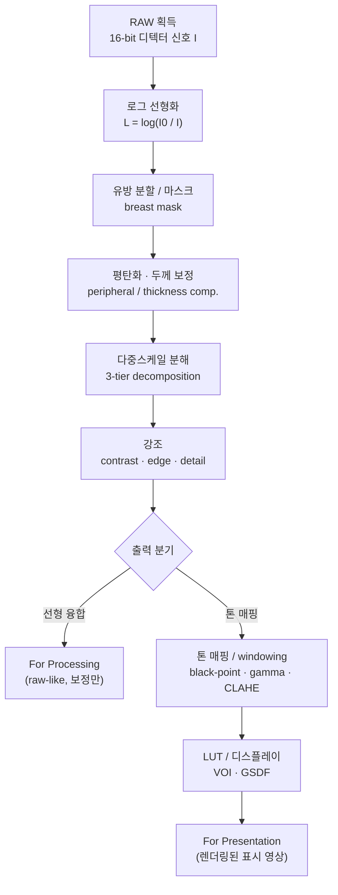
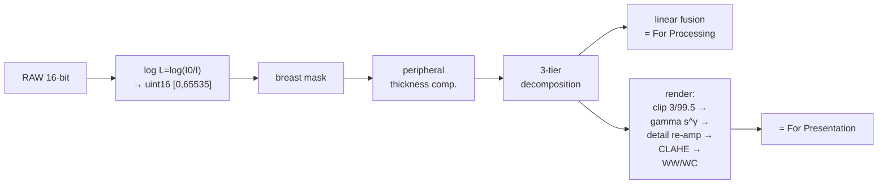

# RAW에서 표시 영상까지: 처리 파이프라인 개요

!!! abstract "요약"
    이 문서는 디지털 유방촬영(mammography)에서 디텍터가 획득한 RAW 16-bit 신호가
    진단의가 모니터에서 보는 표시 영상(display image)으로 변환되기까지의 전체 처리
    파이프라인을 조망한다. 각 단계(획득 → 로그 선형화 → 분할/마스크 → 평탄화/두께 보정 →
    다중스케일 분해 → 강조 → 톤 매핑/windowing → LUT/디스플레이)가 무엇을 하고 왜
    필요한지를 설명하고, DICOM의 **For Processing** 영상과 **For Presentation** 영상의
    구분을 정리한다. 이 페이지는 이후 세부 문서들로 가는 독자의 지도(roadmap) 역할을 한다.

## 1. 왜 파이프라인인가

유방촬영 영상은 다른 X-ray 영상과 구별되는 두 가지 어려움을 가진다.

1. **미세한 대조도(low contrast) 신호.** 미세석회화(microcalcification)와 종괴(mass)의
   경계는 주변 유선조직과의 감쇠 차이가 매우 작다. 단일 [점 연산](../techniques/point-operations.md)
   으로는 전 영역에서 동시에 드러내기 어렵다.
2. **거대한 동적 범위(dynamic range).** 압박된 유방의 두꺼운 중심부와 얇은 피부선(skin line)
   사이의 신호 차이가 매우 크다. 16-bit로 획득한 신호를 8-bit 표시 장치에 그대로 선형
   매핑하면 한쪽이 포화되거나 다른 쪽이 검게 뭉개진다.

따라서 단일 변환이 아니라, **물리적 보정 → 구조 분리 → 강조 → 인지적 표시**로 이어지는
다단계 파이프라인이 필요하다. 각 단계는 직전 단계의 가정을 기반으로 동작하므로 순서가
중요하다.

## 2. 전체 흐름도

## 3. 단계별 개요와 세부 문서 링크

각 단계는 별도 문서에서 깊게 다룬다. 여기서는 "무엇을, 왜"만 짧게 짚는다.

### 3.1 RAW 획득 (acquisition)

디텍터의 각 픽셀은 도달한 X-ray 광자 수에 비례하는 신호를 12–16-bit 정수로 기록한다.
이 단계의 물리는 [X-ray의 성질](../foundations/xray-physics.md)과
[디지털 디텍터](../foundations/detector.md)에서 다룬다. 본 프로젝트에서 입력은
RAW 16-bit 영상 $I$ 이다.

### 3.2 로그 선형화 (log linearization)

X-ray 감쇠는 Beer–Lambert 법칙에 의해 **지수적**이다. 즉 두께·밀도에 대해 신호가
$I = I_0 e^{-\mu t}$ 로 감소한다. 로그를 취하면

$$
L = \log\!\left(\frac{I_0}{I}\right) = \mu t
$$

가 되어 조직의 두께·감쇠계수에 대해 **선형**인 양으로 바뀐다. 이렇게 선형화된 값을
$[0, 65535]$ 의 uint16로 정규화하여 이후 단계의 입력으로 쓴다. 변환 곡선의 이론은
[특성 곡선](characteristic-curves.md)에서 다룬다.

### 3.3 분할 / 마스크 (segmentation)

배경(공기), 유방 영역, 흉근(pectoral muscle)을 분리하여 이후 보정·통계가 유방 조직에만
적용되도록 한다. 임계화와 모폴로지(morphology) 연산이 쓰이며, 형태학적 평활화는
[모폴로지/스무딩](../techniques/smoothing.md)에서 다룬다.

### 3.4 평탄화 · 두께 보정 (flatten / thickness compensation)

압박 유방은 가장자리로 갈수록 얇아져(peripheral thinning) 밝기가 급격히 변한다.
heel effect와 산란도 배경 조도(illumination)를 불균일하게 만든다. 저주파 배경 조도
$I_0$ 를 추정해 보정하여 균일한 바탕 위에서 병변을 평가할 수 있게 한다. 자세한 수식은
[windowing](windowing.md)의 flatten 절과 [peripheral equalization](../techniques/peripheral-equalization.md)
에서 다룬다.

### 3.5 다중스케일 분해 (multiscale decomposition)

영상을 여러 공간 주파수 대역(저주파 배경 / 중간 구조 / 고주파 디테일)으로 분리한다.
본 프로젝트의 3-tier 분해는 배경·구조·디테일을 독립적으로 다룰 수 있게 하여, 배경은
압축하고 디테일은 보존·강조하는 톤 매핑을 가능하게 한다. [다중스케일 분해](../techniques/multiscale.md)
참고.

### 3.6 강조 (enhancement)

분해된 각 대역에 서로 다른 이득(gain)을 적용해 대조도(contrast)·경계(edge)·미세
디테일(detail)을 강조한다. 미세석회화 같은 고주파 성분을 재증폭(detail re-amplification)
하는 것이 핵심이다.

### 3.7 톤 매핑 / windowing (tone mapping)

표시 가능한 범위로 압축하는 단계다. 본 프로젝트는 black-point 클리핑(percentile 3 / 99.5),
평활화한 배경에 대한 gamma 톤 압축($s' = s^{\gamma}$), 디테일 재증폭, CLAHE를 적용하고,
DICOM의 WindowWidth/WindowCenter를 percentile로 설정한다. 이론은 [windowing](windowing.md)과
[특성 곡선](characteristic-curves.md)에서 다룬다.

### 3.8 LUT / 디스플레이 (display)

최종 입력→출력 매핑을 Look-Up Table(LUT)로 미리 계산해 픽셀당 O(1)로 적용한다.
모니터의 인지적 균일성을 위해 DICOM GSDF가 presentation LUT로 적용된다.
[LUT](../techniques/lut.md) 참고.

## 4. For Processing vs For Presentation

실제 유방촬영 DICOM 워크플로는 동일한 노출에서 **두 종류의 영상**을 생성한다. 이는
DICOM의 *Presentation Intent Type* (0008,0068) 으로 구분된다.

=== "For Processing"

    - **무엇:** 물리 보정(로그 선형화, 게인/오프셋, 결함 픽셀 보정)만 적용한, 본질적으로
      RAW에 가까운 선형 영상.
    - **목적:** CAD나 후처리 워크스테이션이 자체 알고리즘으로 재처리할 수 있도록 원본
      정보를 최대한 보존한다.
    - **본 프로젝트 대응:** 선형 융합(linear fusion) 출력.

=== "For Presentation"

    - **무엇:** 진단의가 바로 판독할 수 있도록 톤 매핑·windowing·강조·LUT까지 적용한
      렌더링 영상.
    - **목적:** 사람 눈과 표시 장치 특성에 맞춘 최종 표시. 일반적으로 재처리하지 않는다.
    - **본 프로젝트 대응:** 톤 매핑(tone-mapped) 출력.

!!! note "왜 둘 다 보존하는가"
    For Presentation은 보기 좋지만 비가역적 변환(클리핑, 비선형 압축)을 포함해 정량
    정보를 잃는다. For Processing은 정량성을 보존하므로 재처리·정량분석·CAD의 입력으로
    적합하다. 두 영상은 같은 노출에서 파생되지만 사용 목적이 다르다.

## 5. 본 프로젝트 파이프라인과의 대응

전체 구현 흐름은 [프로젝트 파이프라인](../pipeline/three-tier.md)에서 코드 수준으로 다룬다.

## 6. 읽기 순서 제안

1. 물리 기초: [X-ray의 성질](../foundations/xray-physics.md), [디지털 디텍터](../foundations/detector.md)
2. 변환 이론: [특성 곡선](characteristic-curves.md)
3. 표시 매핑: [windowing](windowing.md) → [LUT](../techniques/lut.md)
4. 강조 알고리즘: [다중스케일 분해](../techniques/multiscale.md), [점 연산](../techniques/point-operations.md)
5. 통합: [프로젝트 파이프라인](../pipeline/three-tier.md)

## 참고문헌

[^bushberg]: Bushberg JT, Seibert JA, Leidholdt EM, Boone JM. *The Essential Physics of Medical Imaging*, 4th ed. Wolters Kluwer, 2020.

- DICOM PS3.3, *Information Object Definitions* — Digital Mammography X-Ray Image IOD, Presentation Intent Type (0008,0068). NEMA.
- DICOM PS3.14, *Grayscale Standard Display Function (GSDF)*. NEMA.
- Bushberg JT, et al. *The Essential Physics of Medical Imaging*, 4th ed. Wolters Kluwer, 2020.[^bushberg]
- Hurter F, Driffield VC. "Photochemical Investigations and a New Method of Determination of the Sensitiveness of Photographic Plates." *J. Soc. Chem. Ind.* 9 (1890): 455–469.
