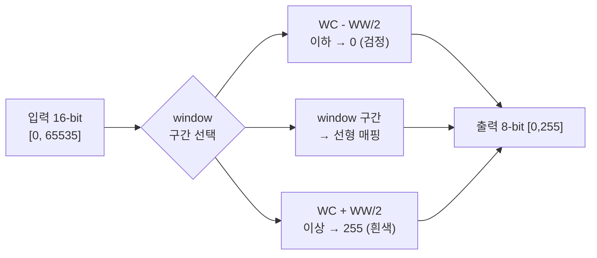

# Windowing, Window Width/Level, Flatten, 조도 조정

!!! abstract "요약"
    Windowing은 12–16-bit의 넓은 비트 깊이로 획득한 영상에서 진단에 필요한 휘도
    구간만 선택해 표시용 8-bit로 매핑하는 점 연산(point operation)이다. 이 문서는
    Window Width(WW)와 Window Center/Level(WC/WL)의 정의·수식, DICOM 태그와의
    연결, percentile 기반 자동 windowing, 그리고 불균일한 배경 조도(illumination)를
    제거하는 평탄화(flatten)/flat-field correction과 peripheral equalization 개념을
    다룬다.

## 1. Windowing 개념

디텍터는 12–16-bit(예: $[0, 65535]$)로 신호를 기록하지만, 표시 장치와 사람 눈은
한 화면에서 그만큼의 계조(gray level)를 구별하지 못한다. 일반 모니터의 표시 깊이는
사실상 8-bit($[0,255]$) 수준이다. 따라서 **전체 입력 범위 중 관심 있는 부분 구간만**
골라 출력 범위 전체로 늘여 매핑한다. 이 부분 구간을 정의하는 것이 windowing이다.



## 2. Window Width(WW)와 Window Center/Level(WC/WL)

- **Window Center / Level (WC, WL):** 선택 구간의 중심 휘도값. 이 값을 올리면 영상이
  전체적으로 어두워지고, 내리면 밝아진다.
- **Window Width (WW):** 선택 구간의 폭. 출력 전체 범위에 매핑되는 입력 범위의 크기.

구간의 경계는

$$
x_{\min} = \mathrm{WC} - \frac{\mathrm{WW}}{2}, \qquad
x_{\max} = \mathrm{WC} + \frac{\mathrm{WW}}{2}
$$

이고, 출력 범위 $[0, y_{\max}]$ (8-bit이면 $y_{\max}=255$) 로의 매핑은

$$
y = \operatorname{clip}\!\left(\frac{x - (\mathrm{WC} - \mathrm{WW}/2)}{\mathrm{WW}},\; 0,\; 1\right) \cdot y_{\max}
$$

로 쓴다. 즉 $x_{\min}$ 이하는 0, $x_{\max}$ 이상은 $y_{\max}$, 그 사이는 선형 보간이다.

!!! warning "표기 주의: WH / WL / WC"
    사용자 메모에 등장하는 "WH"는 표준 용어가 아니다.[^wh] 맥락에 따라 **Window
    Height** (= 출력 진폭, 일부 벤더 표기) 또는 **Window Level/Center** (= WL/WC)를
    혼용한 표기일 수 있다. 본 문서와 DICOM 표준에서는 구간의 중심을 **Window Center
    (WC)** 또는 **Window Level (WL)** 로, 폭을 **Window Width (WW)** 로 통일한다.

[^wh]: DICOM PS3.3 (0028,1050) *Window Center*, (0028,1051) *Window Width* 만이 표준 태그이며 "Window Height"라는 표준 속성은 없다.

### 2.1 WW가 대조도에 주는 영향

윈도 구간의 기울기는 $1/\mathrm{WW}$ 이다. 따라서

- **WW ↓ (좁은 창):** 기울기↑ → 대조도↑, 표현 가능한 휘도 범위↓. 좁은 신호 구간을
  강조할 때(예: 특정 조직 대조도).
- **WW ↑ (넓은 창):** 기울기↓ → 대조도↓, 표현 범위↑. 넓은 동적 범위를 한 화면에
  담을 때.

WC를 옮기면 강조되는 휘도대(어두운 쪽/밝은 쪽)가 이동한다.

## 3. DICOM 연결과 percentile 기반 설정

DICOM에서 windowing 파라미터는 다음 태그로 저장된다.

| 태그 | 이름 | 의미 |
|------|------|------|
| (0028,1050) | Window Center | WC / WL |
| (0028,1051) | Window Width | WW |
| (0028,1052) | Rescale Intercept | Modality LUT 절편 |
| (0028,1053) | Rescale Slope | Modality LUT 기울기 |

표시 소프트웨어는 이 값을 읽어 VOI(Value Of Interest) LUT로 적용한다(파이프라인은
[LUT](../techniques/lut.md) 참고). 본 프로젝트는 영상 히스토그램의 **percentile**로 WW/WC를
자동 설정한다.

```py
import numpy as np

def auto_window_from_percentiles(img, mask=None, p_low=3.0, p_high=99.5):
    """percentile로 black/white point를 잡아 DICOM WW/WC를 산출."""
    vals = img[mask] if mask is not None else img.ravel()
    lo = np.percentile(vals, p_low)    # black point (clip 하한)
    hi = np.percentile(vals, p_high)   # white point (clip 상한)
    ww = hi - lo
    wc = lo + ww / 2.0
    return float(ww), float(wc)        # DICOM (0028,1051), (0028,1050)
```

percentile을 쓰면 소수의 극단값(잡음, 핫픽셀, 공기 영역)에 끌려가지 않고 유방
조직의 실제 분포에 맞춘 창을 얻는다. 본 프로젝트의 black-point 클리핑(percentile
3 / 99.5)이 바로 이 원리다.

## 4. Worked example: WW/WL 수치 매핑

!!! example "구체적 수치 예시"
    16-bit 입력에서 percentile로 $x_{\min}=8000$, $x_{\max}=52000$ 을 얻었다고 하자.

    - $\mathrm{WW} = 52000 - 8000 = 44000$
    - $\mathrm{WC} = 8000 + 44000/2 = 30000$

    이제 임의 입력값을 8-bit로 매핑한다($y_{\max}=255$):

    | 입력 $x$ | 정규화 $\dfrac{x-8000}{44000}$ | clip | 출력 $y$ |
    |---------:|---------:|---:|---:|
    | 6000 | $-0.045$ | 0.000 | 0 |
    | 8000 | 0.000 | 0.000 | 0 |
    | 19000 | 0.250 | 0.250 | 64 |
    | 30000 | 0.500 | 0.500 | 128 |
    | 52000 | 1.000 | 1.000 | 255 |
    | 60000 | 1.182 | 1.000 | 255 |

    WC=30000이 출력 중간값 128로 매핑되고, 창 밖의 값은 검정/흰색으로 포화됨을 볼 수 있다.

## 5. Flatten(평탄화) / 조도(illumination) 보정

Windowing은 *전역* 점 연산이라 위치에 따라 변하는 밝기 편차를 다루지 못한다.
유방촬영 영상의 배경 조도는 다음 이유로 공간적으로 불균일하다.

- **두께 구배(thickness gradient):** 압박 유방은 가장자리로 갈수록 얇아진다.
- **peripheral thinning:** 피부선 근처에서 조직이 급격히 얇아져 매우 밝아진다.
- **heel effect:** X-ray 관(tube)의 양극(anode) 쪽으로 강도가 감소하는 불균일.

이런 저주파 배경 편차를 제거하는 것이 **flatten / 조도 보정**이다.

### 5.1 Flat-field correction

기준 평탄장(flat field) $I_{\text{flat}}$ 으로 나누어 게인 불균일을 보정한다.

$$
I_{\text{corr}} = \frac{I}{I_{\text{flat}}}
$$

flat field를 직접 측정하기 어려우면, 영상 자체에서 배경을 추정한다.

### 5.2 배경 추정 후 차감/나눗셈

저주파 배경 $\hat{B}$ 를 다항식 피팅(polynomial surface fitting)이나 저주파 필터
(large-$\sigma$ Gaussian, morphological opening)로 추정한 뒤,

- **선형 영역:** 나눗셈 $I/\hat{B}$,
- **로그 영역:** 차감 $L - \hat{B}$

로 평탄화한다. 로그 선형화([특성 곡선](characteristic-curves.md))를 먼저 하면 곱셈적
조도 변화가 덧셈으로 바뀌어 **차감만으로** 평탄화가 가능해진다.

```py
import numpy as np
from scipy.ndimage import gaussian_filter

def flatten_log_domain(L, mask, sigma=64):
    """로그 영역에서 저주파 배경을 추정해 차감 (조도 평탄화)."""
    bg = gaussian_filter(L * mask, sigma=sigma)
    norm = gaussian_filter(mask.astype(np.float32), sigma=sigma) + 1e-6
    bg = bg / norm                 # 마스크 경계 누설 보정
    return (L - bg) * mask
```

### 5.3 Peripheral equalization

피부선 근처의 얇은 조직(peripheral region)은 과도하게 밝아 내부 조직과 함께 보기
어렵다. **peripheral equalization**은 가장자리로 갈수록 커지는 보정 이득을 적용해
얇은 부위를 어둡게 끌어내려 두께 보정을 수행한다. 상세 알고리즘은
[peripheral equalization](../techniques/peripheral-equalization.md)에서 다룬다.

## 6. 히스토그램 기반 자동 windowing

WW/WC를 사람이 매번 조절하지 않도록, 히스토그램에서 자동으로 결정하는 방법이 있다.

=== "Percentile 방식"

    저/고 percentile(예: 3% / 99.5%)을 black/white point로 삼아 WW/WC를 정한다(§3).
    구현이 단순하고 극단값에 강건하다. 본 프로젝트의 기본 방식.

=== "Otsu 방식"

    Otsu 임계화로 전경(유방)과 배경(공기)을 분리한 뒤, 전경 분포에서 평균±표준편차나
    percentile로 창을 정한다. 배경이 창에 끼어드는 것을 막아 대조도를 키울 수 있다.

!!! tip "마스크와 함께 쓰기"
    어느 방식이든 유방 마스크(breast mask) 내부 픽셀로만 히스토그램을 계산해야 한다.
    공기·배경을 포함하면 분포가 왜곡되어 창이 부정확해진다. 분할은
    [모폴로지/스무딩](../techniques/smoothing.md) 참고.

## 7. 정리

| 도구 | 작동 범위 | 다루는 문제 | 한계 |
|------|-----------|-------------|------|
| Windowing (WW/WC) | 전역(global) | 동적 범위 → 8-bit 매핑 | 위치별 편차 불가 |
| Flatten / flat-field | 전역, 저주파 | 균일한 게인·조도 불균일 | 국소 대조도 보존 X |
| Peripheral equalization | 공간 가변(spatial) | 두께 구배·peripheral thinning | 파라미터 의존 |

Windowing은 [특성 곡선](characteristic-curves.md)의 선형/시그모이드 곡선의 특수형이며,
실제 적용은 [LUT](../techniques/lut.md)로 미리 계산되어 픽셀당 O(1)로 수행된다. 전체 맥락은
[프로젝트 파이프라인](../pipeline/three-tier.md) 참고.

## 참고문헌

- DICOM PS3.3, *Information Object Definitions* — Window Center (0028,1050), Window Width (0028,1051), Rescale Slope/Intercept (0028,1053/1052), VOI LUT Module. NEMA.
- Bushberg JT, Seibert JA, Leidholdt EM, Boone JM. *The Essential Physics of Medical Imaging*, 4th ed. Wolters Kluwer, 2020.
- Pisano ED, et al. "Image processing algorithms for digital mammography: a pictorial essay." *RadioGraphics* 20(5) (2000): 1479–1491.
- Stefanoyiannis AP, et al. "A digital density equalization technique to improve visualization of breast periphery in mammography." *Br. J. Radiol.* 76 (2003): 410–420.
- Otsu N. "A Threshold Selection Method from Gray-Level Histograms." *IEEE Trans. Syst. Man Cybern.* 9(1) (1979): 62–66.
