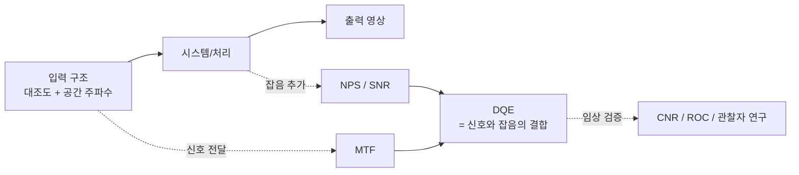

# 영상 품질 지표(Image Quality Metrics)

!!! abstract "요약"
    이 페이지는 "어떤 처리(processing) 단계가 영상을 실제로 개선했는가, 아니면 손상시켰는가"를 객관적으로 판정하기 위한 물리적·통계적 지표 체계를 정리한다. 핵심은 시스템이 공간 주파수(spatial frequency)별로 대조도(contrast)를 얼마나 전달하는지를 나타내는 **MTF(Modulation Transfer Function)**이다. MTF를 중심으로 분해능(spatial resolution)을 기술하는 PSF/LSF/ESF 계열, 잡음의 주파수 분포를 보는 **NPS(Noise Power Spectrum)**, 선량 효율의 종합 지표인 **DQE(Detective Quantum Efficiency)**, 그리고 대조도·잡음 기반 지표인 SNR/CNR을 차례로 다룬다. 마지막으로 객관 지표와 임상 검출능을 잇는 관찰자 연구(observer study)와, [sharpening](../techniques/sharpening.md)·[smoothing](../techniques/smoothing.md) 같은 처리가 이들 지표를 어떻게 왜곡할 수 있는지를 경고한다.

## 왜 정량 지표가 필요한가

맘모그램 처리 파이프라인에서 우리는 끊임없이 선택을 내린다. 어떤 sharpening 커널을 쓸 것인가, 어느 정도의 [denoising](../techniques/smoothing.md)을 적용할 것인가, 톤 압축 곡선을 어떻게 잡을 것인가. 이런 선택은 "보기에 좋다"는 주관적 인상만으로는 정당화할 수 없다. [미세석회화(microcalcification)](../foundations/mammography.md) 검출처럼 임상적으로 결정적인 과제는 사람 눈에 더 선명해 보이는 영상이 실제로는 잡음을 함께 증폭하여 검출능을 떨어뜨리는 경우가 흔하기 때문이다.

따라서 영상 품질은 **신호 전달 특성**(얼마나 충실히 구조를 전달하는가)과 **잡음 특성**(얼마나 많은 무작위 변동이 섞이는가), 그리고 둘의 결합인 **검출능**(detectability)의 세 축으로 분해해서 측정한다. 이 페이지의 지표들은 각각 이 세 축 중 하나 또는 그 결합을 정량화한다.

## 공간 분해능과 PSF / LSF / ESF

**공간 분해능(spatial resolution)**은 시스템이 얼마나 가깝게 붙어 있는 두 구조를 분리해서 표현할 수 있는가를 가리킨다. 분해능을 기술하는 출발점은 시스템의 **임펄스 응답(impulse response)**, 즉 이상적인 점 입력에 대한 출력 모양이다.

- **PSF(Point Spread Function)**: 무한히 작은 점 광원(point source)을 입력했을 때 출력에 퍼져 나타나는 2차원 분포 $h(x,y)$. 시스템이 점을 얼마나 번지게(blur) 하는지를 직접 보여 준다.
- **LSF(Line Spread Function)**: 무한히 가는 선(line) 입력에 대한 1차원 응답. PSF를 한 방향으로 적분(투영)한 것과 같다.

    $$\mathrm{LSF}(x) = \int_{-\infty}^{\infty} \mathrm{PSF}(x, y)\, dy$$

- **ESF(Edge Spread Function)**: 계단형 경계(step edge) 입력에 대한 응답. 실무에서 점·선보다 날카로운 직선 경계를 만들기가 훨씬 쉬우므로 측정에 가장 널리 쓰인다. ESF를 미분하면 LSF가 된다.

    $$\mathrm{LSF}(x) = \frac{d}{dx}\,\mathrm{ESF}(x)$$

세 함수는 본질적으로 같은 정보를 다른 입력 형태로 본 것이며, $\text{ESF} \xrightarrow{\,d/dx\,} \text{LSF} \xrightarrow{\,\mathcal{F}\,} \text{MTF}$의 사슬로 연결된다.

!!! note "왜 미세석회 검출에 분해능이 결정적인가"
    [미세석회화](../foundations/mammography.md)는 크기가 대략 수십~수백 µm에 불과한 고대비 점 구조다. 시스템의 PSF 폭이 석회 크기에 근접하거나 그보다 크면, 신호가 주변 화소로 번져 대조도가 희석되고 두 개의 인접한 석회가 하나로 합쳐져 보인다. 즉 미세석회 검출 가능성은 시스템의 고주파 전달 능력(=높은 공간 주파수에서의 MTF)에 직접적으로 의존한다. 이것이 분해능 지표를 맘모그래피에서 특히 중요하게 다루는 이유다.

## MTF (Modulation Transfer Function)

### 정의

**MTF**는 시스템이 공간 주파수 $f$(단위: line pair per millimeter, **lp/mm**)별로 입력 대조도(modulation)를 출력에 얼마나 충실히 전달하는지를 나타내는 함수다. 어떤 주기적 패턴의 변조도(modulation)는

$$M = \frac{I_{\max} - I_{\min}}{I_{\max} + I_{\min}}$$

로 정의되며, MTF는 주파수별 출력 변조도와 입력 변조도의 비다.

$$\mathrm{MTF}(f) = \frac{M_{\text{out}}(f)}{M_{\text{in}}(f)}$$

선형·시불변(linear shift-invariant, LSI) 시스템 가정 아래에서 MTF는 LSF의 푸리에 변환 크기를 0 주파수에서 1이 되도록 정규화한 것과 같다.

$$\mathrm{MTF}(f) = \frac{\left| \mathcal{F}\{\mathrm{LSF}(x)\} \right|}{\left| \mathcal{F}\{\mathrm{LSF}(x)\} \right|_{f=0}} = \frac{\left| \int \mathrm{LSF}(x)\, e^{-i 2\pi f x}\, dx \right|}{\int \mathrm{LSF}(x)\, dx}$$

$\mathrm{MTF}(0)=1$은 평탄한(DC) 대조도는 완벽히 전달된다는 뜻이고, 주파수가 올라갈수록 MTF가 떨어지는 것은 미세한 구조일수록 흐려진다는 뜻이다.

### Nyquist 주파수와 픽셀 피치

[디지털 디텍터](../foundations/detector.md)는 화소를 일정 간격으로 표본화(sampling)한다. 화소 피치(pixel pitch)를 $\Delta x$라 하면, 표본화 정리에 의해 충실히 표현 가능한 최대 공간 주파수인 **Nyquist 주파수(Nyquist frequency)**는

$$f_{\text{Nyquist}} = \frac{1}{2\,\Delta x}$$

이다. 예컨대 화소 피치가 50 µm($0.05$ mm)인 디텍터의 Nyquist 주파수는 $10$ lp/mm이다. 이보다 높은 주파수 성분은 별칭(aliasing)으로 접혀 들어와 인공물(artifact)을 만든다. 따라서 디텍터 MTF는 보통 Nyquist 주파수까지 평가하며, 이 대역에서 MTF가 높을수록 미세 구조 전달 능력이 좋다.

### 측정법: edge method / slanted-edge

현실에서 이상적 점·선을 만들기 어렵기 때문에, 표준 측정은 **에지법(edge method)**을 쓴다. 텅스텐 같은 고감쇠 물질의 날카로운 직선 경계를 촬영하여 ESF를 얻고, 이를 미분해 LSF를 구한 뒤 푸리에 변환한다.

특히 **경사 에지법(slanted-edge method)**은 에지를 화소 격자에 대해 1.5~3° 정도 기울여 배치한다. 이렇게 하면 여러 행(row)에 걸쳐 에지가 화소 경계를 조금씩 다른 위상으로 가로질러, 화소 피치보다 미세한 초표본화(super-sampled) ESF를 합성할 수 있다. 그 결과 Nyquist 주파수 부근까지 안정적으로 MTF를 측정할 수 있어 IEC 62220-1을 비롯한 표준이 이 방법을 채택한다.

??? info "측정 절차 요약"
    1. 경사진 에지 팬텀(edge phantom)을 촬영해 에지 영역 영상을 얻는다.
    2. 에지 각도를 추정하고, 각 행의 에지 프로파일을 에지에 수직인 축으로 재정렬(re-bin)하여 초표본화 ESF를 구성한다.
    3. ESF를 평활·미분하여 LSF를 얻는다.
    4. LSF에 윈도우(window)를 적용한 뒤 이산 푸리에 변환하고 $f=0$에서 정규화하여 MTF를 얻는다.

### 종속 MTF (cascaded MTF)

영상 시스템은 여러 단계(초점 크기, 신틸레이터/광변환, 화소 개구, 표본화, 처리 등)의 직렬 결합이다. 각 단계가 LSI라면 전체 MTF는 각 구성요소 MTF의 **곱**이다.

$$\mathrm{MTF}_{\text{sys}}(f) = \mathrm{MTF}_{\text{focal}}(f)\cdot \mathrm{MTF}_{\text{detector}}(f)\cdot \mathrm{MTF}_{\text{aperture}}(f)\cdots$$

곱셈이므로 어느 한 단계라도 특정 주파수에서 0에 가까우면 전체 시스템도 그 주파수를 잃는다. 이것이 "가장 약한 고리"가 분해능을 결정하는 이유다.

### 처리와 MTF의 관계

후처리(post-processing)도 MTF를 바꾼다. 단, 디텍터의 물리적 MTF와 처리의 MTF는 성격이 다르다.

- [Sharpening / edge enhancement](../techniques/sharpening.md)는 고주파 성분을 인위적으로 증폭하여 고주파 영역의 MTF를 **1보다 크게** 끌어올릴 수 있다. 보기에는 선명해지지만, 손실된 정보를 복원하는 것이 아니라 남아 있는 신호와 **잡음을 함께** 증폭하는 것이라는 점에 주의해야 한다.
- [Smoothing / denoising](../techniques/smoothing.md)는 고주파를 억제하므로 고주파 MTF를 **떨어뜨린다**. 잡음은 줄지만 미세 구조도 함께 흐려진다.

!!! warning "처리 MTF는 검출능을 보장하지 않는다"
    Sharpening으로 MTF를 끌어올려도 SNR은 개선되지 않을 수 있다. 신호와 잡음을 같은 비율로 증폭하기 때문이다. 처리가 진짜로 도움이 되었는지는 MTF 하나가 아니라 NPS·SNR과 함께 봐야 하며, 궁극적으로는 DQE 또는 관찰자 연구로 판정해야 한다.

## NPS (Noise Power Spectrum)

**NPS**(또는 Wiener spectrum)는 잡음의 분산이 공간 주파수에 어떻게 분포하는지를 나타낸다. 균일 노출(flat-field) 영상에서 평균을 뺀 잡음 변동 $\Delta I(x,y)$의 푸리에 변환 크기 제곱의 기댓값으로 정의된다.

$$\mathrm{NPS}(u, v) = \lim_{L\to\infty} \frac{\Delta x\,\Delta y}{L_x L_y}\, \left\langle \left| \mathcal{F}\{\Delta I(x,y)\} \right|^2 \right\rangle$$

여기서 $u,v$는 2차원 공간 주파수, $\Delta x, \Delta y$는 화소 피치, $L_x, L_y$는 분석 영역 크기다. NPS를 전 주파수에 걸쳐 적분하면 화소 분산 $\sigma^2$이 되므로, NPS는 분산을 주파수별로 분해한 것으로 볼 수 있다.

NPS의 모양은 잡음의 "색"을 알려 준다. 평탄한 NPS는 백색 잡음(white noise)이고, 저주파에 치우치면 얼룩진(blotchy) 잡음, 고주파에 치우치면 입자감(grainy) 잡음이다. Sharpening은 NPS를 고주파 쪽으로 밀어 올리고, smoothing은 깎아내린다. 두 처리가 MTF에 한 일과 정확히 같은 방향이라는 점이 핵심이다 — 그래서 MTF만으로는 처리의 순효과를 알 수 없다.

## 잡음 통계와 SNR

### 양자 잡음 (Poisson noise)

맘모그래피에서 지배적인 잡음원은 X-ray 광자의 통계적 변동인 **양자 잡음(quantum noise)**이다. [X-ray와 감쇠](../foundations/xray-physics.md)에서 보듯 검출되는 광자 수 $N$은 푸아송 분포(Poisson distribution)를 따르며, 그 분산은 평균과 같다.

$$\sigma_N^2 = \bar{N}, \qquad \sigma_N = \sqrt{\bar{N}}$$

즉 잡음의 표준편차는 신호(광자 수)의 제곱근에 비례하고($\sigma \propto \sqrt{\text{신호}}$), 분산은 신호에 비례한다. 이는 선량(dose)을 높일수록 절대 잡음은 커지지만 상대 잡음은 줄어듦을 뜻한다.

### SNR 정의

**SNR(Signal-to-Noise Ratio)**은 신호의 평균을 그 잡음 표준편차로 나눈 값이다.

$$\mathrm{SNR} = \frac{\mu}{\sigma}$$

양자 잡음이 지배적인 경우 $\mathrm{SNR} = \bar{N}/\sqrt{\bar{N}} = \sqrt{\bar{N}}$이 되어, SNR이 광자 수(즉 선량)의 제곱근에 비례한다. 이 관계가 선량과 영상 품질의 근본적 균형을 규정한다.

## DQE (Detective Quantum Efficiency)

**DQE**는 디텍터가 입사한 X-ray 광자의 정보를 얼마나 효율적으로 출력 영상의 SNR로 변환하는지를 주파수별로 나타내는, 디지털 디텍터 평가의 **황금 표준(gold standard)**이다. 정의는 출력 SNR 제곱과 입력 SNR 제곱의 비다.

$$\mathrm{DQE}(f) = \frac{\mathrm{SNR}_{\text{out}}^2(f)}{\mathrm{SNR}_{\text{in}}^2(f)}$$

입력 SNR은 입사 광자의 푸아송 통계로 결정되므로 $\mathrm{SNR}_{\text{in}}^2 = q$(단위 면적당 입사 광자수 fluence)와 같다. 이를 측정 가능한 양으로 풀어 쓰면

$$\mathrm{DQE}(f) = \frac{G^2\,\mathrm{MTF}^2(f)}{q\,\mathrm{NPS}(f)}$$

가 된다. 여기서 $G$는 시스템 이득(평균 신호/입사 광자수), $q$는 입사 광자 fluence이다. 핵심 구조는 **분자에 $\mathrm{MTF}^2$, 분모에 $\mathrm{NPS}$**가 들어간다는 점이다.

$$\mathrm{DQE}(f) \propto \frac{\mathrm{MTF}^2(f)}{\mathrm{NPS}(f)}$$

!!! tip "DQE가 황금 표준인 이유"
    DQE는 신호 전달(MTF)과 잡음(NPS)을 한 지표로 결합하므로, 처리나 시스템 변경이 영상을 정말 개선했는지 판단할 수 있다. Sharpening처럼 MTF와 NPS를 같은 비율로 키우는 처리는 분자·분모가 함께 커져 DQE가 변하지 않는다 — 즉 "새 정보"를 만들지 못했음을 정확히 드러낸다. 같은 선량으로 더 높은 DQE를 내는 시스템은 더 좋은 시스템이며, 반대로 같은 영상 품질을 더 낮은 선량으로 달성한다. 측정 표준은 **IEC 62220-1**에 정의되어 있다.

!!! warning "DQE는 선형 디텍터 지표다"
    DQE는 LSI·선형 신호 응답을 전제로 하며 주로 [디텍터](../foundations/detector.md) 수준에서 정의된다. 비선형 톤 매핑이나 적응형 enhancement 같은 후처리에는 그대로 적용되지 않는다. 처리 단계의 평가에는 아래의 CNR/SNR 비교와 관찰자 연구가 더 적합하다.

## 대조도 지표: Contrast와 CNR

### 대조도 (contrast)

대조도는 관심 구조와 배경의 밝기 차이다. 두 영역 A(병변), B(배경)의 평균 신호를 $\mu_A, \mu_B$라 하면 차이 대조도는 $C = |\mu_A - \mu_B|$, 상대 대조도는 $C = |\mu_A - \mu_B|/\mu_B$로 정의한다. 대조도의 물리적 기원과 [특성 곡선](../image-formation/characteristic-curves.md)에 의한 변환은 별도 페이지에서 다룬다.

### CNR (Contrast-to-Noise Ratio)

대조도만으로는 검출 가능성을 알 수 없다. 잡음이 그 차이를 묻어 버릴 수 있기 때문이다. **CNR**은 대조도를 잡음 표준편차로 정규화한다.

$$\mathrm{CNR} = \frac{|\mu_A - \mu_B|}{\sigma}$$

여기서 $\sigma$는 보통 배경 영역의 잡음 표준편차(또는 두 영역 잡음의 결합)다. CNR은 "병변이 잡음 위로 얼마나 솟아 있는가"를 직접 나타내므로, 검출 가능성과 직관적으로 잘 대응한다.

!!! note "처리 알고리즘 비교의 실무 관행"
    서로 다른 enhancement/denoising 설정을 비교할 때, 동일한 관심 영역(ROI)에서 병변 ROI와 배경 ROI를 잡아 SNR과 CNR을 측정하고 처리 전후로 비교하는 것이 표준적 정량 평가 방식이다. CNR이 올랐다면 처리가 검출에 도움을 줄 가능성이 있다. 다만 CNR은 단일 주파수·단일 ROI 측정이라 공간 주파수 정보를 잃으므로, 가능하면 MTF/NPS와 병행해 해석한다.

## 인지·관찰자 지표: 객관 지표에서 임상 검출능으로

MTF·NPS·DQE·CNR은 모두 물리·통계적 지표지만, 최종 목적은 "사람(또는 알고리즘)이 병변을 실제로 더 잘 찾는가"이다. 이 둘을 잇는 것이 **관찰자 연구(observer study)**다. 여러 판독자가 처리된 영상에서 병변 유무를 판정하게 하고, 그 성능을 **ROC(Receiver Operating Characteristic) 곡선**과 그 아래 면적인 **AUC(Area Under the Curve)**로 정량화한다. AUC가 1에 가까울수록 검출능이 높고, 0.5는 무작위 추측 수준이다.

물리 지표와 관찰자 성능을 잇는 표준 도구가 **팬텀(phantom)**이다. **CDMAM 팬텀**은 다양한 지름·두께의 금 원반(gold disc)을 격자에 배열하여, 시스템과 처리가 어느 대조도·크기까지 검출 가능한지를 대조도-세부 곡선(contrast-detail curve)으로 측정한다. **ACR 인증 팬텀**은 모사 미세석회·섬유·종괴를 포함해 일상 정도관리(QC)에 쓰인다.

!!! tip "리포지터리 안의 팬텀 데이터"
    이 프로젝트의 `data/` 디렉터리에는 ACR 팬텀 영상이 포함되어 있어, 처리 파이프라인이 모사 미세석회·섬유·종괴를 얼마나 잘 보존하는지를 실제로 점검하는 데 활용할 수 있다.

## 처리 알고리즘 평가 시 주의사항

지금까지의 지표를 종합하면, 처리(enhancement/denoising) 평가에서 빠지기 쉬운 함정을 분명히 정리할 수 있다.

1. **보기 좋음 ≠ 정보 증가.** Sharpening은 고주파 MTF를 1 이상으로 끌어올려 영상을 선명하게 보이게 하지만, 동시에 NPS도 같이 커져 DQE는 그대로일 수 있다. 즉 새 정보를 만든 것이 아니다.
2. **잡음·인공물 증폭.** 과도한 enhancement는 양자 잡음과 구조적 인공물(ringing, halo, 위양성 점)을 함께 강조하여 위양성을 늘릴 수 있다.
3. **MTF 왜곡.** 비선형·적응형 처리는 국소적으로 MTF를 들쭉날쭉하게 만들어, 전역 MTF 한 곡선으로는 특성을 제대로 기술하기 어렵다.
4. **정량+정성 병행.** 따라서 단일 지표에 의존하지 말고, SNR/CNR(국소), MTF/NPS(주파수), DQE(종합), 그리고 ROC/관찰자 연구(임상)를 함께 보아 처리의 순효과를 판정해야 한다.

## 지표 요약표

| 지표 | 측정 대상 | 정의식 | 해석 |
| --- | --- | --- | --- |
| PSF / LSF / ESF | 임펄스 응답(번짐) | $\mathrm{LSF}=\frac{d}{dx}\mathrm{ESF}$, $\mathrm{LSF}=\int \mathrm{PSF}\,dy$ | 분해능의 공간 영역 기술. 좁을수록 선명 |
| MTF | 주파수별 신호 전달 | $\mathrm{MTF}(f)=\dfrac{M_{\text{out}}(f)}{M_{\text{in}}(f)}=\dfrac{\lvert\mathcal{F}\{\mathrm{LSF}\}\rvert}{\lvert\mathcal{F}\{\mathrm{LSF}\}\rvert_{f=0}}$ | 1에 가까울수록 충실 전달. 고주파에서 분해능 결정 |
| Nyquist 주파수 | 표본화 한계 | $f_{\text{Nyq}}=\dfrac{1}{2\Delta x}$ | 이보다 높은 주파수는 aliasing |
| NPS | 잡음의 주파수 분포 | $\mathrm{NPS}(u,v)\propto\langle\lvert\mathcal{F}\{\Delta I\}\rvert^2\rangle$ | 잡음의 "색". 전적분 = $\sigma^2$ |
| SNR | 신호 대 잡음 | $\mathrm{SNR}=\dfrac{\mu}{\sigma}$ | 양자잡음 한계에서 $\propto\sqrt{\bar N}$ |
| DQE | 선량 효율(종합) | $\mathrm{DQE}(f)=\dfrac{\mathrm{SNR}_{\text{out}}^2(f)}{\mathrm{SNR}_{\text{in}}^2(f)}\propto\dfrac{\mathrm{MTF}^2(f)}{\mathrm{NPS}(f)}$ | 디텍터 평가의 황금 표준 |
| Contrast | 신호 차이 | $C=\lvert\mu_A-\mu_B\rvert$ | 잡음 무시 시 한계 명확 |
| CNR | 대조도 대 잡음 | $\mathrm{CNR}=\dfrac{\lvert\mu_A-\mu_B\rvert}{\sigma}$ | 검출 가능성과 직접 대응 |
| ROC / AUC | 관찰자 검출능 | $\mathrm{AUC}=\int_0^1 \mathrm{TPR}\,d(\mathrm{FPR})$ | 임상 검출 성능. 1=완벽, 0.5=무작위 |

## 참고문헌

- International Electrotechnical Commission, *IEC 62220-1: Medical electrical equipment — Characteristics of digital X-ray imaging devices — Part 1: Determination of the detective quantum efficiency*, IEC, Geneva, 2003. (개정판 IEC 62220-1-1:2015, 맘모그래피용 IEC 62220-1-2:2007 포함)
- J. T. Dobbins III, "Image Quality Metrics for Digital Systems," in *Handbook of Medical Imaging, Vol. 1: Physics and Psychophysics*, J. Beutel, H. L. Kundel, R. L. Van Metter, Eds., SPIE Press, 2000, ch. 3.
- J. T. Dobbins III, D. L. Ergun, L. Rutz, D. A. Hinshaw, H. Blume, D. C. Clark, "DQE(f) of four generations of computed radiography acquisition devices," *Medical Physics*, 22(10):1581–1593, 1995.
- ICRU, *Report 54: Medical Imaging — The Assessment of Image Quality*, International Commission on Radiation Units and Measurements, 1996.
- J. T. Bushberg, J. A. Seibert, E. M. Leidholdt, J. M. Boone, *The Essential Physics of Medical Imaging*, 3rd ed., Lippincott Williams & Wilkins, 2011.
- E. Samei, M. J. Flynn, D. A. Reimann, "A method for measuring the presampled MTF of digital radiographic systems using an edge test device," *Medical Physics*, 25(1):102–113, 1998.
- AAPM Task Group 233, *Performance Evaluation of Computed Tomography Systems*, AAPM Report No. 233, 2019. (DQE·NPS 측정 방법론 일반 참고)
- A. E. Burgess, "The Rose model, revisited," *Journal of the Optical Society of America A*, 16(3):633–646, 1999.
- ACR, *Mammography Quality Control Manual / Digital Mammography QC Manual*, American College of Radiology. (ACR 팬텀 평가)
