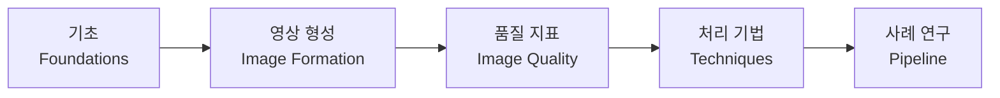

# Mammogram Processing for All

!!! abstract "이 문서는"

    유방촬영(mammography) RAW 영상을 진단·판독에 적합한 표시 영상으로 변환하는 **영상 처리(image processing)** 전 과정을, 물리적 기초부터 최신 알고리즘까지 서베이(survey) 수준으로 정리한 기술 문서입니다. 임상 개념과 X-ray 물리, 디지털 디텍터의 비선형 응답에서 출발하여, 특성 곡선·windowing·LUT 같은 톤 매핑 도구, MTF 등 영상 품질 지표, 그리고 가장 단순한 점 연산에서 다중스케일·딥러닝까지 이어지는 처리 기법을 다룹니다. 마지막으로 이 모든 이론이 실제 코드에서 어떻게 결합되는지 [3-Tier 파이프라인 사례](pipeline/three-tier.md)로 묶습니다.

## 왜 맘모그램 영상 처리인가

유방촬영은 **저대조도 병변(종괴)** 과 **수십 µm 크기의 미세석회화(microcalcification)** 를, 지방조직과 섬유선조직이 겹쳐 만드는 넓은 동적 범위(dynamic range) 안에서 **동시에** 보여 주어야 합니다. 디텍터가 받아 낸 RAW 신호는 조직 두께·밀도에 대해 [지수적(비선형)으로 변하기](foundations/detector.md) 때문에, 그대로는 사람 눈이나 디스플레이에 맞지 않습니다. 이 간극을 메우는 것이 영상 처리의 역할입니다.

## 문서 구조

이 문서는 "물리 → 표현 → 측정 → 기법 → 실제 구현" 순서로 읽도록 구성했습니다.

### 1. 기초 (Foundations)

| 페이지 | 내용 |
| --- | --- |
| [맘모그램의 개념과 임상적 배경](foundations/mammography.md) | 유방촬영의 목적, 정상 해부, 주요 소견, 촬영 뷰, BI-RADS |
| [유방촬영 장비의 기본 구조](foundations/system.md) | X-ray tube·필터·압박·grid·AEC·검출기로 이어지는 영상 사슬 |
| [X-ray의 성질과 감쇠](foundations/xray-physics.md) | X-ray 생성, 물질 상호작용, Beer–Lambert 지수 감쇠, 대조도 |
| [디지털 디텍터와 신호의 비선형성](foundations/detector.md) | 검출기 응답, RAW 신호가 두께에 대해 비선형인 이유, log 선형화의 동기 |

### 2. 영상 형성과 톤 매핑 (Image Formation)

| 페이지 | 내용 |
| --- | --- |
| [처리 파이프라인 개요](image-formation/pipeline-overview.md) | RAW→표시 영상 전체 흐름, For Processing vs For Presentation |
| [특성 곡선과 톤 매핑](image-formation/characteristic-curves.md) | H&D 곡선, log·gamma·sigmoid, DRC, DICOM GSDF |
| [Windowing, WW/WL, Flatten](image-formation/windowing.md) | window width/level, 조도 평탄화, 자동 windowing |
| [LUT (Look-Up Table)](techniques/lut.md) | 톤 매핑 가속, 1D/3D LUT, DICOM Modality/VOI/Presentation LUT |

### 3. 영상 품질 지표 (Image Quality)

| 페이지 | 내용 |
| --- | --- |
| [영상 품질 지표](image-quality/metrics.md) | 분해능·PSF/LSF, **MTF**, NPS, DQE, SNR/CNR, ROC, 팬텀 |

### 4. 처리 기법 (Techniques) — 가장 단순한 것부터 최신까지

| 페이지 | 내용 |
| --- | --- |
| [기법 개요와 분류](techniques/index.md) | 분류 체계와 연대기적 발전, 읽는 순서 |
| [점 연산](techniques/point-operations.md) | windowing·gamma·히스토그램 평활화·CLAHE |
| [Smoothing과 Denoising](techniques/smoothing.md) | 선형 필터→에지보존 필터→morphology |
| [Sharpening과 Edge Enhancement](techniques/sharpening.md) | 미분 연산자, unsharp masking, 적응형 강조 |
| [Contrast Enhancement](techniques/contrast-enhancement.md) | 전역·국소·다중스케일 대조도 향상, DRC |
| [다중스케일 분해와 변환영역](techniques/multiscale.md) | 라플라시안 피라미드, 웨이브렛, MUSICA, local Laplacian |
| [Peripheral Equalization과 두께 보상](techniques/peripheral-equalization.md) | 외곽 두께 보정, flatten, normalized convolution |
| [최신 동향: 학습 기반 처리](techniques/modern-dl.md) | 딥러닝 denoising·enhancement·복원과 그 위험 |

### 5. 사례 연구 (Pipeline)

| 페이지 | 내용 |
| --- | --- |
| [3-Tier 맘모그래피 향상 파이프라인](pipeline/three-tier.md) | 실제 구현 코드로 보는 전체 파이프라인 |

## 처음 읽는다면

- **빠르게 큰 그림부터**: [처리 파이프라인 개요](image-formation/pipeline-overview.md) → [기법 개요](techniques/index.md) → [사례 연구](pipeline/three-tier.md)
- **물리부터 차근차근**: [기초](foundations/mammography.md)부터 순서대로

---

이 사이트의 마크다운 작성 규칙과 사용 가능한 확장 문법은 [Markdown 작성 가이드](examples.md)를 참고하세요.
