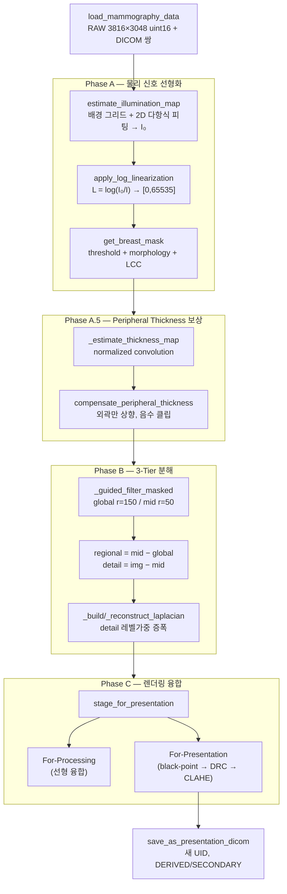

# 사례 연구: 3-Tier 맘모그래피 향상 파이프라인

!!! abstract "요약"
    이 페이지는 단일 참조 구현(`references/euiju/heo_mammo_0608.py`)을 처음부터 끝까지 해부하여, 앞선 이론 페이지들이 실제 코드에서 어떻게 결합되는지를 보이는 구체적인 사례 연구(case study)다. 파이프라인은 RAW 검출기 신호를 입력으로 받아 다음 네 단계를 거친다.

    1. **Phase A — 물리 신호 선형화**: 조명 맵(illumination map) $I_0$ 추정 → log 선형화 $L=\log(I_0/I)$ → 유방 마스크(mask) 생성.
    2. **Phase A.5 — Peripheral thickness 보상**: 정규화 컨볼루션(normalized convolution)으로 외곽 두께 구배(wedge)를 추정하고, 얇은 가장자리만 선택적으로 상향 보정.
    3. **Phase B — 3-Tier 분해**: cascaded guided filter로 global / regional / detail 세 계층으로 분해하고, detail은 Laplacian pyramid로 증폭.
    4. **Phase C — 렌더링 융합**: 선형 융합(For-Processing) 출력과 톤매핑(For-Presentation) 출력 두 가지를 생성하고, 후자를 DICOM으로 저장.

    전체 흐름은 [파이프라인 개요](../image-formation/pipeline-overview.md)의 일반 모델을 구체화한 것이며, 두 종류의 출력(For-Processing vs For-Presentation)이라는 구분이 핵심 설계 결정이다.

## 1. 개요와 전체 파이프라인

맘모그래피 RAW 영상은 검출기에 도달한 광자 수(quanta)에 비례하는 선형 신호이지만, 사람이 보기에는 부적합하다. X-ray 감쇠가 지수적이고([X-ray 감쇠](../foundations/xray-physics.md)), 검출기 응답이 비선형 구간을 포함하며([디텍터 비선형성](../foundations/detector.md)), 유방 외곽은 압박 두께가 얇아 신호가 과도하게 밝아진다(wedge/heel 효과). 이 파이프라인은 그 세 가지 왜곡을 차례로 제거한 뒤, 다중스케일 분해로 진단적으로 중요한 구조(미세석회·종괴·혈관벽)를 선택적으로 강조한다.



!!! note "For-Processing vs For-Presentation"
    의료영상 표준에서 **For-Processing** 영상은 후속 알고리즘(CAD, 정량분석)을 위한 선형성에 가까운 데이터이고, **For-Presentation** 영상은 사람이 판독하도록 톤매핑·대비강조·CLAHE가 적용된 데이터다. 이 코드의 `stage_for_presentation`은 한 번의 호출에서 두 출력을 모두 만들어낸다. 자세한 위치는 [파이프라인 개요](../image-formation/pipeline-overview.md) 참조.

## 2. 데이터 I/O

### 2.1 RAW + DICOM 쌍 적재

RAW 영상은 헤더 없는 순수 픽셀 덤프다. 따라서 해상도(3816×3048), 바이트 순서(little-endian), 비트심도(uint16)를 코드가 알고 있어야 `np.fromfile`로 올바르게 복원할 수 있다.

```py
def load_mammography_data(root_dir, folders_range=(0, 10)):
    RAW_HEIGHT, RAW_WIDTH = 3816, 3048
    RAW_DTYPE = np.dtype('<u2')          # little-endian unsigned 16-bit
    ...
    raw_array = np.fromfile(raw_path, dtype=RAW_DTYPE).reshape((RAW_HEIGHT, RAW_WIDTH))
```

각 RAW 파일은 동일한 베이스 이름의 `*.dcm` 파일과 짝지어 적재된다. DICOM의 `pixel_array`(제조사 처리 결과)는 일종의 정답(ground truth) 참조로 활용되고, 메타데이터는 출력 저장 시 재사용된다.

### 2.2 For-Presentation DICOM 저장

처리된 uint16 배열을 참조 DICOM 메타데이터에 주입하되, 새 영상임을 표시하기 위해 새 UID를 부여하고 `ImageType`을 `DERIVED/SECONDARY`로 설정한다.

```py
def save_as_presentation_dicom(img_array, reference_dcm_path, output_path):
    dcm = pydicom.dcmread(reference_dcm_path)
    dcm.SOPInstanceUID = pydicom.uid.generate_uid()
    dcm.SeriesInstanceUID = pydicom.uid.generate_uid()
    dcm.ImageType = ['DERIVED', 'SECONDARY', 'OTHER']
    dcm.PixelData = img_array.tobytes()
    dcm.Rows, dcm.Columns = img_array.shape

    fg_pixels = img_array[img_array > 0]
    p_min, p_max = np.percentile(fg_pixels, (2, 98))
    dcm.WindowWidth  = int(p_max - p_min)
    dcm.WindowCenter = int((p_max + p_min) / 2)
```

!!! tip "percentile 기반 WW/WL"
    `WindowWidth`/`WindowCenter`는 전경 픽셀의 2–98 percentile로 산출된다. 이는 뷰어가 영상을 열었을 때 기본 [windowing](../image-formation/windowing.md)이 진단 영역을 합리적으로 펼치도록 하는 초기값(initial WW-WL)이다. 극단값(0 또는 포화)을 잘라내므로 대비가 과도하게 압축되지 않는다.

## 3. Phase A — 물리 신호 선형화

목표는 RAW 신호 $I$를 X-ray가 통과한 조직의 누적 감쇠량에 비례하는 양으로 바꾸는 것이다. 이상적으로는 Beer–Lambert 법칙 $I = I_0 e^{-\mu t}$에서

$$
L \;=\; \log\!\frac{I_0}{I} \;=\; \mu\, t,
$$

즉 로그 영상이 두께·감쇠계수 곱에 선형이다([X-ray 감쇠](../foundations/xray-physics.md), [디텍터 비선형성](../foundations/detector.md)). 문제는 $I_0$(빈 빔/조명 맵)이 시야 전체에서 일정하지 않다는 점이다.

### 3.1 조명 맵 $I_0$ 추정

`estimate_illumination_map`은 유방 바깥의 직접 노출 영역(배경)을 표본화하여 $I_0$를 공간적으로 추정한다. Otsu 이진화 + 최대 연결 요소(LCC)로 배경을 잡고, 경계 오염을 막기 위해 30×30 erosion으로 안전 영역을 만든 뒤, `grid_size=100` 격자마다 95-percentile을 표본으로 모은다. 이 표본을 차수 `degree=2`의 2D 다항식에 최소자승(least squares)으로 피팅한다.

```py
def _get_polynomial_basis(x_val, y_val, deg):
    basis = [(x_val**i) * (y_val**j)
             for i in range(deg + 1)
             for j in range(deg + 1 - i)]
    return np.column_stack(basis)

def estimate_illumination_map(raw_array, degree=2, grid_size=100):
    ...
    safe_bg_mask = cv2.erode(bg_mask, np.ones((30, 30), np.uint8), iterations=1)
    for y in range(0, h, grid_size):
        for x in range(0, w, grid_size):
            block_mask = safe_bg_mask[y:..., x:...]
            if np.mean(block_mask) > 0.9:                      # 거의 순수 배경 블록만
                z_val = np.percentile(raw_array[y:..., x:...], 95)
                ...
    A = _get_polynomial_basis(sx / w, sy / h, degree)
    coeffs, _, _, _ = np.linalg.lstsq(A, sz, rcond=None)
    X, Y = np.meshgrid(np.arange(w), np.arange(h))
    full_basis = _get_polynomial_basis(X.flatten()/w, Y.flatten()/h, degree)
    i0_map = (full_basis @ coeffs).reshape(h, w)
    i0_floor = float(np.percentile(positive_pixels, 50))
    return np.clip(i0_map, a_min=i0_floor, a_max=None)
```

??? info "왜 다항식 피팅인가"
    빈 빔 영상이 없으므로 $I_0$는 측정할 수 없다. 대신 유방 그림자가 없는 배경 영역의 밝기는 거의 순수 $I_0$이므로, 그 표본을 매끄러운 저차 다항식으로 외삽하면 유방 아래 영역의 $I_0$도 합리적으로 복원된다. 차수가 너무 높으면 표본 잡음에 과적합하므로 2차로 제한한다. `i0_floor`(중앙값 클립)는 외삽이 음수/0으로 발산하여 로그가 폭발하는 것을 막는다.

### 3.2 log 선형화

```py
def apply_log_linearization(raw_array, i0_map):
    EPSILON = 1.0
    linearized = np.log(np.clip(i0_map, EPSILON, None) / np.clip(raw_array, EPSILON, None))
    linearized = np.clip(linearized, 0, None)        # 음수(배경) 제거
    l_max = linearized.max()
    result = (linearized / l_max * 65535) if l_max > 0 else linearized
    return result.astype(np.uint16)
```

$L=\log(I_0/I)$를 계산하고 $[0,65535]$로 정규화한다. 이 변환은 곧 영상 밝기를 [특성 곡선](../image-formation/characteristic-curves.md)의 선형 구간으로 끌어오는 작업이다. 음수 클립은 $I>I_0$인 배경 픽셀(잡음)을 0으로 만든다.

### 3.3 유방 마스크 생성

```py
def get_breast_mask(img, mask_thresh=1000):
    _, thresh = cv2.threshold(thresh_input, mask_thresh, 255, cv2.THRESH_BINARY)
    kernel = cv2.getStructuringElement(cv2.MORPH_ELLIPSE, (5, 5))
    thresh = cv2.morphologyEx(thresh, cv2.MORPH_CLOSE, kernel)   # 구멍 메우기
    thresh = cv2.morphologyEx(thresh, cv2.MORPH_OPEN,  kernel)   # 점잡음 제거
    num_labels, labels, stats, _ = cv2.connectedComponentsWithStats(thresh)
    largest_label = 1 + np.argmax(stats[1:, cv2.CC_STAT_AREA])   # 최대 연결요소(LCC)
    return np.where(labels == largest_label, 255, 0).astype(np.uint8)
```

임계값 이진화 후 close → open [morphology/마스크](../techniques/smoothing.md) 연산으로 경계를 정리하고, 최대 연결 요소(largest connected component)만 남겨 유방 본체를 분리한다. 이후 모든 단계는 이 마스크 내부에서만 작동한다.

## 4. Phase A.5 — Peripheral Thickness 보상

압박된 유방은 가장자리로 갈수록 두께가 얇아져(wedge) X-ray가 덜 감쇠되고, 따라서 외곽이 과도하게 밝게 나타난다. 이 단계는 두께 구배를 추정하여 얇은 외곽만 선택적으로 끌어올린다. 이론적 배경은 [peripheral equalization/두께 보상](../techniques/peripheral-equalization.md)에 정리되어 있다.

### 4.1 두께 맵 추정 — 정규화 컨볼루션

마스크 경계에서 단순 Gaussian blur를 쓰면 배경(0)이 섞여 들어와 외곽 밝기를 과소추정하고 halo를 만든다. 정규화 컨볼루션은 마스크로 가중한 blur를 마스크 자체의 blur로 나눠 이를 보정한다.

$$
T(x,y) \;=\; \frac{G_\sigma * (I \cdot m)}{G_\sigma * m}.
$$

```py
def _estimate_thickness_map(img_f, mask, radius, downsample_factor=4):
    ...
    numer = cv2.GaussianBlur(img_ds * mask_f, (0, 0), sigmaX=sigma)
    denom = cv2.GaussianBlur(mask_f,          (0, 0), sigmaX=sigma)

    DENOM_THRESH = 0.15      # 1e-6 → 0.15 로 강화
    valid_vals = numer[denom > DENOM_THRESH] / (denom[denom > DENOM_THRESH] + 1e-6)
    fill_val   = float(np.median(valid_vals)) if len(valid_vals) > 0 else 0.0
    thick_ds   = np.where(denom > DENOM_THRESH, numer / (denom + 1e-6), fill_val)
```

!!! warning "Halo 방지 설계 — denom 임계 0.15와 중앙값 채움"
    경계부에서는 분모 $G_\sigma*m$가 0에 가까워져 $T$가 폭발적으로 커진다. 코드는 두 가지 장치로 이를 막는다.

    - **denom 임계값 0.15**: 분모가 작은 불안정 픽셀을 아예 나눗셈에서 제외한다(일반적 1e-6 대비 강화).
    - **중앙값 채움(fill_val)**: 제외한 픽셀을 0이 아니라 유효 영역의 중앙값으로 채운다. 만약 0으로 채우면 뒤의 보정식 `correction = 0 − t_ref < 0`이 되어 과보정(over-correction)으로 오히려 halo가 생긴다.

    연산은 `downsample_factor=4`로 축소한 저해상도에서 수행해 속도를 높이고, 마지막에 원해상도로 복원한다.

### 4.2 보정 적용 — 외곽만 상향

```py
def compensate_peripheral_thickness(processed_raw, mask, radius_wedge=300, ...):
    img_f = processed_raw.astype(np.float32) / 65535.0
    thickness_map = _estimate_thickness_map(img_f, mask, radius=radius_wedge, ...)
    t_ref = float(np.percentile(fg_pixels, 90))               # 두꺼운 중심부 기준
    correction  = np.clip(thickness_map - t_ref, None, 0.0)   # 외곽(얇은 곳)만 음수
    compensated = np.clip(img_f - correction, 0.0, None)      # img - (음수) = 상향
    compensated[mask == 0] = 0.0
    return (compensated * 65535.0).astype(np.uint16)
```

기준값 $t_\text{ref}$를 전경 90-percentile(두꺼운 중심부 두께)로 잡고, $T < t_\text{ref}$인 얇은 외곽에서만 `correction`이 음수가 된다. `img − correction`은 그 영역을 끌어올리고, 중심부는 `np.clip(..., None, 0.0)`에 의해 건드리지 않는다. 즉 **얇은 곳만 밝게 보정하고 두꺼운 곳은 보존**하는 단방향 보정이다.

## 5. Phase B — 3-Tier 분해

선형화·보상된 영상을 주파수 대역별 세 계층으로 분해한다([다중스케일 분해](../techniques/multiscale.md)). 분해의 뼈대는 반복 적용되는 edge-preserving guided filter[^gf]다.

### 5.1 마스크 인식 Guided Filter

```py
def _guided_filter_masked(img_float, mask, radius, eps):
    mask_f = (mask > 0).astype(np.float32)
    sigma  = float(radius) * 0.6
    numer  = cv2.GaussianBlur(img_float * mask_f, (0, 0), sigmaX=sigma)
    denom  = cv2.GaussianBlur(mask_f,             (0, 0), sigmaX=sigma)
    filled = np.where(denom > 1e-6, numer / (denom + 1e-6), 0.0)
    filled[mask > 0] = img_float[mask > 0]                    # 전경은 원값 보존, 배경만 외삽
    result = cv2.ximgproc.guidedFilter(guide=filled, src=filled, radius=radius, eps=eps)
    result[mask == 0] = 0.0
    return result
```

guided filter를 마스크 경계에 그대로 적용하면 0인 배경이 평활화에 섞여 경계 halo가 생긴다. 그래서 배경을 전경값으로 외삽(normalized convolution)하여 채운 뒤 필터를 돌리고, 끝에서 배경을 다시 0으로 복원한다.

### 5.2 세 계층 분리와 detail 증폭

```py
def stage_decomposition(processed_raw, mask, pyr_levels=5,
                        radius_global=150, radius_regional=50,
                        eps_global=0.01, eps_regional=0.001):
    img_float    = processed_raw.astype(np.float32) / 65535.0
    global_layer = _guided_filter_masked(img_float, mask, radius=150, eps=0.01)   # 초저주파
    mid_layer    = _guided_filter_masked(img_float, mask, radius=50,  eps=0.001)  # 중주파

    regional_layer = mid_layer - global_layer     # 중간 주파수 국소 조직
    detail_layer   = img_float - mid_layer         # 고주파 미세 구조

    # 경계 Halo 억제: 양수 성분만 경계에서 감쇠, 음수(실제 조직)는 보존
    dist = cv2.distanceTransform(mask.astype(np.uint8), cv2.DIST_L2, 5)
    boundary_fade = np.clip(dist / 30.0, 0.0, 1.0)
    regional_layer = (np.maximum(regional_layer, 0.0) * boundary_fade
                      + np.minimum(regional_layer, 0.0))

    # 고주파 우선 증폭 가중치
    weights = [2.0, 2.0, 1.5, 1.0, 0.5]
    lp, residual = _build_laplacian_pyramid(detail_layer, pyr_levels)
    enhanced_detail = _reconstruct_from_laplacian(lp, residual, weights)
    return global_layer, regional_layer, enhanced_detail
```

세 계층의 의미는 다음과 같다.

| 계층 | 정의 | 주파수 | 담는 정보 |
|------|------|--------|-----------|
| `global_layer` | guided filter (r=150) | 초저주파 | 두께 구배·전체 밝기 |
| `regional_layer` | mid(r=50) − global | 중주파 | 국소 조직 구조·종괴 |
| `detail_layer` → `enhanced_detail` | img − mid, Laplacian 증폭 | 고주파 | 미세석회·혈관벽 |

detail 계층은 Laplacian pyramid[^lp]로 다시 5단계로 쪼갠 뒤, 레벨별 가중치 `[2.0, 2.0, 1.5, 1.0, 0.5]`로 재합성한다. `lp[0]`이 최고주파(미세석회)이므로 가장 크게 증폭하고, 저주파로 갈수록 완화한다.

```py
def _build_laplacian_pyramid(img, levels):
    gp = [img]
    for _ in range(levels):
        gp.append(cv2.pyrDown(gp[-1]))
    lp = []
    for i in range(levels):
        size = (gp[i].shape[1], gp[i].shape[0])
        lp.append(cv2.subtract(gp[i], cv2.pyrUp(gp[i + 1], dstsize=size)))
    return lp, gp[-1]

def _reconstruct_from_laplacian(lp, residual, weights):
    R = residual
    for i in range(len(lp) - 1, -1, -1):
        size = (lp[i].shape[1], lp[i].shape[0])
        R = cv2.add(cv2.pyrUp(R, dstsize=size), lp[i] * weights[i])
    return R
```

!!! note "regional 경계 soft fade의 비대칭성"
    `regional_layer`의 경계 처리는 distance transform 기반 fade를 **양수 성분에만** 적용한다. 양수 잔차는 경계 halo의 주범이므로 30px 안쪽으로 선형 감쇠시키지만, 음수 잔차(실제 조직·미세석회의 어두운 신호)는 그대로 보존한다. 모든 성분을 일괄 감쇠(blanket fade)하면 경계 안쪽의 유효 신호까지 지워지기 때문이다.

## 6. Phase C — 렌더링 융합

`stage_for_presentation`은 세 계층을 선형 결합한 뒤, For-Processing(선형)과 For-Presentation(톤매핑) 두 출력을 만든다([contrast enhancement/DRC](../techniques/contrast-enhancement.md)).

### 6.1 선형 융합과 For-Processing 출력

```py
def stage_for_presentation(global_layer, regional_layer, enhanced_detail, mask,
                           equalization_alpha=0.7, regional_gain=1.5, detail_gain=1.5,
                           gamma=2.5, clahe_clip=1.0, clahe_blend=0.1):
    suppressed_global  = global_layer * (1.0 - equalization_alpha)   # 두께 구배 억제
    amplified_regional = regional_layer * regional_gain
    fused_float        = suppressed_global + amplified_regional + (enhanced_detail * detail_gain)

    # ── For-Processing 출력: 단순 min-max 정규화(선형) ──
    fp_min, fp_max = np.percentile(fused_float[mask > 0], (0.0, 100.0))
    fp_norm = np.clip((fused_float - fp_min) / (fp_max - fp_min + 1e-6), 0.0, 1.0)
    for_proc_img_out = (fp_norm * 65535.0).astype(np.uint16)
```

`equalization_alpha`만큼 global을 억제하면 두께 구배가 평탄화되어 [peripheral equalization](../techniques/peripheral-equalization.md)과 같은 효과가 난다. For-Processing 출력은 여기서 멈추고 선형 정규화만 하므로 후속 정량분석에 적합하다.

### 6.2 For-Presentation: black-point → DRC → CLAHE

```py
    # B-1: Black Point Clipping (하위 3%만 클리핑하여 가장자리 신호 보존)
    p_min, p_max = np.percentile(valid_pixels, (3, 99.5))
    fused_norm = np.clip((fused_float - p_min) / (p_max - p_min + 1e-6), 0.0, 1.0)

    # B-2: Differential Tone Compression (배경만 선택 압축, 미세 구조 보존)
    smooth_bg = cv2.GaussianBlur(fused_norm, (0, 0), sigmaX=20.0)
    fine_str  = fused_norm - smooth_bg
    smooth_bg = np.power(np.clip(smooth_bg, 1e-6, 1.0), gamma) * 0.85   # 배경 gamma 압축
    fused_norm = np.clip(smooth_bg + fine_str * 1.5, 0.0, 1.0)         # 미세 구조 ×1.5 재합성

    # B-3: CLAHE (마스크 ROI 전용)
    fused_16bit = (fused_norm * 65535.0).astype(np.uint16)
    clahe = cv2.createCLAHE(clipLimit=clahe_clip, tileGridSize=(16, 16))
    roi_patch  = fused_16bit[y0:y1, x0:x1].copy()
    clahe_patch = clahe.apply(roi_patch)
    blended_patch = cv2.addWeighted(clahe_patch, clahe_blend, roi_patch, 1.0 - clahe_blend, 0)
    roi_patch[roi_mask > 0] = blended_patch[roi_mask > 0]
    fused_16bit[y0:y1, x0:x1] = roi_patch
    final_img_out = fused_16bit
    final_img_out[mask == 0] = 0
```

세 단계가 사람 판독용 톤을 만든다.

- **B-1 Black point clipping**: 하위 3% / 상위 99.5%로 클리핑. 하위를 3%로만 자르는 이유는 외곽의 얇은 신호를 검게 죽이지 않기 위해서다([특성 곡선](../image-formation/characteristic-curves.md)의 어깨/발 구간 제어).
- **B-2 Differential tone compression(DRC)**: 영상을 매끄러운 배경(`smooth_bg`)과 미세 구조(`fine_str`)로 나눠, 배경에만 $\text{gamma}=2.5$ 압축을 가하고 미세 구조는 1.5배 증폭해 재합성한다. 전역 gamma가 미세 구조까지 뭉개는 것을 피하는 동적 범위 압축(dynamic range compression) 기법이다.
- **B-3 CLAHE**: 마스크 ROI에만 적용하고, `clahe_blend`로 원본과 가중 혼합한다([CLAHE/점연산](../techniques/point-operations.md)). 16비트 정밀도를 유지하며, 배경(마스크 외부)은 CLAHE의 영향에서 제외해 경계 잡음 증폭을 막는다.

!!! example "메인 실행부에서 실제로 쓰인 파라미터"
    `process_mammography_dataset`의 기본 호출은 함수 시그니처의 기본값과 다르다. 실제 운용 값은 다음과 같다.
    ```py
    stage_for_presentation(..., equalization_alpha=0.85, regional_gain=0.8,
                            detail_gain=3.0, clahe_clip=2.0, clahe_blend=0.1)
    ```
    즉 global을 더 강하게 억제(0.85)하고, regional은 약하게(0.8), detail은 강하게(3.0) 강조하는 쪽으로 튜닝되어 있다.

최종 결과는 `save_as_presentation_dicom`을 통해 새 UID가 부여된 For-Presentation DICOM으로 저장된다. 이때 결정되는 WindowWidth/WindowCenter가 곧 뷰어의 [LUT](../techniques/lut.md)·[windowing](../image-formation/windowing.md) 초기값이 된다.

## 7. 파라미터 요약

| Stage | 함수 | 핵심 파라미터(기본값) | 효과 |
|-------|------|----------------------|------|
| A | `estimate_illumination_map` | `degree=2`, `grid_size=100` | $I_0$ 다항식 차수·표본 격자 크기 |
| A | `apply_log_linearization` | `EPSILON=1.0` | log 분모/분자 하한, 0 발산 방지 |
| A | `get_breast_mask` | `mask_thresh=1000` (메인 1300) | 유방 분리 임계값 |
| A.5 | `_estimate_thickness_map` | `DENOM_THRESH=0.15`, `downsample_factor=4` | halo 방지 분모 임계·속도 |
| A.5 | `compensate_peripheral_thickness` | `radius_wedge=300`, `t_ref=p90` | 외곽 보상 범위·기준 두께 |
| B | `stage_decomposition` | `radius_global=150`, `radius_regional=50`, `eps_global=0.01`, `eps_regional=0.001` | 계층 분리 스케일·평활 강도 |
| B | Laplacian 재합성 | `weights=[2,2,1.5,1,0.5]`, `pyr_levels=5`, `BOUNDARY_FADE_PX=30` | detail 레벨별 증폭·경계 fade |
| C | `stage_for_presentation` | `equalization_alpha=0.85`, `regional_gain=0.8`, `detail_gain=3.0` | 계층 융합 비율 |
| C | DRC / CLAHE | `gamma=2.5`, `sigmaX=20`, fine×1.5, `clahe_clip=2.0`, `clahe_blend=0.1`, `tile=(16,16)` | 톤 압축·국소 대비 |
| I/O | `save_as_presentation_dicom` | WW/WL = p2–p98 | 뷰어 초기 windowing |

## 8. 한계와 향후 개선

소스 파일 상단의 주석 `# 유선 조직 소실, 보완 필요`가 가장 중요한 한계를 정확히 지목한다.

- **유선 조직 신호 약화**: Phase A.5의 외곽 두께 보상은 얇은 가장자리를 밝게 끌어올리는데, 그 영역에 실제 유선 조직(fibroglandular tissue)이 있으면 두께 구배와 조직 신호를 구분하지 못하고 함께 평탄화되어 진단 정보가 손실될 수 있다. wedge 효과와 조직 신호의 분리가 본질적으로 불완전하다.
- **Halo / 과보정 트레이드오프**: `DENOM_THRESH=0.15`, 중앙값 채움, 비대칭 boundary fade 등은 모두 halo를 억제하려는 휴리스틱이다. 보상을 강하게 할수록 halo 위험이 커지고, 약하게 하면 외곽 평탄화가 불충분해지는 트레이드오프가 남는다.
- **정량 평가 부재**: 현재 검증은 제조사 DICOM과의 육안 비교(메인 실행부 plot)에 의존한다. CNR/SNR, 미세석회 검출률 등 정량 [품질지표](../image-quality/metrics.md)로 파라미터를 객관적으로 튜닝할 필요가 있다.
- **수작업 파라미터 튜닝**: 10여 개 파라미터가 영상별로 최적값이 다를 수 있다. 두께 보상·다중스케일 분해를 학습 기반(예: 두께 회귀, 대비강조용 U-Net)으로 대체하면 영상별 적응성과 유선 조직 보존을 동시에 개선할 여지가 있다(딥러닝 대안).

## 참고문헌

[^gf]: K. He, J. Sun, X. Tang, "Guided Image Filtering," *ECCV* 2010 / *IEEE TPAMI* 2013. 본 파이프라인의 global·regional 계층 분해에 사용된 edge-preserving 평활 필터.

[^lp]: P. J. Burt, E. H. Adelson, "The Laplacian Pyramid as a Compact Image Code," *IEEE Trans. Communications*, 1983. detail 계층의 다중스케일 증폭에 사용.

- Peripheral equalization / thickness compensation: U. Bick et al., "Density correction of peripheral breast tissue on digital mammograms," *RadioGraphics*, 1996 — 외곽 두께 보상의 고전적 근거.
