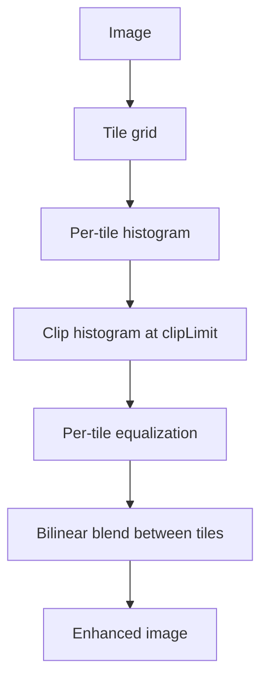
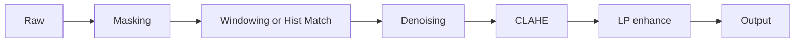

# CLAHE

**CLAHE (Contrast Limited Adaptive Histogram Equalization)** 는 이미지를 작은 타일(tile)로 나누어 **각 타일별로 히스토그램 균등화를 적용**한다. 두 가지 파라미터로 동작이 결정된다.

- `tileGridSize` — 타일 격자 크기. 예: `(8, 8)` 이면 8×8 = 64개 타일.
- `clipLimit` — 한 타일 안에서 히스토그램 피크를 자르는 한계. 너무 높으면 노이즈도 증폭, 너무 낮으면 효과 미미.

타일별 변환 후 경계 부분은 **bilinear interpolation**으로 부드럽게 이어 붙여 격자 흔적을 없앤다.



## OpenCV 한 줄 사용

```python title="clahe.py" linenums="1"
import cv2
import numpy as np

def apply_clahe(img_u8: np.ndarray,
                clip_limit: float = 0.03,
                tile_grid: tuple[int, int] = (8, 8)) -> np.ndarray:
    """img_u8: uint8 grayscale."""
    clahe = cv2.createCLAHE(clipLimit=clip_limit, tileGridSize=tile_grid)
    return clahe.apply(img_u8)
```

!!! note "16비트 입력"
    OpenCV CLAHE는 `uint8` 또는 `uint16`을 받지만, 보통 윈도잉으로 8비트로 줄인 뒤 적용한다. 16비트 그대로 적용하려면 `clipLimit`을 더 낮게 조정해야 한다.

## 파라미터 감각

| `clipLimit` | 효과 |
|------------|------|
| 0.005~0.01 | 보수적, 노이즈 증폭 최소 |
| 0.02~0.05 | mammography 일반 권장 |
| 0.10 이상 | 공격적, 미세 구조 강조 (노이즈도 증폭) |

| `tileGridSize` | 효과 |
|--------------|------|
| (4, 4) | 매우 거시적, 전역 HE에 가까움 |
| (8, 8) | 일반 권장 |
| (16, 16) | 국소 대비 강조 (병변 가시화) |
| (32, 32) | 너무 작은 영역, 타일별 통계 불안정 |


## 적용 순서

CLAHE의 위치는 파이프라인 끝부분이 일반적이다.



- 노이즈가 큰 이미지에 먼저 CLAHE를 걸면 노이즈가 함께 증폭된다 → [Denoising](denoising.md) 다음에 적용
- 주파수 대역별 강조([Laplacian Pyramid](laplacian-pyramid.md))를 함께 쓸 때는 LP의 입력 신호 콘트라스트를 CLAHE가 미리 끌어올려두는 형태가 자연스럽다

## 마스크와 함께 사용

배경 영역까지 CLAHE에 노출시키면 타일별 통계가 왜곡된다. 보통은 [Breast Masking](masking.md)으로 구한 마스크 안쪽에만 적용한다.

```python title="masked_clahe.py" linenums="1"
def masked_clahe(img_u8, mask, clip_limit=0.03, tile_grid=(8, 8)):
    clahe = cv2.createCLAHE(clipLimit=clip_limit, tileGridSize=tile_grid)
    enhanced = clahe.apply(img_u8)
    out = img_u8.copy()
    out[mask.astype(bool)] = enhanced[mask.astype(bool)]
    return out
```

## 16-bit ROI 부분 적용 (blend) { #16-bit-roi }

표시용 8비트로 줄이기 전 **16비트 그대로** CLAHE를 적용하면 정보 손실을 줄일 수 있다(`clip_limit`은 낮게). 또한 강화 강도를 미세 조절하려면 결과를 통째로 쓰지 말고 **원본과 가중 혼합(blend)** 한다 — 과증폭과 노이즈를 억제하면서 대비만 일부 끌어올린다. 연산은 마스크의 ROI 박스 안에서만 수행해 비용을 줄인다([RAW→DCM 복원](raw-to-dcm.md)의 표시 렌더링 단계에서 사용).

```python title="clahe_16bit_blend.py"
def clahe_roi_blend(img_u16, mask, clip_limit=1.0, tile=(16, 16), blend=0.1):
    clahe = cv2.createCLAHE(clipLimit=clip_limit, tileGridSize=tile)
    ys, xs = np.where(mask > 0)
    y0, y1, x0, x1 = ys.min(), ys.max() + 1, xs.min(), xs.max() + 1
    roi = img_u16[y0:y1, x0:x1]
    enhanced = clahe.apply(roi)                                  # uint16 그대로
    blended = cv2.addWeighted(enhanced, blend, roi, 1.0 - blend, 0)
    out = img_u16.copy()
    out[y0:y1, x0:x1][mask[y0:y1, x0:x1] > 0] = blended[mask[y0:y1, x0:x1] > 0]
    return out
```

`blend=0.1`이면 CLAHE 효과를 10%만 섞는다. 미세석회화 가시화처럼 강하게 강조해야 할 때는 비중을 높인다.

## 한계

- 미세석회화 같은 **고주파 디테일은 CLAHE만으로 충분히 강조되지 않는다** — [Laplacian Pyramid](laplacian-pyramid.md) 등 주파수 분해와 결합
- 타일 경계가 큰 균일 영역에서 부드러운 그라데이션을 도입할 수 있음 — `tileGridSize`를 너무 크게 잡지 않기
- 윈도잉 후 8비트로 양자화된 이미지에 적용하면 16비트 원본보다 정보 손실이 크다 — 가능하면 윈도잉 직전에 적용
