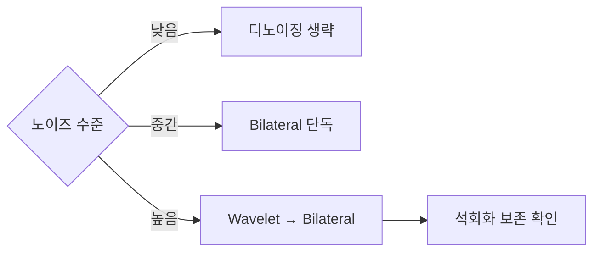

# Denoising

## Mammography 디노이징

Mammography의 노이즈는 균일한 검정 영역에서는 잘 보이지만, **임상적으로 중요한 미세 구조 — 미세석회화(microcalcification), 종괴 변연(margin), 구조왜곡(architectural distortion) — 은 노이즈와 같은 고주파 대역에 모여 있다.** 단순한 저역통과 필터로 노이즈를 지우면 진단 정보도 함께 지워진다.

따라서 mammography 디노이징은 **에지·미세 구조 보존**과 **노이즈 억제**를 동시에 해야 한다.

## 세 가지 접근 비교

| 기법 | 동작 원리 | 에지 보존 | 비용 | 추천 강도 |
|------|---------|----------|----|--------|
| **FFT 저역통과** | 주파수 영역에서 고주파 차단 | 약함 | 낮음 | ★☆☆ |
| **Wavelet (BayesShrink)** | 웨이블릿 계수의 큰 값(에지)/작은 값(노이즈) 분리 | 중간 | 중간 | ★★☆ |
| **Bilateral Filter** | 공간 거리 + 밝기 차이 동시 고려 가중 평균 | 강함 | 높음 | ★★★ |

## 1. FFT 저역통과 필터

가장 단순한 접근. 이미지를 주파수 영역으로 보내 중앙(저주파)만 통과시킨다.

```python title="fft_lowpass.py" linenums="1"
import numpy as np

def fft_lowpass(img: np.ndarray, sigma: float) -> np.ndarray:
    F  = np.fft.fft2(img)
    Fs = np.fft.fftshift(F)

    rows, cols = img.shape
    cy, cx = rows // 2, cols // 2
    Y, X   = np.ogrid[:rows, :cols]
    mask   = np.exp(-((X - cx) ** 2 + (Y - cy) ** 2) / (2 * sigma ** 2))

    return np.fft.ifft2(np.fft.ifftshift(Fs * mask)).real
```

### 함정 — 석회화를 지운다

저역통과는 "고주파 = 노이즈"라는 가정에 기댄다. Mammography에서는 고주파에 **노이즈 + 미세석회화 + 병변 경계**가 함께 들어 있다. 결과는 일관되게 **뿌연 이미지** — 노이즈만큼 임상 정보도 잃는다.

추가 함정으로, sigma를 이미지 크기에 고정 비율로 잡으면 유방 영역이 작거나 큰 케이스에서 부적합한 차단 주파수가 된다. 이를 보정하려고 **adaptive sigma** (예: bounding box 단변의 3%)를 도입했지만, 실측 결과 폴더 간 변동이 거의 없어 효과가 미미했다 — 입력 분포가 다양하지 않으면 자동 분기가 의미 없다는 [Masking](masking.md)·[CLAHE](clahe.md)에서 본 패턴과 같다.

## 2. Wavelet Denoising (BayesShrink)

웨이블릿 변환은 이미지를 **위치 + 주파수** 두 축으로 표현한다. 큰 계수(에지)와 작은 계수(노이즈)를 분리할 수 있어, 단순 주파수 컷보다 에지를 잘 살린다.

```python title="wavelet_denoise.py" linenums="1"
import numpy as np
import pywt

def wavelet_denoise(img: np.ndarray, wavelet: str = "db4",
                    levels: int = 3, sigma: float | None = None) -> np.ndarray:
    if sigma is None:
        # MAD 노이즈 추정: 가장 미세한(finest) detail subband의 cD(대각) 계수
        # coeffs는 [cA_n, (cH_n, cV_n, cD_n), ..., (cH_1, cV_1, cD_1)] 순서
        coeffs = pywt.wavedec2(img, wavelet=wavelet, level=levels)
        sigma  = np.median(np.abs(coeffs[-1][2])) / 0.6745

    coeffs = pywt.wavedec2(img, wavelet=wavelet, level=levels)
    new = [coeffs[0]]
    for detail in coeffs[1:]:
        new.append(tuple(
            pywt.threshold(c, value=sigma, mode="soft") for c in detail
        ))
    return pywt.waverec2(new, wavelet=wavelet)
```

- `db4` (Daubechies 4) — mammography에 흔히 쓰는 기본 선택
- BayesShrink 등 적응적 임계값을 쓰면 계수 분포에 따라 cutoff를 자동 조정한다
- `mode="soft"` — 임계값보다 작은 계수를 0으로, 큰 계수에서 임계값만큼 뺀다 (artifact 완화)

### 한계

웨이블릿은 FFT보다 낫지만, soft threshold가 작은 진폭의 미세 구조도 함께 깎아낸다. 결과적으로 **약한 석회화**가 사라지는 케이스가 여전히 있다. 그래서 LP·Bilateral과 결합해서 쓴다.

## 3. Bilateral Filter

공간 거리(`sigmaSpace`)와 밝기 차이(`sigmaColor`)를 동시에 가중치로 사용해 평균을 낸다. 에지처럼 밝기 차이가 큰 경계에서는 가중치가 0에 가까워져 거의 평균이 일어나지 않는다.

$$
y(\mathbf{p}) = \frac{1}{W_p} \sum_{\mathbf{q}} G_s(\|\mathbf{p}-\mathbf{q}\|)\, G_r(|x(\mathbf{p})-x(\mathbf{q})|)\, x(\mathbf{q})
$$

```python title="bilateral.py" linenums="1"
import cv2
import numpy as np

def bilateral_denoise(img_u16: np.ndarray, mask: np.ndarray,
                      d: int = 9,
                      sigma_color: float = 50,
                      sigma_space: float = 50) -> np.ndarray:
    img_u8   = (img_u16 / img_u16.max() * 255).astype(np.uint8)
    denoised = cv2.bilateralFilter(
        img_u8, d=d, sigmaColor=sigma_color, sigmaSpace=sigma_space
    )
    out          = img_u16.astype(np.float32).copy()
    out[mask.astype(bool)] = (
        denoised[mask.astype(bool)].astype(np.float32) / 255.0 * img_u16.max()
    )
    return out
```

### 파라미터 감각

| 파라미터 | 작용 |
|---------|------|
| `d` | 필터 반경(픽셀). 0이면 자동 계산. |
| `sigmaColor` | 밝기 차이 허용 범위. 클수록 더 평탄화. |
| `sigmaSpace` | 공간 거리 허용 범위. 클수록 더 넓은 영역 평균. |

### 한계

- 큰 sigma일수록 비싸다 — 전체 이미지에 적용하면 느리다
- 매우 가는 선형 구조(스피큘레이션 spiculation)는 sigma_color가 크면 함께 부드러워질 수 있다

## 어떤 걸 언제 쓰나



### 권장 순서

1. **마스크 안쪽만** 디노이징 ([Breast Masking](masking.md) 참조)
2. Wavelet (BayesShrink)로 큰 노이즈 제거
3. Bilateral로 잔여 노이즈 + 에지 보존 강화
4. 이어서 [CLAHE](clahe.md) 또는 [Laplacian Pyramid](laplacian-pyramid.md)로 대비 강화
