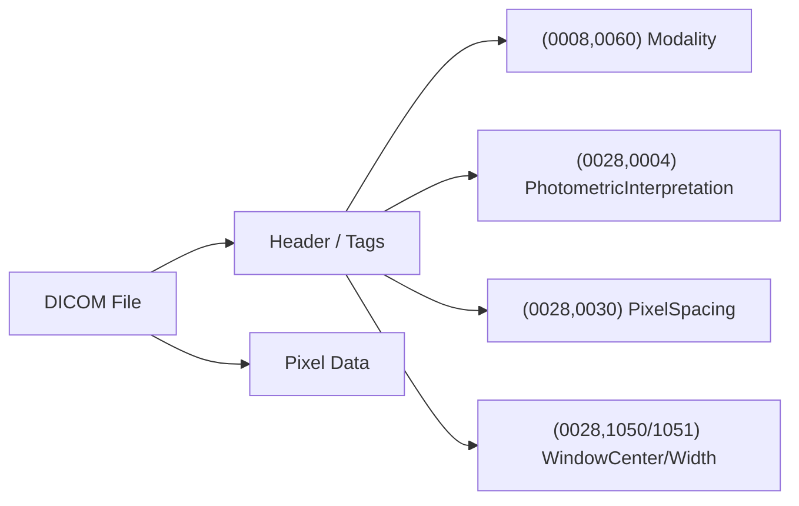

# DICOM Basics

## DICOM이란?

**DICOM (Digital Imaging and Communications in Medicine)** 은 의료 영상의 국제 표준 포맷이다. 일반 이미지(PNG, JPEG)와 가장 다른 점은 **픽셀 데이터와 메타데이터(촬영 장비·환자·파라미터)가 한 파일에 묶여 있다**는 점이다. 유방촬영(Mammography)에서 DICOM은 거의 모든 임상 데이터셋의 기본 포맷이다.

## 파일 구조 한눈에



태그는 `(group, element)` 쌍의 16진수 키로 식별되며, 표준 사전(DICOM Standard PS3.6)에 의미가 정의되어 있다.

## Mammography에서 자주 보는 핵심 태그

| 태그 | 이름 | 일반적 값 (MG) | 의미 |
|------|------|--------------|------|
| `(0008,0060)` | Modality | `MG` | Mammography |
| `(0028,0004)` | PhotometricInterpretation | `MONOCHROME1` / `MONOCHROME2` | 밝기 해석 방향 |
| `(0028,0100)` | BitsAllocated | 16 | 픽셀당 할당 비트 |
| `(0028,0101)` | BitsStored | 12 / 14 / 16 | 실제 저장 비트 |
| `(0028,0030)` | PixelSpacing | `0.085\0.085` mm | 픽셀당 물리 크기 |
| `(0028,1050)` | WindowCenter | 임상 권장 WC | 표시 윈도잉 기준 |
| `(0028,1051)` | WindowWidth | 임상 권장 WW | 표시 윈도잉 폭 |
| `(0028,1052)` | RescaleIntercept | 보통 0 | Modality LUT 절편 |
| `(0028,1053)` | RescaleSlope | 보통 1 | Modality LUT 기울기 |
| `(0018,1110)` | DistanceSourceToDetector | mm | SID, 기하 보정용 |
| `(0020,0062)` | ImageLaterality | `L` / `R` | 좌·우 유방 |
| `(0054,0220)` | ViewCodeSequence | CC / MLO | 촬영 뷰 (자세한 내용은 [Views](../clinical/views.md)) |

!!! note "왜 16비트인가"
    Mammography 디텍터는 미세한 밀도 차이를 보존해야 해서 일반 X-ray보다 더 넓은 동적 범위를 사용한다. 디스플레이로 보낼 때는 [Windowing](windowing.md)으로 8비트(0~255)로 압축한다.

## Photometric Interpretation 함정

`PhotometricInterpretation` 태그는 "픽셀 값이 클수록 어떻게 보여야 하는가"를 정의한다.

| 값 | 의미 | 표시 |
|----|------|------|
| `MONOCHROME2` | 값이 클수록 **밝게** | 일반 그레이스케일 |
| `MONOCHROME1` | 값이 클수록 **어둡게** | 반전 필요 |

`MONOCHROME1`을 그대로 화면에 보내면 흑백이 반전된 채로 표시된다. 반드시 다음과 같이 보정한다.

```python title="monochrome1_fix.py" linenums="1"
import pydicom
import numpy as np

dcm = pydicom.dcmread("sample.dcm")
arr = dcm.pixel_array  # uint16

if dcm.PhotometricInterpretation == "MONOCHROME1":
    arr = arr.max() - arr  # 표시 방향 통일
```

## Modality LUT — RescaleSlope/Intercept

저장된 픽셀값을 의미 있는 단위(예: HU, 광학 밀도)로 환산하는 첫 단계가 **Modality LUT**다. 흔한 형태는 선형 변환으로, `RescaleSlope`와 `RescaleIntercept`만 있으면 된다.

$$
x_{\text{output}} = x_{\text{stored}} \cdot \text{RescaleSlope} + \text{RescaleIntercept}
$$

```python title="modality_lut.py" linenums="1"
slope     = float(getattr(dcm, "RescaleSlope", 1.0))
intercept = float(getattr(dcm, "RescaleIntercept", 0.0))
arr = arr.astype(np.float32) * slope + intercept
```

대부분의 mammography DICOM은 `slope=1, intercept=0`이라 무시해도 결과가 같아 보인다. 하지만 일부 디바이스·CT 파생 영상에서는 의미 있는 값이 들어 있어 **빠뜨리면 강도 매핑이 어긋난다.** 학습·평가 파이프라인에서는 안전하게 항상 적용한다. 이 단계가 끝난 값이 [Windowing](windowing.md) 단계의 입력이다.

이 한 줄을 빠뜨려서 모델 학습 데이터셋 전체의 좌우 유방 밝기가 뒤집힌 채로 학습되는 사고가 흔하다.

## pydicom으로 시작하기

```python title="open_dicom.py" linenums="1"
import pydicom

dcm = pydicom.dcmread("1_target.dcm")

print(dcm.Modality)                   # 'MG'
print(dcm.PhotometricInterpretation)  # 'MONOCHROME2'
print(dcm.Rows, dcm.Columns)          # 3816 3048
print(dcm.BitsAllocated, dcm.BitsStored)
print(dcm.PixelSpacing)               # [0.085, 0.085]

# 픽셀 배열은 numpy ndarray로 반환된다
arr = dcm.pixel_array                 # dtype=uint16
print(arr.min(), arr.max(), arr.dtype)
```

pydicom은 픽셀 데이터를 자동으로 압축 해제하지만, **MONOCHROME1 반전은 직접 처리해야 한다.** 또한 `dcm.pixel_array`가 반환하는 값은 raw 픽셀이지 디스플레이용 8비트가 아니다 — 그 다음 단계가 [Windowing](windowing.md)이다.

## RAW 파일과의 차이

같은 검사에서 얻은 `.raw`(센서 직접 출력)와 `.dcm`(임상 표시용)을 비교하면 다음과 같은 차이가 보인다.

| 항목 | RAW | DCM |
|------|-----|-----|
| 픽셀 범위 | 0 ~ 65535 | 0 ~ 65535 |
| 배경 밝기 | 높음 | 낮음 |
| 유방 밝기 | 낮음 | 높음 |
| 상관계수 | RAW vs DCM ≈ −0.97 (역상관) | — |
| 메타데이터 | 없음 | 풍부 |

RAW에서 DCM 수준의 표시 이미지를 만드는 과정에는 단순 반전 외에도 [윈도잉](windowing.md), [LUT](../lut.md), [유방 영역 마스킹](masking.md) 등 여러 단계가 끼어든다. 전체 흐름은 [RAW → DCM 복원](raw-to-dcm.md) 참고.

## 출력 DICOM 패키징 { #dicom }

처리 결과를 다시 DICOM으로 저장해 뷰어·PACS 워크플로우와 호환시키려면, 원본 헤더를 뼈대로 쓰되 몇 가지를 반드시 갱신해야 한다.

```python title="save_presentation_dicom.py" linenums="1"
import pydicom, numpy as np

def save_as_presentation_dicom(img_u16, reference_dcm_path, output_path):
    dcm = pydicom.dcmread(reference_dcm_path)

    # 1) 새 UID — 원본 UID 유지 시 PACS가 원본을 덮어쓸 위험
    dcm.SOPInstanceUID    = pydicom.uid.generate_uid()
    dcm.SeriesInstanceUID = pydicom.uid.generate_uid()
    if hasattr(dcm, "file_meta"):
        dcm.file_meta.MediaStorageSOPInstanceUID = dcm.SOPInstanceUID

    # 2) 파생 영상 표시
    dcm.ImageType = ["DERIVED", "SECONDARY", "OTHER"]
    dcm.DerivationDescription = "Mammography Enhancement Pipeline Output"

    # 3) 픽셀 교체
    dcm.PixelData = img_u16.tobytes()
    dcm.Rows, dcm.Columns = img_u16.shape

    # 4) Window 레벨 = 전경 백분위 (배경 0 제외)
    fg = img_u16[img_u16 > 0]
    p_min, p_max = np.percentile(fg, (2, 98))
    dcm.WindowCenter = int((p_max + p_min) / 2)
    dcm.WindowWidth  = int(p_max - p_min)

    # 5) 16-bit 비부호 픽셀 + Padding
    dcm.BitsAllocated, dcm.BitsStored, dcm.HighBit = 16, 16, 15
    dcm.PixelRepresentation = 0
    dcm.add_new([0x0028, 0x0120], "US", 0)   # PixelPaddingValue

    pydicom.dcmwrite(output_path, dcm)
```

| 갱신 항목 | 이유 |
|----------|------|
| `SOPInstanceUID` / `SeriesInstanceUID` 신규 | **원본 UID 유지 시 PACS에서 원본을 덮어씀** |
| `ImageType = DERIVED/SECONDARY` | 원본이 아닌 파생 영상임을 명시 |
| `WindowCenter/Width` 재계산 | 처리 후 강도 분포가 바뀌었으므로 ([Windowing](windowing.md)) |
| `BitsStored/HighBit/PixelRepresentation` | 픽셀 dtype과 헤더 불일치 방지 |
