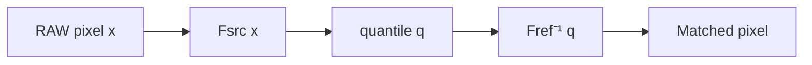

# Histogram Matching

## 단순 반전으로는 부족한 이유

RAW와 DCM은 같은 검사에서 얻은 영상이지만 강한 **역상관 관계 (r ≈ −0.97)** 를 보인다. RAW는 배경이 밝고 유방이 어둡고, DCM은 반대다. 처음 떠올리는 보정은 단순 반전이다.

$$
y(x) = x_{\max} - x
$$

이 한 단계만으로는 부족하다. 반전은 *선형* 매핑인데, 실측한 RAW→DCM 관계는 **명확히 비선형**이다. 단순 반전 후에도 잔차에 곡선이 남는다. 그래서 등장하는 것이 **히스토그램 매칭(histogram matching)** 이다.

## 핵심 아이디어 — CDF로 1:1 대응

두 이미지의 픽셀 강도 분포가 다르더라도, 누적분포함수(CDF)를 통해 두 분포의 같은 "분위(quantile)"를 가지는 픽셀을 1:1로 대응시킬 수 있다.

$$
T(x) = F_{\text{ref}}^{-1}\bigl( F_{\text{src}}(x) \bigr)
$$

- $F_{\text{src}}$ : 원본(RAW) 이미지의 CDF
- $F_{\text{ref}}$ : 참조(DCM) 이미지의 CDF
- $T$ : 픽셀별 변환 함수, 자동으로 비선형

이 변환은 회귀처럼 모델을 학습하는 것이 아니라 두 분포의 분위만 비교하므로, **데이터 한 쌍만으로도 작동한다.**



## skimage 한 줄 구현

```python title="hist_match.py" linenums="1"
import numpy as np
from skimage.exposure import match_histograms

def match_to_dcm(raw_img: np.ndarray, dcm_ref: np.ndarray) -> np.ndarray:
    return match_histograms(raw_img, dcm_ref, channel_axis=None)
```

`channel_axis=None`은 그레이스케일이라는 뜻이다. 컬러 이미지는 채널마다 따로 매칭한다.

## 매칭 전후 비교

다음 실험에서 RAW→매칭 후의 분포가 DCM 분포와 거의 일치하는 것을 확인할 수 있다.

| 단계 | 평균 픽셀값 | 표준편차 | DCM과 상관계수 |
|------|-----------|---------|-------------|
| RAW 원본 | 높음 | 좁음 | −0.97 |
| 단순 반전 | 중간 | 좁음 | +0.71 |
| 히스토그램 매칭 | 낮음 (DCM과 유사) | DCM과 유사 | **+0.83** |

매칭은 강도 분포를 일치시키지만, **공간 구조**까지 보정하지는 않는다. 매칭 후에도 SSIM이 음수로 떨어지는 케이스가 있다는 점은 그 자체로 디버깅 포인트다 — 자세한 함정은 아래 절을 참고.

## 함정 — 방향이 반대인 채로 매칭하면 SSIM이 음수

다음과 같은 단계별 SSIM 추적 결과를 보면, 히스토그램 매칭 단계에서 픽셀 분포는 맞춰지지만 **공간적으로 반전**된 채로 매칭되면 SSIM이 0 아래로 떨어진다.

| 폴더 | 사전 정렬(반전) 후 | 매칭 후 |
|------|---------------|---------|
| 1 | +0.221 | +0.207 |
| 2 | — | **−0.693** |
| 4 | — | **−0.760** |
| 6~10 | — | −0.41 ~ −0.58 |

**원인**: RAW(유방이 밝음) → DCM(유방이 어두움) 분포에 그대로 매칭하면 유방 영역 픽셀이 일제히 어두워지면서 DCM의 유방 영역과 공간적으로 반대로 정렬된다.

**해결책**: 매칭 전에 반드시 `MONOCHROME1` 보정 또는 `max - x` 반전을 끝낸 뒤에 매칭한다. 자세한 내용은 [DICOM Basics](dicom-basics.md)의 Photometric Interpretation 절 참고.

## No-Reference 모드 — 배포 환경 대응

운영 환경에서는 매칭 시점에 DCM 참조 이미지가 없을 수 있다. 사전에 여러 대표 DCM에서 픽셀 샘플을 추출해 **참조 분포 자체를 저장**해두면, 추론 시에는 RAW만으로 매칭이 가능하다. 신뢰할 수 없는 출처의 직렬화 파일을 로드하는 위험을 피하려고 `numpy`의 안전한 포맷(`.npz`)을 권장한다.

```python title="ref_histogram.py" linenums="1"
import numpy as np
import pydicom

def save_reference_histogram(dcm_paths, save_path="ref_histogram.npz"):
    samples = []
    for p in dcm_paths:
        dcm = pydicom.dcmread(p)
        arr = dcm.pixel_array.astype(np.float32)
        # 유방 영역 추정 (배경 컷)
        samples.append(arr[arr > arr.mean()].flatten())
    pool = np.concatenate(samples)
    np.savez_compressed(save_path, samples=pool)


def match_using_reference(raw_img: np.ndarray,
                          ref_path: str = "ref_histogram.npz") -> np.ndarray:
    ref_samples = np.load(ref_path)["samples"]

    # 1D 참조 분포에 대해 분위 매칭 직접 수행
    src_flat   = raw_img.ravel()
    src_sorted = np.sort(src_flat)
    ref_sorted = np.sort(ref_samples)

    quantiles = np.linspace(0, 1, src_sorted.size)
    ref_quant = np.linspace(0, 1, ref_sorted.size)
    mapped    = np.interp(quantiles, ref_quant, ref_sorted)

    # 다시 원본 위치로 환원
    inv_order = np.argsort(np.argsort(src_flat))
    return mapped[inv_order].reshape(raw_img.shape)
```

실측 참조 분포 파일 크기는 1~2 MB 수준으로, 동봉 배포가 충분히 가볍다.

## 언제 매칭이 유리한가

| 상황 | 매칭의 이점 |
|------|----------|
| 여러 디바이스에서 수집한 이종 RAW를 한 톤으로 통일 | 강함 |
| 단일 디바이스, 단일 프로토콜 | 약함 (윈도잉만으로 충분) |
| 학습 데이터를 추론 환경 분포에 맞춤(domain transfer) | 강함 |
| 정량적 분석(예: 평균 밀도 측정) | **부적합** — 비선형 매핑이 원본 강도를 왜곡 |

매칭은 표시·시각화에 유리하지만, 픽셀의 절대 강도가 의미를 가지는 분석에는 권장하지 않는다.
