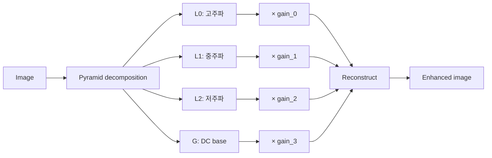
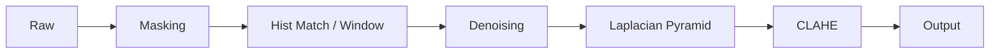

# Laplacian Pyramid

## 동기 — FFT/Wavelet과 무엇이 다른가

[Denoising](denoising.md) 페이지에서 다룬 FFT 저역통과 필터는 고주파를 **제거**한다. 그러나 mammography의 진단 정보(미세석회화·병변 변연)는 고주파에 모여 있다. 같은 이유로 wavelet의 soft thresholding도 작은 진폭의 미세 구조를 함께 깎아낼 수 있다.

**Laplacian Pyramid (LP)** 는 정반대의 사고방식이다. 이미지를 주파수 대역별로 분해한 뒤, **각 대역에 독립적인 이득(gain)을 곱하고 재합성**한다. 고주파를 잘라내는 대신 **선택적으로 강화**할 수 있다.



## 두 가지 구현 — Band-pass vs True LP

LP라는 이름으로 흔히 쓰는 구현은 사실 두 종류가 있다.

### Band-pass LP — 다운샘플링 없음

```python title="band_pass_lp.py" linenums="1"
import cv2
import numpy as np

def build_lp_bandpass(img: np.ndarray, levels: int = 4) -> list[np.ndarray]:
    pyramid, current = [], img.astype(np.float32)
    for _ in range(levels - 1):
        blurred   = cv2.GaussianBlur(current, (5, 5), 0)
        laplacian = current - blurred           # 대역통과 차분
        pyramid.append(laplacian)
        current = blurred
    pyramid.append(current)                     # 최저주파 베이스
    return pyramid


def reconstruct_bandpass(pyr: list[np.ndarray],
                         gains: list[float]) -> np.ndarray:
    return sum(layer * g for layer, g in zip(pyr, gains))
```

**모든 레벨이 같은 공간 해상도**다 — 다운샘플링이 없다. 엄밀히는 "Laplacian Pyramid"가 아니라 **대역통과 필터 분해(band-pass decomposition)** 다.

### True LP — Burt & Adelson 원전

```python title="true_lp.py" linenums="1"
import cv2
import numpy as np

def build_lp_true(img: np.ndarray, levels: int = 4) -> list[np.ndarray]:
    # 가우시안 피라미드 (옥타브 다운샘플)
    gp = [img.astype(np.float32)]
    for _ in range(levels - 1):
        gp.append(cv2.pyrDown(gp[-1]))

    # 라플라시안 피라미드 (각 레벨 = 현재 - 다음 레벨 업샘플)
    lp = []
    for i in range(levels - 1):
        up = cv2.pyrUp(gp[i + 1],
                       dstsize=(gp[i].shape[1], gp[i].shape[0]))
        lp.append((gp[i] - up).astype(np.float32))
    lp.append(gp[-1].astype(np.float32))         # DC (최저 해상도)
    return lp


def reconstruct_true(lp: list[np.ndarray],
                     gains: list[float]) -> np.ndarray:
    result = lp[-1] * gains[-1]
    for i in range(len(lp) - 2, -1, -1):
        result = cv2.pyrUp(result,
                           dstsize=(lp[i].shape[1], lp[i].shape[0]))
        result = result + gains[i] * lp[i]
    return result
```

| | Band-pass | True LP |
|--|----------|--------|
| 분해 방식 | `GaussianBlur` 반복 | `pyrDown`(옥타브 다운샘플) |
| L0 크기 | 원본 | 원본 |
| L1 크기 | 원본 | 절반 |
| L2 크기 | 원본 | 1/4 |
| L3(DC) 크기 | 원본 | 1/8 |
| 재합성 | 단순 합 | `pyrUp` 누적 |
| 주파수 분리 | 대역통과 근사 | 진정한 옥타브 분리 |

## 어느 쪽이 더 좋은가 — 실측

3,816 × 3,048 mammography 39쌍에 대해 **각자 최적 gain**으로 비교한 결과:

| 방식 | SSIM | PSNR |
|------|------|------|
| Band-pass (최적 gain) | **0.3699** | 7.52 dB |
| True LP (최적 gain) | 0.3652 | 7.43 dB |
| 차이 | −0.0047 | −0.09 dB |

**차이는 미미하다.** Mammography에서 특정 옥타브가 결정적으로 중요하지 않아, True LP의 진정한 옥타브 분리가 band-pass 근사 대비 의미 있는 이점을 주지 못했다. 코드 단순성·계산 비용을 고려하면 **band-pass LP로 충분**하다는 것이 이 데이터셋에서의 결론.

다른 데이터셋(예: DBT, 매우 고해상도 패치)에서는 결과가 달라질 수 있다.

## Gain 튜닝

LP의 자유 파라미터는 레벨별 gain이다. 단순 그리드 서치로 충분하다.

```python title="lp_grid_search.py" linenums="1"
import itertools, numpy as np

def grid_search_gains(eval_set, lp_fn, recon_fn, score_fn):
    L0 = [1.5, 2.5, 3.5]   # 고주파
    L1 = [1.2, 1.8, 2.4]   # 중주파
    L2 = [1.0, 1.3, 1.6]   # 저주파
    L3 = 1.0                # DC 고정

    best = (-np.inf, None)
    for l0, l1, l2 in itertools.product(L0, L1, L2):
        gains = [l0, l1, l2, L3]
        scores = [score_fn(recon_fn(lp_fn(img), gains), target)
                  for img, target in eval_set]
        m = float(np.mean(scores))
        if m > best[0]:
            best = (m, gains)
    return best
```

실측 최적값(SSIM 기준):

- Band-pass LP: `[3.5, 2.4, 1.6, 1.0]`
- True LP: `[4.0, 2.5, 1.6, 1.0]`

두 방식 모두 **고주파 gain이 가장 크다** — 미세 구조를 강조한다는 의도가 그대로 반영된다.

## 클리핑 주의

고주파 gain을 너무 크게 잡으면 재합성 결과가 표시 범위를 벗어난다. 항상 마지막에 클리핑·정규화한다.

```python title="clip.py" linenums="1"
def normalize_for_display(arr):
    a = arr - arr.min()
    return np.clip(a / (a.max() + 1e-8) * 65535, 0, 65535).astype(np.uint16)
```

또한 LP는 노이즈가 큰 영상에서 [Denoising](denoising.md)을 먼저 걸지 않으면 노이즈도 함께 증폭한다. 권장 순서:



## Guided Filter 다단 분해 { #guided-filter }

LP가 가우시안 흐림으로 대역을 나눈다면, **Guided Filter**는 에지를 보존하며 저주파(base)를 추정한다. radius를 바꿔가며 여러 번 적용하면 LP와 유사하게 **스케일별 분리**를 얻되, 경계가 더 또렷하다. [RAW→DCM 복원](raw-to-dcm.md)의 물리 기반 전략에서 쓰인 3단(3-tier) 분해 예:

```python title="guided_decomposition.py"
def stage_decomposition(img, mask, radius_global=150, radius_regional=50,
                        eps_global=0.01, eps_regional=0.001, pyr_levels=5):
    g = _guided_filter_masked(img, mask, radius_global,   eps_global)   # 초저주파 두께
    m = _guided_filter_masked(img, mask, radius_regional, eps_regional) # 중주파 조직
    global_layer   = g
    regional_layer = m - g          # 중간 대역
    detail_layer   = img - m        # 고주파 미세구조
    # detail 은 LP 로 다중 스케일 증폭 후 합성
    lp, residual    = build_lp_true(detail_layer, pyr_levels)
    enhanced_detail = reconstruct_true(lp, residual, [0.5, 1.0, 1.5, 2.0, 2.5])
    return global_layer, regional_layer, enhanced_detail
```

!!! warning "마스크 경계 halo"
    Guided Filter를 마스크 영상에 그대로 적용하면 배경(0)이 경계로 번져 halo가 생긴다. 적용 전에 **배경을 전경값으로 채우고**(정규화 컨볼루션) 적용 후 배경을 다시 0으로 복원하는 `_guided_filter_masked` 래핑이 필요하다. 같은 halo 함정은 [경계 두께 보정](raw-to-dcm.md#2-halo)에서도 다룬다.

OpenCV의 `cv2.ximgproc.guidedFilter`가 필요하다(`opencv-contrib-python`).

## sigmoid LUT와의 관계

[`lut.md`](../lut.md)에서 다루는 sigmoid LUT는 **단조(monotonic) 픽셀별 매핑**이다. 공간 정보를 보지 않는다. LP는 반대로 공간 주파수 정보에 작용한다.
