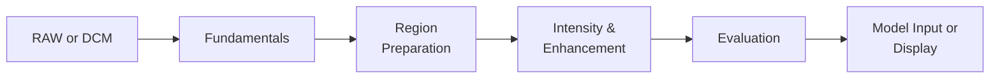
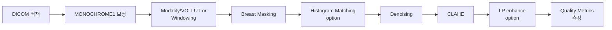

# Pipeline Overview



| 단계 | 묻는 질문 | 페이지 |
|------|---------|------|
| Fundamentals | 픽셀을 어떻게 읽고 디스플레이로 보내는가? | [DICOM Basics](dicom-basics.md), [Windowing](windowing.md), [LUT](../lut.md) |
| Region Preparation | 어디까지가 유방인가? | [Breast Masking](masking.md) |
| Intensity & Enhancement | 유방 안에서 무엇을 강조할 것인가? | [Histogram Matching](histogram-matching.md), [CLAHE](clahe.md), [Denoising](denoising.md), [Laplacian Pyramid](laplacian-pyramid.md) |
| Evaluation | 잘 처리됐는지 어떻게 측정하는가? | [Quality Metrics](../quality-metrics/index.md) |

## 한 영상이 거치는 표준 경로



모든 영상에 모든 단계를 적용할 필요는 없다. 흔히 마주치는 4가지 시나리오와 그 경로를 정리한다.

### 시나리오 A — 디스플레이용 변환

DICOM을 그냥 보기 좋게 화면에 띄우는 것이 목표.

```
DICOM → MONOCHROME1 보정 → Windowing (또는 sigmoid LUT) → 8bit display
```

추가 단계 없이 윈도잉만으로 충분한 경우가 많다. 자세한 매핑 식은 [Windowing](windowing.md), sigmoid LUT는 [LUT](../lut.md).

### 시나리오 B — 모델 입력 준비

탐지·분류 모델에 넣을 입력을 만든다.

```
DICOM → MONOCHROME1 보정 → 마스킹 → (raw 16bit 그대로 정규화) → 모델
```

표시용 윈도잉을 모델 입력에 적용하지 않는 것이 일반적이다. raw 강도를 모델이 직접 학습하게 둔다. 마스킹은 학습 데이터의 일관성을 위해 거의 항상 적용. 자세한 마스킹 옵션은 [Breast Masking](masking.md).

### 시나리오 C — RAW → DCM 복원

센서 RAW에서 임상용 DCM 수준의 표시 이미지를 생성한다.

```
RAW → 반전 → 마스킹 → Histogram Matching → Denoising → CLAHE → LP enhance → Output
```

전 단계가 모두 동원되는 가장 긴 파이프라인. 각 단계의 효과는 [Quality Metrics](../quality-metrics/index.md)로 단계별 추적.

### 시나리오 D — 미세석회화 가시화

지름 < 0.5 mm의 칼슘 침착을 시각적으로 키운다.

```
DCM → 마스킹 → Denoising (bilateral) → LP enhance (고주파 gain↑) → CLAHE
```

자세한 임상 배경은 [Lesion Types](../clinical/lesion-types.md)의 미세석회화 절.

## 단계별 함정 요약

각 페이지에서 마주친 함정을 한 곳에 모은다. 새 파이프라인을 짤 때 체크리스트로 쓰면 좋다.

| 단계 | 흔한 함정 | 위치 |
|------|---------|------|
| 적재 | `MONOCHROME1` 보정 누락 → 좌우 유방이 학습 데이터에서 반전됨 | [DICOM Basics](dicom-basics.md) |
| 적재 | `RescaleSlope/Intercept` 무시 → 강도 매핑 어긋남 | [DICOM Basics](dicom-basics.md) |
| 윈도잉 | 표시용 8비트를 모델에 입력 → 정보 손실 | [Windowing](windowing.md) |
| 마스킹 | Otsu 단독 → 입력 분포에 따라 IoU 변동 큼 | [Breast Masking](masking.md) |
| 매칭 | 반전 안 한 채 매칭 → SSIM 음수 | [Histogram Matching](histogram-matching.md) |
| CLAHE | 자동 clip이 모든 입력에 같은 값 반환 → 분기 무의미 | [CLAHE](clahe.md) |
| 디노이징 | FFT 저역통과 → 석회화·에지 손실 | [Denoising](denoising.md) |
| LP | 고주파 gain 과다 → 노이즈 증폭, 표시 범위 초과 | [Laplacian Pyramid](laplacian-pyramid.md) |
| 평가 | 독립 정규화 SSIM → 절대 밝기 차이 놓침 | [Quality Metrics](../quality-metrics/ssim.md) |

## 적용 순서 요약 카드

```
1. 적재             dicom-basics
2. 표시 매핑        windowing / lut    (선택)
3. 영역 정의        masking
4. 강도 통일        histogram-matching  (선택, 도메인 통합 시)
5. 노이즈 억제      denoising            (선택, 노이즈 큰 영상)
6. 대비 강화        clahe
7. 미세 구조 강조   laplacian-pyramid    (선택, 석회화·미세 구조)
8. 평가             quality-metrics
```
