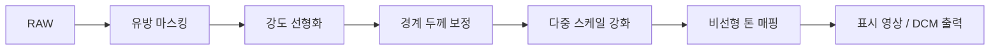

# RAW → DCM 복원

센서 RAW에서 임상 표시용 DCM 수준의 영상을 복원하는 과업([파이프라인 시나리오 C](pipeline-overview.md))이다. [마스킹](masking.md)·강도 선형화·대비 강화·톤 매핑이 모두 동원되는 가장 긴 경로이며, 정답(임상 DCM)이 있어 [SSIM/PSNR](../quality-metrics/index.md)로 직접 채점할 수 있다.

RAW와 DCM은 [강도가 역상관(≈ −0.97)](dicom-basics.md)이므로, 단순 반전만으로는 임상 영상이 되지 않는다. 강도를 두께에 선형인 도메인으로 되돌린 뒤, 다중 스케일로 미세구조를 강조하고 비선형 톤 매핑으로 표시 영상을 만든다.



## 1. 강도 선형화 — 두 가지 전략

RAW 강도를 "두께·밀도에 비례하는" 값으로 되돌리는 단계다. 실측에서 효과가 좋았던 두 전략이 있다.

### 전략 A — 로그 반전 정규화

`log` 후 실제 min/max 기준으로 반전·정규화한다. 구현이 단순하고 calcification 같은 고휘도 미세구조를 보존하기 위해 상위 백분위(99.9%)로 상한을 잡는다.

```python title="log_inversion.py"
def apply_log_transform(raw_img, breast_mask):
    out = np.zeros_like(raw_img, dtype=np.float64)
    pixels = np.clip(raw_img[breast_mask], 1, None)
    log_pixels = np.log(pixels)
    inverted = log_pixels.max() - log_pixels        # 반전
    inv_min, inv_max = inverted.min(), np.percentile(inverted, 99.9)
    out[breast_mask] = np.clip((inverted - inv_min) / (inv_max - inv_min), 0, 1)
    return out
```

### 전략 B — Beer–Lambert 로그 선형화

물리 모델을 명시적으로 가정한다. 입사 강도 \(I_0\)에 대해 감쇠 신호는

\[
S = \log\!\left(\frac{I_0}{I}\right)
\]

로 경로 적분 감쇠(≈ 조직 두께·밀도)에 비례한다. \(I_0\)는 영상에 직접 없으므로 **배경(공기) 영역**에서 추정한다: 배경을 Otsu로 분리해 그리드 샘플링한 뒤 2차 다항식으로 \(I_0\) 맵을 피팅한다. 다항식 외삽이 음수·발산하지 않도록 조직 중앙값으로 하한 클리핑한다(입사 광자 수는 물리적으로 양수).

```python title="beer_lambert.py"
def estimate_illumination_map(raw_array, degree=2, grid_size=100):
    # 배경 Otsu 분리 → 그리드(95퍼센타일) 샘플링 → 2차 다항식 lstsq 피팅
    # i0_map = np.clip(i0_map, a_min=조직_중앙값, a_max=None)  # 외삽 발산 방어
    ...

def apply_log_linearization(raw_array, i0_map):
    ratio = np.clip(i0_map, 1, None) / np.clip(raw_array, 1, None)
    linearized = np.clip(np.log(ratio), 0, None)
    return (linearized / linearized.max() * 65535).astype(np.uint16)
```

전략 B는 \(I_0\)·두께 같은 **해석 가능한 중간 산물**을 남기는 장점이 있으나, 배경이 충분히 보이는 영상에서만 안정적이다(유방이 시야를 크게 채우면 외삽 의존도가 커진다).

## 2. 경계 두께 보정 — halo 방지 (핵심 교훈) { #2-halo }

유방 경계부는 조직이 얇아 신호가 약하다. 전역 균일 강화를 적용하면 **경계부가 과도하게 밝아지는 halo**가 생기며, 특히 지방형 유방(fatty breast)에서 두드러진다. 전역 강화로는 풀리지 않고, 경계의 얇은 두께를 명시적으로 다루는 **국소 적응 보정**이 필요하다. 실측에서 서로 다른 두 보정이 모두 효과적이었다.

### 보정 1 — 밀도 적응형 경계 평활화

국소 평균(두께 대용)으로 나눠 경계 밝기를 보정하되, **유방 밀도에 따라 보정 강도를 자동 조절**한다. 로그 도메인에서 dense=높은값/fatty=낮은값이므로 평균 밝기가 낮은(fatty) 영상일수록 강도를 줄여 halo를 억제한다.

```python title="adaptive_peripheral_eq.py"
def peripheral_equalization_adaptive(log_img, breast_mask, base_strength=1.0):
    # density 추정: 정규화된 평균 밝기
    lv = log_img[breast_mask]
    mean_brightness = ((lv - lv.min()) / (lv.max() - lv.min() + 1e-6)).mean()
    strength = base_strength * np.clip(mean_brightness, 0.05, 0.6)  # fatty면 작아짐
    # eq = log / local_mean (정규화 후), 그 다음 strength로 원본과 blend
    ...
    output[breast_mask] = strength * eq[breast_mask] + (1 - strength) * log_norm[breast_mask]
    return output
```

### 보정 2 — Wedge 보상 선형화

두께 구배 맵을 추정해 **얇은 외곽 영역만 선택적으로 상향 보정**한다. 핵심은 두께 맵 추정 시 **정규화 컨볼루션(normalized convolution)** 으로 배경을 외삽하지 않는 것 — 배경 외삽이 곧 halo의 원인이기 때문이다.

```python title="wedge_compensation.py"
def compensate_peripheral_thickness(processed_raw, mask, radius_wedge=300):
    thickness_map = _estimate_thickness_map(img_f, mask, radius=radius_wedge)  # 외삽 없음
    t_ref = np.percentile(img_f[mask > 0], 90)
    correction = np.clip(thickness_map - t_ref, None, 0.0)   # 기준보다 얇은 곳만
    return np.clip(img_f - correction, 0.0, None)
```

> **교훈**: 출발점이 다른 두 복원 접근이 독립적으로 같은 결론에 도달했다 — 경계 halo는 mammography RAW 강화의 핵심 함정이며, 두께를 인지하는 국소 적응 보정으로만 해소된다.

## 3. 다중 스케일 강화 + 톤 매핑

선형화·보정된 신호에서 미세구조를 강조한다. [Laplacian Pyramid](laplacian-pyramid.md) 또는 [Guided Filter 다단 분해](laplacian-pyramid.md#guided-filter)로 저주파(두께)·중주파(조직)·고주파(미세구조)를 분리해 고주파에 큰 이득을 준 뒤, 거리 기반 피부/실질 톤 매핑이나 Black Point → Gamma → [CLAHE blend](clahe.md#16-bit-roi)로 임상 DCM 특유의 톤 곡선을 근사한다. 최종 결과는 [DERIVED DICOM으로 패키징](dicom-basics.md#dicom)한다.

## 정량 비교 (37 영상 쌍)

학습형(U-Net)과 고전 LP 계열의 벤치마크. 모든 지표는 **마스크 내부·공동 동적 범위**에서 계산했다.

| 파이프라인 | 핵심 | SSIM | PSNR (dB) | MAE |
|---|---|---|---|---|
| v1_LP (baseline) | FFT + band-pass LP | 0.3203 | 6.25 | 0.4997 |
| v1_LP_opt | LP gain 최적화 | 0.3284 | 6.58 | 0.4805 |
| **v2_UNet** | AttentionUNet, MS-SSIM | **0.7571** | **20.20** | **0.0834** |
| v3_UNet | v2 + Dropout + early stop | 0.6265 | 19.36 | 0.0858 |
| true_LP | 옥타브 분해 LP | 0.3402 | 6.92 | 0.4612 |

- **학습형이 고전 LP를 압도**: v2_UNet은 SSIM +0.44, PSNR +13.6 dB. 벤더 표시 변환은 단순 대비 강화로 재현되지 않는 비선형·공간 적응적 매핑을 포함한다.
- **히스토그램 매칭은 역상관 유발**: 매칭 기반 파이프라인은 10개 중 9개 폴더에서 음수 SSIM. 단일 영상 튜닝이 다른 영상에서 무너지는 전형적 실패.
- **소규모 데이터에서 과정규화는 해롭다**: v3(Dropout)가 v2보다 0.13 낮음.
- **옥타브 분해 이점 미미**: true_LP ≈ band-pass 근사. 이 데이터에서는 band-pass LP로 충분.

## 트레이드오프 — 미세석회화 vs SSIM

디테일 증폭(CLAHE clip↑ / LP gain↑)을 강하게 줄수록 미세석회화 delineation은 좋아지나 노이즈도 증폭되어 참조 일치도(SSIM)는 하락한다. "보기 좋음"과 "정답과의 일치"가 항상 같은 방향은 아니므로, [디스플레이용 경로와 모델 입력용 경로](pipeline-overview.md)를 분리한다.
