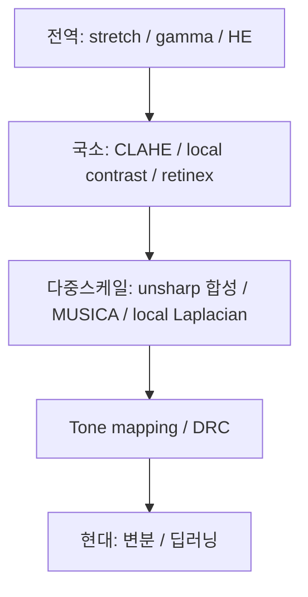

# Contrast Enhancement(대조도 향상)

!!! abstract "요약"
    Contrast enhancement(대조도 향상)는 진단상 중요한 조직 간 밝기 차이를 키우는 모든
    기법의 총칭이다. 점 연산(HE/CLAHE), 공간 연산(unsharp), 다중스케일(MUSICA), 톤
    매핑/DRC, 딥러닝까지 여러 분류를 가로지른다. 이 페이지는 그 전체를 **전역(global) →
    국소(local/adaptive) → 다중스케일 → tone mapping/DRC → 현대적(변분·딥러닝)** 순서,
    즉 **단순→정교**로 조망하고, 다른 페이지(점 연산·다중스케일)와의 중복·차이를 정리한다.

## 1. 왜 맘모그래피에 대조도 향상이 어려운가

대조도(contrast)는 인접 영역 간 밝기 차이다. X-ray에서 그 차이는 조직별 감쇠계수
($\mu$) 차이와 선량·에너지에서 비롯된다([X-ray 대조도/물리](../foundations/xray-physics.md)).
유방촬영의 어려움은 두 요구가 **상충**한다는 데 있다.

- **저대조도 병변** : 유선 조직 배경에서 종괴·미세석회의 밝기 차이가 매우 작다 → 대비를
  키워야 한다.
- **넓은 동적범위** : 두꺼운 흉벽 근처(저신호)부터 얇은 피부선·주변부(고신호)까지 한 영상에
  공존 → 전역적으로 펼치면 일부 영역이 포화된다.

!!! note "DRC(Dynamic Range Compression)의 동기"
    그래서 현대 맘모 처리는 **전역 동적범위는 압축하면서 국소 대비는 보존·증폭**하는
    DRC 전략을 쓴다. "큰 밝기 차이는 줄이고, 작은(국소) 디테일은 살린다"는 것이 핵심이며,
    본 프로젝트의 tone mapping이 바로 이 방식이다(아래 6절, [pipeline](../pipeline/three-tier.md)).

## 2. 전역 대조도 향상 (가장 단순)

영상 전체에 같은 변환을 적용. 모두 점 연산이라 [LUT](lut.md)로 가속된다.

### 2.1 Contrast stretching / Normalization

관심 강도 구간을 출력 전 범위로 선형 확장. 이상치에 강건하도록 **percentile min-max**를
흔히 쓴다(예: 1·99 백분위수로 클리핑 후 스트레치).

$$
g = \frac{f - p_{\text{low}}}{p_{\text{high}} - p_{\text{low}}}\,(g_{\max})
$$

```py
import numpy as np
lo, hi = np.percentile(img[mask > 0], [1, 99])   # 마스크 내부 통계
out = np.clip((img - lo) / (hi - lo), 0, 1)
```

본 프로젝트도 percentile 기반 normalization을 사용한다.

### 2.2 Gamma / Sigmoid 톤 곡선

비선형 톤 곡선으로 특정 밝기 구간의 대비를 키운다. gamma는
[특성 곡선](../image-formation/characteristic-curves.md)과 연결되고, sigmoid는 중간 톤
대비를 키우면서 양 끝을 부드럽게 압축(부드러운 windowing)한다.

### 2.3 히스토그램 평활화 (HE)

영상 히스토그램으로 톤 곡선을 자동 생성. 전역적이라 국소 대비 저하·잡음 과증폭의 한계가
있다. 자세한 수식·장단점은 [point-operations](point-operations.md) 참고.

## 3. 국소/적응형 대조도 향상 (개선)

전역 방법이 "한 곡선을 모든 곳에" 적용하는 한계를 풀기 위해, **위치마다 다른 변환**을 쓴다.

- **CLAHE** : 타일 단위 + clip limit + 경계 보간. 국소 대비를 살리면서 잡음 증폭을 억제하는
  대표적 적응형 기법. 수식·맘모 활용·OpenCV 예시는 [point-operations](point-operations.md) 참고.
- **지역 통계 기반(local contrast)** : 지역 평균 $\mu_{\text{loc}}$과 표준편차
  $\sigma_{\text{loc}}$로 $g = \mu_{\text{loc}} + k\,(f-\mu_{\text{loc}})$처럼 국소 편차를
  증폭. unsharp masking과 사실상 같은 가족이다([sharpening](sharpening.md)).
- **Retinex / Homomorphic** : 영상을 조도(illumination)와 반사(reflectance)로 분리해
  $\log$ 영역에서 저주파(조도)를 누르고 고주파(반사·대비)를 살린다. 조명 불균일과 동적범위를
  동시에 다루는 고전적 DRC 접근.

## 4. 다중스케일 대조도 향상 (정교)

대비는 본질적으로 **스케일 의존적**이다(미세석회의 대비와 종괴의 대비는 다른 스케일).
다중스케일 방법은 영상을 여러 대역으로 분해해 **대역별로 다르게 증폭**한다.

- **다중 σ unsharp 합성** : 여러 radius의 unsharp mask를 가중 합성([sharpening](sharpening.md)).
- **MUSICA (Multiscale Image Contrast Amplification, Philips)** : Laplacian-pyramid 류
  다중스케일 분해 후, 각 대역 계수에 **비선형 게인(작은 계수는 강하게, 큰 계수는 약하게)**을
  적용해 약한 디테일을 부각하고 강한 엣지의 과증폭을 막는, 상용 맘모 처리의 사실상 표준 개념.
- **Laplacian pyramid contrast / local Laplacian filters (Paris 2011)** : 대역별·국소
  계수 조작으로 halo 없이 국소 대비를 조절. 다중스케일의 자세한 이론은
  [다중스케일 분해](multiscale.md) 참고.

## 5. (요약 흐름)



## 6. Tone Mapping / DRC — 전역 압축 + 국소 대비 보존

DRC의 핵심 레시피는 **영상을 평활 배경(base)과 디테일(detail)로 분해**한 뒤,
**배경은 압축하고 디테일은 보존·증폭**하는 것이다(HDR tone mapping과 동일한 발상).

!!! example "프로젝트의 tone mapping"
    본 프로젝트는 [guided filter](smoothing.md) + [Laplacian pyramid](multiscale.md)로
    base/detail을 분해한 뒤 다음을 수행한다.

    1. **black-point clip** : 배경 하한을 잘라 헛된 동적범위 제거.
    2. **gamma on smoothed background (global suppression)** : 평활화된 배경에 gamma를
       적용해 큰 밝기 차이(전역 동적범위)를 압축.
    3. **detail re-amplification (regional/detail)** : 분해한 디테일 성분을 다시 증폭해
       국소 대비를 되살림.

    이렇게 전역 압축과 국소 대비 보존을 분리해 다루므로, 두꺼운/얇은 영역을 한 화면에
    담으면서도 미세 구조의 대비를 유지한다. 이후 [CLAHE](point-operations.md)를 마스크
    내부에 약하게 blend하고 [windowing](../image-formation/windowing.md)으로 마무리한다.
    주변부 밝기 불균일은 [peripheral equalization](peripheral-equalization.md)이 별도로
    보상한다. 전체 흐름은 [프로젝트 파이프라인](../pipeline/three-tier.md) 참고.

## 7. 현대적 방법 (최신)

- **변분/최적화(variational)** : 대비 향상을 에너지 최소화로 정식화. Total Variation(TV)
  정칙화로 잡음을 억제하면서 대비를 키우거나, 히스토그램 형태를 제약으로 거는 최적화 기반
  HE 변형 등.
- **딥러닝 기반 enhancement** : CNN/U-Net으로 저대조도→고대조도 매핑을 학습하거나, GAN으로
  지각적으로 자연스러운 강조를, diffusion으로 잡음 억제와 대비 향상을 동시에 수행한다.
  데이터 주도라 수작업 파라미터 튜닝을 줄여 주지만, 일반화·아티팩트·검증 부담이 크다.
  자세한 내용은 [딥러닝 기반 처리](modern-dl.md) 참고.

## 8. 비교표

| 방법 | 전역/국소 | 잡음 영향 | 대표 사용처 |
|------|-----------|-----------|-------------|
| Contrast stretching / normalization | 전역 | 낮음(증폭 거의 없음) | 동적범위 정규화, 전처리 |
| Gamma / sigmoid 톤 곡선 | 전역 | 낮음 | 디스플레이 톤, DRC 배경 압축 |
| HE | 전역 | 높음(과증폭) | 빠른 자동 대비 확장 |
| CLAHE | 국소 | 중간(clip로 억제) | 맘모 국소 대비, 표시용 |
| Local contrast / unsharp | 국소 | 높음(엣지보존시 완화) | 미세구조 강조 |
| Retinex / homomorphic | 국소+전역 | 중간 | 조명 불균일, DRC |
| MUSICA / local Laplacian | 다중스케일 | 중간(대역 게인 제어) | 상용 맘모 처리 |
| Tone mapping / DRC | 전역+국소 | 낮음~중간 | 넓은 동적범위 압축 |
| 딥러닝 | 데이터 주도 | 학습 의존 | 최신 연구·제품 |

## 참고문헌

- R. C. Gonzalez, R. E. Woods, *Digital Image Processing*, 4th ed., Pearson, 2018.
- E. D. Pisano et al., "Contrast Limited Adaptive Histogram Equalization Image Processing to Improve the Detection of Simulated Spiculations in Dense Mammograms," *Journal of Digital Imaging*, vol. 11, no. 4, pp. 193–200, 1998.
- P. Vuylsteke, E. Schoeters, "Multiscale Image Contrast Amplification (MUSICA)," *Proc. SPIE Medical Imaging*, vol. 2167, pp. 551–560, 1994.
- A. F. Laine, S. Schuler, J. Fan, W. Huda, "Mammographic Feature Enhancement by Multiscale Analysis," *IEEE Transactions on Medical Imaging*, vol. 13, no. 4, pp. 725–740, 1994.
- S. Paris, S. W. Hasinoff, J. Kautz, "Local Laplacian Filters: Edge-Aware Image Processing with a Laplacian Pyramid," *ACM Transactions on Graphics*, vol. 30, no. 4, 2011.
- E. H. Land, "An Alternative Technique for the Computation of the Designator in the Retinex Theory of Color Vision," *PNAS*, vol. 83, no. 10, pp. 3078–3080, 1986.
