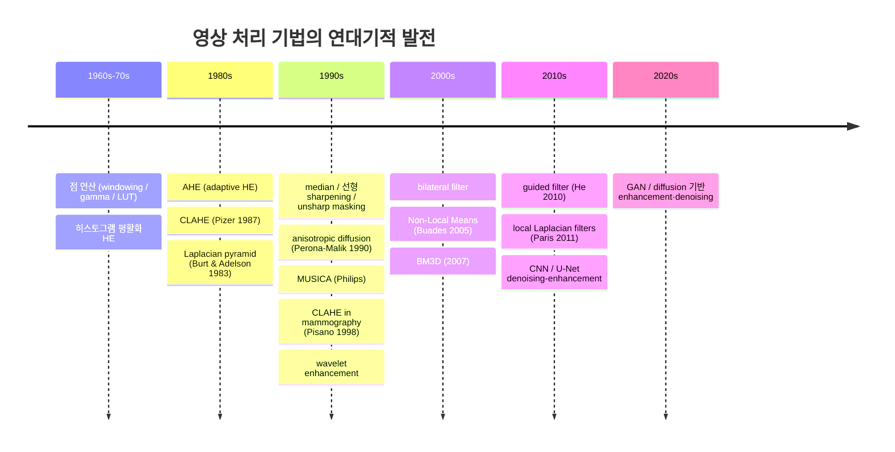
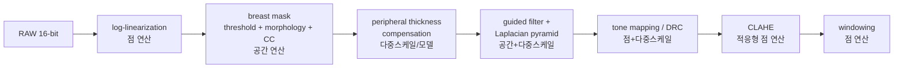

# 영상 처리 기법 개요와 분류

!!! abstract "요약"
    이 페이지는 유방촬영(mammography) 영상 처리에서 쓰이는 기법 전체를 **분류 체계**로
    정리하고, **가장 간단한 고전 알고리즘부터 최신 알고리즘까지 연대기적 순서**로 배열한
    로드맵이다. 점 연산(point operation), 공간 연산(spatial operation), 다중스케일/변환영역
    (multiscale/transform), 학습 기반(learning-based)의 네 축으로 나누고, 각 기법이 어느
    상세 페이지에서 다뤄지는지 링크한다. 본 사이트의 모든 기법 페이지는 이 순서를 따른다.

## 1. 왜 분류가 필요한가

유방촬영 영상은 **저대조도(low-contrast) 병변**(미세석회 microcalcification, 종괴 mass)과
**넓은 동적범위(wide dynamic range)**(두꺼운 흉벽 근처부터 얇은 피부선까지)를 동시에 다뤄야
한다. 어떤 기법도 단독으로 모든 요구를 만족시키지 못하므로, 실무 파이프라인은 여러 기법을
순서대로 조합한다([프로젝트 파이프라인](../pipeline/three-tier.md) 참고). 기법을 올바르게
조합하려면 각 기법이 **무엇을 입력으로 보는가**(픽셀 하나? 이웃? 여러 스케일? 데이터셋?)를
기준으로 분류하는 것이 가장 유용하다.

## 2. 분류 체계 (Taxonomy)

| 분류 | 입력이 보는 범위 | 공간 정보 사용 | 대표 기법 | 상세 페이지 |
|------|------------------|----------------|-----------|-------------|
| **점 연산** (point/pixel operation) | 픽셀 하나의 값 | 없음 | windowing, gamma, contrast stretching, HE, AHE, CLAHE | [point-operations](point-operations.md) |
| **공간 연산** (spatial/neighborhood) | 픽셀 + 이웃 커널(kernel) | 지역적 | mean/Gaussian, median, bilateral, anisotropic diffusion, guided filter, NLM, Sobel/Laplacian, unsharp masking, morphology | [smoothing](smoothing.md), [sharpening](sharpening.md) |
| **다중스케일/변환영역** (multiscale/transform) | 여러 해상도·주파수 대역 | 전역+지역 | Laplacian pyramid, wavelet, MUSICA, local Laplacian, homomorphic, peripheral equalization | [다중스케일 분해](multiscale.md), [peripheral equalization](peripheral-equalization.md) |
| **학습 기반** (learning-based) | 데이터셋 전체로 학습한 모델 | 데이터 주도 | CNN, U-Net, GAN, diffusion, 변분/최적화 융합 | [딥러닝](modern-dl.md) |

!!! note "분류는 배타적이지 않다"
    실제 기법은 경계에 걸친다. 예를 들어 CLAHE는 타일(tile) 단위 점 연산이지만 타일 간
    공간 보간이 들어가고, unsharp masking은 공간 필터지만 여러 σ로 적용하면 다중스케일이
    된다. 분류는 "이 기법이 본질적으로 무엇을 보는가"를 이해하기 위한 도구일 뿐이다.

## 3. 연대기적 발전 (Chronological Progression)

본 사이트는 **단순한 컨셉 → 정교한 컨셉** 순서로 기술을 소개한다. 아래는 그 큰 줄기다.

순서대로 정리하면 다음과 같다(번호가 곧 학습 권장 순서다).

1. **점 연산 — windowing / gamma / LUT** : 가장 단순. 픽셀값을 함수 하나로 매핑.
   → [point-operations](point-operations.md), [windowing](../image-formation/windowing.md),
   [특성 곡선](../image-formation/characteristic-curves.md), [LUT](lut.md)
2. **히스토그램 평활화 (HE)** : 전역 히스토그램을 균일화. 여전히 점 연산.
   → [point-operations](point-operations.md)
3. **적응형 — AHE → CLAHE** : 국소 히스토그램 + clip limit로 잡음 억제.
   → [point-operations](point-operations.md)
4. **선형 공간 필터** : smoothing(mean/Gaussian)과 sharpening(Sobel/Laplacian),
   unsharp masking. → [smoothing](smoothing.md), [sharpening](sharpening.md)
5. **비선형/에지보존 필터** : median, bilateral, anisotropic diffusion, guided filter, NLM.
   → [smoothing](smoothing.md)
6. **다중스케일/변환영역** : Laplacian pyramid, wavelet, MUSICA, local Laplacian.
   → [다중스케일 분해](multiscale.md), [contrast-enhancement](contrast-enhancement.md)
7. **Peripheral equalization / thickness modeling** : 유방 주변부 두께 보상.
   → [peripheral equalization](peripheral-equalization.md)
8. **최적화/변분(variational, TV)** : 에너지 최소화로 denoise·enhance.
   → [딥러닝](modern-dl.md) (변분-학습 융합 포함)
9. **딥러닝 (CNN/U-Net/GAN/diffusion)** : 데이터 주도 최신 기법.
   → [딥러닝](modern-dl.md)

!!! tip "왜 이 순서인가"
    각 단계는 직전 단계의 한계를 극복하며 등장했다. HE의 전역 한계 → AHE의 잡음 과증폭
    → CLAHE의 clip limit. 선형 smoothing의 엣지 흐림(MTF 저하) → 에지보존 필터.
    단일 스케일 처리의 한계 → 다중스케일. 수작업 파라미터의 한계 → 학습 기반.
    한계와 극복의 사슬을 따라가면 전체 분야가 하나의 이야기로 읽힌다.

## 4. 프로젝트 파이프라인과의 대응

본 프로젝트의 처리 흐름을 위 분류에 대응시키면 다음과 같다.

- **log-linearization** $\log(I_0/I)$ : 점 연산. → [point-operations](point-operations.md)
- **breast mask** (threshold + morphology + largest connected component) : 형태학적 공간
  연산. → [smoothing](smoothing.md) 의 morphology 절
- **peripheral thickness compensation** : → [peripheral equalization](peripheral-equalization.md)
- **guided filter + Laplacian pyramid** : 에지보존 + 다중스케일.
  → [smoothing](smoothing.md), [다중스케일 분해](multiscale.md)
- **tone mapping / DRC** : 전역 압축 + 국소 대비 보존.
  → [contrast-enhancement](contrast-enhancement.md)
- **CLAHE → windowing** : 적응형 + 전역 점 연산. → [point-operations](point-operations.md)

## 5. 이 사이트를 읽는 순서

처음 읽는다면 아래 순서를 권장한다.

1. [점 연산: Windowing, Gamma, HE, CLAHE](point-operations.md) — 가장 기본.
2. [Smoothing과 Denoising](smoothing.md) — 잡음 제거와 에지보존 필터.
3. [Sharpening과 Edge Enhancement](sharpening.md) — 에지 강조와 unsharp masking.
4. [Contrast Enhancement](contrast-enhancement.md) — 대조도 향상 종합.
5. [다중스케일 분해](multiscale.md) — pyramid/wavelet/MUSICA.
6. [Peripheral equalization](peripheral-equalization.md) — 주변부 균등화.
7. [딥러닝 기반 처리](modern-dl.md) — 최신 학습 기반.

배경 지식이 필요하면 [맘모그래피 개념](../foundations/mammography.md),
[X-ray 물리](../foundations/xray-physics.md), [디텍터](../foundations/detector.md),
[품질지표(MTF/NPS/SNR)](../image-quality/metrics.md)를 먼저 읽으면 좋다.

## 참고문헌

- R. C. Gonzalez, R. E. Woods, *Digital Image Processing*, 4th ed., Pearson, 2018. (점 연산·공간 필터·히스토그램 처리의 표준 교재)
- S. M. Pizer et al., "Adaptive Histogram Equalization and Its Variations," *Computer Vision, Graphics, and Image Processing*, vol. 39, no. 3, pp. 355–368, 1987.
- E. D. Pisano et al., "Contrast Limited Adaptive Histogram Equalization Image Processing to Improve the Detection of Simulated Spiculations in Dense Mammograms," *Journal of Digital Imaging*, vol. 11, no. 4, pp. 193–200, 1998.
- P. J. Burt, E. H. Adelson, "The Laplacian Pyramid as a Compact Image Code," *IEEE Transactions on Communications*, vol. 31, no. 4, pp. 532–540, 1983.
- P. Perona, J. Malik, "Scale-Space and Edge Detection Using Anisotropic Diffusion," *IEEE TPAMI*, vol. 12, no. 7, pp. 629–639, 1990.
- K. He, J. Sun, X. Tang, "Guided Image Filtering," *ECCV 2010*; *IEEE TPAMI*, vol. 35, no. 6, pp. 1397–1409, 2013.
