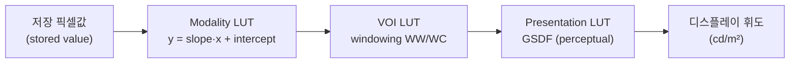

# LUT (Look-Up Table)

!!! abstract "요약"
    LUT(Look-Up Table)는 픽셀별로 비싼 함수(sigmoid, gamma, log, windowing, GSDF)를
    매 픽셀 재계산하는 대신, **입력값 → 출력값 매핑을 미리 한 번 계산해 배열로 저장**해
    두고 픽셀당 O(1) 조회로 적용하는 자료구조다. 원래 의도(밝기 조정·보정 시 sigmoid
    같은 연산을 미리 계산해 속도를 높이는 표)를 유지하면서, 1D/보간/3D LUT의 종류,
    NumPy·OpenCV 구현, 그리고 DICOM의 Modality / VOI / Presentation LUT 파이프라인까지
    조망한다.

## 1. LUT란? — 정의와 동기

X-ray 영상 처리에서 밝기 조정·보정을 할 때 sigmoid function 같은 비선형 변환을 자주
쓴다. 이런 함수를 수백만 개 픽셀마다 직접 계산하면 비용이 크다. LUT는 그 변환을
**가능한 모든 입력값에 대해 미리 한 번 계산**해 배열에 담아 두고, 실제 처리에서는
픽셀값을 인덱스로 배열을 조회(lookup)하기만 한다.

$$
y = f(x) \quad\Longrightarrow\quad \text{LUT}[x] = f(x),\quad y = \text{LUT}[x]
$$

!!! tip "왜 빠른가"
    16-bit 영상의 가능한 입력값은 $2^{16} = 65536$ 가지뿐이다. 영상이 수백만~수천만
    픽셀이어도 함수 평가는 **65536번만** 하면 되고, 이후는 픽셀당 메모리 조회 1회(O(1))다.
    초월함수(exp, pow, log)를 픽셀마다 부르는 것과 비교하면 수십~수백 배 빠르다.
    더구나 windowing·gamma·특성곡선·GSDF를 **하나의 합성 LUT**로 미리 합쳐 둘 수 있어,
    여러 변환을 단일 조회로 끝낼 수 있다.

## 2. 1D LUT — 그레이스케일 톤 매핑

가장 흔한 형태다. 입력 그레이값 하나를 출력 그레이값 하나로 대응시키는 1차원 배열이다.
[windowing](../image-formation/windowing.md), gamma, 그리고 대부분의
[특성 곡선](../image-formation/characteristic-curves.md)이 1D LUT로 구현된다.

- **크기:** 입력 비트 깊이에 대해 $2^{\text{bitdepth}}$ 엔트리. 8-bit면 256, 16-bit면 65536.
- **메모리:** 16-bit 입력 → 8-bit 출력 LUT는 $65536 \times 1\,\text{byte} = 64\,\text{KB}$.
  16-bit 입력 → 16-bit 출력이면 $65536 \times 2 = 128\,\text{KB}$. 모두 CPU 캐시에 들어갈
  만큼 작다.

## 3. 구현: precompute then index

핵심 패턴은 "한 번 계산(precompute) → 인덱싱"이다.

=== "NumPy (16-bit, gamma)"

    ```py
    import numpy as np

    # 16-bit 입력 -> 8-bit 출력 gamma LUT를 미리 계산
    gamma = 2.2
    lut = (255 * ((np.arange(65536) / 65535) ** gamma)).astype(np.uint8)

    # 적용: 픽셀값을 인덱스로 조회 (fancy indexing = 벡터화된 O(N) 조회)
    out = lut[img]          # img: uint16 배열 -> out: uint8 배열
    ```

=== "NumPy (windowing LUT)"

    ```py
    import numpy as np

    def build_window_lut(ww, wc, out_max=255, in_bits=16):
        x = np.arange(1 << in_bits, dtype=np.float64)
        y = (x - (wc - ww / 2)) / ww          # 선형 매핑
        y = np.clip(y, 0, 1) * out_max
        return y.astype(np.uint8)

    lut = build_window_lut(ww=44000, wc=30000)
    out = lut[img]
    ```

=== "OpenCV cv2.LUT"

    ```py
    import cv2, numpy as np

    # cv2.LUT는 8-bit 입력만 지원 (LUT 크기 256 고정)
    lut8 = (255 * ((np.arange(256) / 255) ** 0.5)).astype(np.uint8)
    out8 = cv2.LUT(img8, lut8)               # img8: uint8

    # 16-bit는 cv2.LUT 불가 -> NumPy 직접 인덱싱 사용
    out16 = lut16[img16]
    ```

!!! warning "OpenCV cv2.LUT의 8-bit 제한"
    `cv2.LUT`는 LUT 길이가 256으로 고정되어 **8-bit 입력 전용**이다. 유방촬영의
    12–16-bit 영상에는 쓸 수 없으므로, NumPy의 fancy indexing(`lut[img]`)으로 직접
    인덱싱해야 한다. 인덱싱 전에 입력이 LUT 범위를 벗어나지 않도록(예: 음수, 65536
    이상) 클리핑하는 것이 안전하다.

## 4. 보간 LUT와 3D LUT

### 4.1 보간 LUT (interpolated LUT)

전체 입력 도메인 대신 **샘플 점 몇 개**만 저장하고, 그 사이는 선형 보간(linear
interpolation)으로 채운다. 곡선이 매끄러울 때 메모리를 크게 줄인다. 예를 들어 65536
엔트리 대신 256개 노드만 저장하고 `np.interp`로 16-bit를 복원할 수 있다.

```py
nodes_x = np.linspace(0, 65535, 256)
nodes_y = tone_curve(nodes_x)               # 비싼 함수 256번만 평가
out = np.interp(img, nodes_x, nodes_y)      # 나머지는 선형 보간
```

### 4.2 3D LUT (color)

컬러 영상에서 (R,G,B) → (R',G',B') 변환을 위한 3차원 격자 LUT다. 영화·사진 색보정에
널리 쓰이며 격자점 사이를 삼선형(trilinear) 보간한다. 유방촬영은 본질적으로
그레이스케일이라 3D LUT는 **드물다** — 의사색(pseudocolor) 표시처럼 특수한 경우에만
등장한다.

## 5. DICOM의 LUT 파이프라인

DICOM 그레이스케일 표시는 세 단계의 LUT를 순서대로 적용한다. 각 단계는 앞 절에서 본
1D LUT로 구현된다.



| 단계 | 역할 | 본 문서 |
|------|------|---------|
| **Modality LUT** | 저장값을 물리량(예: 감쇠/OD)으로 선형 변환. Rescale Slope (0028,1053) · Intercept (0028,1052). | — |
| **VOI LUT** | Value Of Interest 선택 = windowing. Window Width/Center (0028,1051/1050) 적용. | [windowing](../image-formation/windowing.md) |
| **Presentation LUT** | 표시 장치에서 인지적으로 균일하도록 GSDF 적용. | [디스플레이 GSDF](../image-formation/characteristic-curves.md) |

!!! note "GSDF가 Presentation LUT로 적용된다"
    [디스플레이 GSDF](../image-formation/characteristic-curves.md)에서 설명한 Grayscale
    Standard Display Function은 Presentation Value를 모니터 휘도로 매핑하는 표준 곡선이다.
    이 곡선이 바로 presentation LUT로 구현되어, 휘도 특성이 다른 모니터들에서 같은
    영상이 일관되게 보이도록 한다. 즉 GSDF는 "느린 인지 곡선을 미리 계산해 두는" 전형적인
    LUT 응용이다.

## 6. 한계와 주의

!!! warning "1D LUT는 전역(global) 점 연산이다"
    LUT는 **입력값에만** 의존하고 위치(공간 좌표)는 보지 않는다. 따라서 같은 입력값은
    영상 어디에 있든 같은 출력으로 매핑된다. 두께 구배나 peripheral thinning처럼
    **공간적으로 변하는 보정**은 1D LUT로 표현할 수 없다.

이런 공간 가변 처리는 LUT가 아니라 다음 기법이 담당한다.

- **CLAHE**(Contrast Limited Adaptive Histogram Equalization): 타일별로 다른 매핑을 적용
  ([점 연산](../image-formation/characteristic-curves.md)의 톤 곡선을 국소화한 것).
- **국소/적응 처리**: peripheral equalization, [다중스케일](../image-formation/characteristic-curves.md)
  분해 기반 디테일 강조 등.

따라서 실제 파이프라인은 **전역 변환은 LUT로 가속**하고, **공간 가변 보정은 별도 국소
처리**로 나누어 수행한다.

## 7. 정리

| LUT 종류 | 입력→출력 | 크기(16-bit 기준) | 용도 |
|----------|-----------|-------------------|------|
| 1D 완전 | 1ch → 1ch | 65536 엔트리 | gamma, windowing, 톤 곡선, GSDF |
| 1D 보간 | 1ch → 1ch | 수십~수백 노드 + 보간 | 매끄러운 곡선의 메모리 절약 |
| 3D | 3ch → 3ch | $N^3$ 격자 + 삼선형 보간 | 컬러 변환(맘모에선 드묾) |

LUT의 입력 곡선들은 [특성 곡선](../image-formation/characteristic-curves.md)에서 정의되고,
대표 응용인 windowing은 [windowing](../image-formation/windowing.md)에서 다룬다.

## 참고문헌

- DICOM PS3.3, *Information Object Definitions* — Modality LUT Module, VOI LUT Module, Rescale Slope/Intercept (0028,1053/1052), Window Center/Width (0028,1050/1051). NEMA.
- DICOM PS3.14, *Grayscale Standard Display Function (GSDF)*. NEMA.
- Barten PGJ. *Contrast Sensitivity of the Human Eye and Its Effects on Image Quality*. SPIE Press, 1999.
- Bushberg JT, Seibert JA, Leidholdt EM, Boone JM. *The Essential Physics of Medical Imaging*, 4th ed. Wolters Kluwer, 2020.
- Bradski G. "The OpenCV Library." *Dr. Dobb's Journal of Software Tools*, 2000. (`cv2.LUT` 문서)
